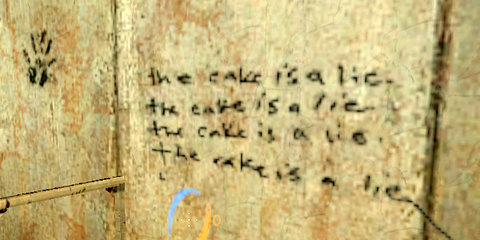

Back to: [West Karana](/posts/westkarana.md) > [2008](/posts/2008/westkarana.md) > [March](./westkarana.md)
# Rudy Rucker's "Postsingular"

*Posted by Tipa on 2008-03-03 08:57:01*

  
*What has Portal got to do with Postsingular, anyway?*

I didn't do a whole lot of gaming this weekend. I spent most of it curled up with my Sony Reader, devouring Rudy Rucker's book "[Postsingular](http://www.rudyrucker.com/postsingular/)", which he is offering for free download on his website in PDF and Reader-friendly HTML. I love HTML books because I can scale the text up nice and big and make reading an anytime, anywhere pleasure. I have Iain M. Banks' new book, "Matter", in dead tree form and I can barely make out the words. Have I mentioned how much I love this thing?

I'm a little angry at Sony for not offering "Matter" in their eBookStore. The absolute, number one, worst thing about the Reader is Sony's bookstore. Amazon doesn't have it for their Kindle either. How can science fiction be so stuck in the 20th century? Here in the good old 21st, it's all about the digital. Get with it.

It's all about the digital in "Postsingular" as well. A crazed nano-machine maker creates voracious little critters called "nants" that, once released, promptly devour Mars and the the world and everything in it, recreating everyone in a poor simulation called "Vearth". Well, mostly everyone. Those not in the President's political party didn't make the jump. And dogs. No dogs. Dogs pee on things. Dogs bad.

Just before his family is due to be swallowed, another nano-engineer figures out the code to get the nants to run in reverse, sends his autistic son (who has memorized the code) into Vearth, upsetting his wife, who sees their son explode into a cloud of nants as he crosses the Earth/Vearth boundary. That puts a strain on their relationship, even though the code does work, and the nants run in reverse, recreating the Earth, Mars, and dogs who pee on things. The President is executed. The nano-engineer later unleashes a new strain of nanos called Orphids, which blanket every surface and give the world and all who live in it access to, well, everything. Orphids can also eat nants -- just in case the dog-hating nant creator is up to something even more nefarious behind his prison of quantum-mirrored walls.

And that's the first couple of chapters of the book. From there, it gets a little weird. Angelic giants from another dimension (the kind of angels that wear green sweats and old t-shirts with dragons on them, and also happen to be the mayor of San Francisco). It's an adventure that never lets up, and Rucker packs more invention into a page than most people can pack into a lifetime.

I saw Rucker talk once or twice at Bay Area science fiction conventions when I lived there. He seems so normal on the outside.

Definitely read this book. Heck, it's FREE (but it's in bookstores as well!)

---

I played through Portal again this weekend, as well as a fair amount of Audiosurf. Single player games for the win...

## Comments!

**[almagill](http://gudeman.co.uk)** writes: "And that’s the first couple of chapters of the book. From there, it gets a little weird".

And that alone is enough for me to wish for a tree to be sacrificed so that I can have a proper book smelling copy to curl up in bed with.

(No audiosurf for me this week. I broke something and am too stuck with RL stuff to be allowed time to fix it)

---

**[Tipa](https://chasingdings.com)** writes: You're in luck, you can buy the dead tree version as well! In fact, he'd probably prefer it.

---

**[Anakh](http://bosw.wordpress.com)** writes: Hey, I have a Sony Reader too. Very handy device, though I agree with you completely about Sony's download website, which is pretty errible. I'll have to check this one out.

---

