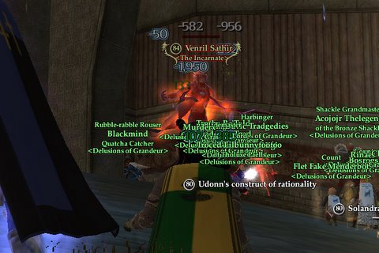

Back to: [West Karana](/posts/westkarana.md) > [2008](/posts/2008/westkarana.md) > [March](./westkarana.md)
# EQ2: Holy crap, we finally killed Venril Sathir

*Posted by Tipa on 2008-03-03 09:09:02*

Aside from a couple of T1 raids, we've been working on Venril Sathir every night since we killed the Overking. Last night, we finally got him.

He isn't a HARD kill, but it's the kind of raid where you have to pay attention -- you have to keep your power around 50%; you can't do anything but autoattack when a certain debuff is placed on you; and you have to keep the helper statues stunned with an item you get from Pawbuster. It's not easy to keep track of everything and do the kind of dps needed to kill him; last night it all came together and he died.

Venril Sathir's death also advanced the quest for my mythical epic; here I am singing my heart out to the evil harp that was stored in his throne room. Supposedly only troubadors can see it, so to everyone else, it probably looks like I'm singing to the moon or something.

Next step for the quest: The T3 raid, Leviathon, which will also give the guild access to Veeshan's Peak, about which I will FINALLY be able to write! First, though, we have to go back and flag everyone who still needs the T1 and T2 raids -- but the guild is on fire now, after Overking and Venril.

## Comments!

**[Ogrebears](http://www.ogrebear.com)** writes: Grats!!!

---

**[Wydow](http://wydow.homeip.net/)** writes: Congrats Tipa! Ugh, we are still practising the strat for killing VS. I can't wait to kill VS!

---

