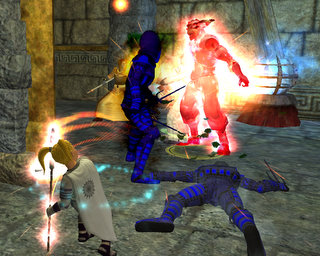

Back to: [West Karana](/posts/westkarana.md) > [2008](/posts/2008/westkarana.md) > [March](./westkarana.md)
# EQ2: Nothing special.

*Posted by Tipa on 2008-03-07 08:52:01*

There's nothing special about this picture... except that it shows why EQ2 is so great.

After last night's raid, I'd logged in my jeweler, Dorah, to make a mirror for a guildie. And then, what the heck, as long as I am on, I'll make some new combat arts for my long-ignored brigand, Donna (if it's a halfling, and an evil-only class, and name begins with 'D' and ends with 'ah' -- it's probably one of mine... Dina, Dera, Donna, Dorah...). I sent them off, logged Donna in after a bit and picked them up, scribed them, and just for the heck of it as I was arranging my "tank" and "rogue" hot bars (one for each of a brigand's roles), I said "29 brigand LFG!" in 20s chat and IMMEDIATELY got a group invite.

So I bought some poisons and headed to Crushbone Keep (from Freeport... LONG trip when you don't have the GFay druid ring).

I get there (eventually) and we spend the next couple of hours just tearing the place apart. Two levels, an AA point, lots of treasure, lots of fun, a few very scary moments... yeah, this was nothing special. Just another night of EverQuest, grouping, meeting and beating challenges, living on the edge and having fun.

Just exactly the sort of thing I loved EQ1 for, and, sadly, the thing I could only rarely find in WoW (though it was fun when it did happen). If a game wants to lure me from EQ2, it's going to have to provide this kind of gameplay -- but better. Maybe Champions Online will do that.

It was fun being the top DPSer for once. I play so many support classes...

## Comments!

**[Openedge1](http://simple-n-complex.blogspot.com)** writes: I so agree with you....what makes this game feel different every time I log in compared to WoW, LOTRO, Guild Wars, etc, etc...
It is not that the game runs great (it does not...see VERY long thread in tech forums on the "8800 nvidia cards" issue), or that it does that much different than the others...

Or maybe it does
Sparklies, HQ's, Writs, Guilds worth a darn, deities, crafting...gorgeous models (when using SOGA for myself...)
And the groupings are just really quite good...Crushbone is fun, Stormhold is fun, Ruins of Varsoon = fun...etc, etc...
I still have not been to Runnyeye, and more...as I am going so slow to take it all in...

I am really glad I found EQ2...and the new games will really need to do something spectacular to take me away (or maybe after I crash for the 500th time...who knows)

Thanks

---

**Elench** writes: I couldn't disagree more. From reading your blog I know you have a soft spot for EQ2, but I have the totally opposite opinion. I came to EQ2 from WoW, and for a week or so I was impressed with the technical superiority of the EQ2 interface. It's endlessly customizable, and you can tweak almost every single option in the game. Avatar customization was also very nice, it's a pleasant change to be able to spend so much effort on getting your character to look exactly the way you want.

But EQ2 falls flat on its face in so many ways, it's virtually slapstick. I levelled all the way to max rank with all the expansions and found something remarkable: in most games, you discover more and more as you gain in power and experience. On EQ2, it is the precise opposite - the higher level you are, the higher the likelihood of being bored stiff, even if you haven't explored every nook and cranny of the world. One corner of any land looks and feels exactly like any other spot in it. Even the monsters and animals look exactly the same wherever you go, with a few rare exceptions.

Character models, if your hardware supports high level detail without glitches, can be very nice. Yet 99% of items you can wear on your character look like cheap crap. Oh look, a new set of armour, this one has the significant difference of being a shade darker than the previous one - amazing change! And yet another problem is that SOE steadfastedly refuses to have anything sexy in the game. Forget showing some legs, cleavage, or muscles - everyone is a boring variation of one of a limited number of boring looks.

Another example of poor planning is the emote system. You have a good range of emotes, including some pretty good voice emotes, but the majority are entirely silent. There is nothing more pathetic than typing /cheer and having your avatar do an enthusiastic cheer in total silence. This is also a very serious failing with another high profile game, LOTRO (which, however, can make it up in a number of ways, such as by having inimitable subject matter and incredible scenery). WoW got emotes absolutely right by associating sounds with key emotes, even if the sounds were minor. It goes a long way towards providing a sense of physicality and ambiance.

And let's dwell for a moment on the map system - THE worst map available in ANY online game is EQ2. It's an embarrassment, especially for such a mature game. I can forgive a game rolling out with such a horrible map system at launch years ago when technology was more primitive (though WoW is from that period and has a pretty good map system). But FOR GOD'S SAKE you've had a zillion updates and expansions over half a decade, and you never bothered to fix the asinine map??? Fix the bloody map instead of adding cretinous trading card games! Which takes me to the next point.

I truly didn't appreciate the constant attempts SOE made to make me part with even more money. Look, I bought your expansions, I pay the monthly fee, now kindly stop trying to get me to pay through my nose for every little thing that might come in handy - like web site services or idiotic newsletters disguised as "magazines".

Finally, the reason that pushed me over the edge and made me abandon my uber avatar was the fact that SOE just doesn't get technology and they don't get users or their desires. SOE actually set up their tech support web site to reject your inquiries unless you jump through some hoops with registering, re-registering, etc. They are the most technologically inept MMORPG company I have ever encountered. Their constant downtime - sometimes dozens of times a week, at a minimum of 1-2 hours each time - is a complete shame on any service provider. Imagine if your email went down that often. Now imagine you were paying for your email. Now imagine if whenever you wanted to complain about downtime you were foiled by the only channel of communication available to you. Even a dedicated fan like you would have a problem with that.

I played EQ2 for a good 6 months and in hindsight it was wasted money. Given the choice today, I'd much rather revisit EQ1, which at least was novel and fun, even if the graphics were obviously more primitive. EQ2 is an inferior product to every other MMORPG out there, with the exception of other SOE products (stunningly inept efforts like Star Wars Galaxies, misguided attempts like Vanguard, etc., are beaten by EQ2).

So yeah... EQ2 is honestly nothing special. It is not a fitting heir to EQ, and is only relatively popular because of the following built up by EQ.

---

**[Tipa](https://chasingdings.com)** writes: Um. Are you sure you're playing EQ2? I came to EQ2 from WoW as well, but my experience was entirely different. My post was on how much I enjoyed EQ2's grouping. But most of your points have me wondering if we're playing the same game.

If you leveled to max level (what's rank? you're absolutely sure this is EQ2 you're talking about?) in all expansions, then how could you confuse the vampire realms of D'Morte with the gnollish caverns of Splitpaw, the rocky plateaus of the Desert of Flames and its city, Maj'Dul; the floating islands and palaces of the Kingdom of Sky; the verdant flora of Faydwer; the ruins of Kunark; the gloom and evil of Neriak; and the mysticism of the island of Mara... all were fairly unique.

Armor now has a wide range of looks, and with the appearance slots, everyone looks pretty much unique. It's true, though, that EQ2 does not show a lot of boobies. For some of us, that adds to the attraction :) But that's a matter of taste. Female avatars can wear dresses that show a lot of legs and cleavage if that's what you like. Men can go shirtless :)

/cheer, for me, has my halfling go "yay! woohoo!". I use it a lot! Not every emote has a sound, but bunches do. The ones that do are under the "voice" tab in the emote window, and cheer is among them.

I rather like EQ2's map system. It shows NPCs who can give quests or can complete quests, is zoomable a long ways out or in, all the roads and zones are clearly marked. The dungeons don't have official maps, but the EQ2Maps add-on adds those as well, as well as zillions of points of interest. EQ2 maps (sans add-ons) are easily the equal of WoW maps (sans add-ons), though I haven't played WoW in over a year and have no idea what they've done with them since I left.

Re: SOE spamming for gold. You and I are in agreement here; I don't like their LoN spamming either. I agree about their web-site services which go largely unused by me because I refuse to pay even more for what other companies give for free, and I don't buy their overpriced Equinox magazine to get information widely available everywhere else. So I definitely see eye-to-eye with you on that.

But as for your customer service criticisms, all I can say is, "huh?" Customer service is available through an in-game browser, to which you must log in, but don't need to register. Petitions are usually answered within a few minutes, sometimes as long as an hour, which is comparable to how I remember it with WoW. Downtime of dozens of times a week, for 1-2 hours each time? I don't remember any downtime aside from patches, which certainly don't come that often. Most patches are "hot", and have zero down-time.

I've played EQ1, DAoC, FFXI, WoW, LotRO, and even Vanguard (briefly), and I have to say that EQ2, in my opinion, is the best MMO currently out there. It sounds like you have a lot of issues with EQ2 that I haven't encountered, and some opinions (re: maps and lack of variety in mobs and scenery) that don't make sense to me, and a severe amount of downtime that seem unrelated to the game (though the Antonia Bayle server had some severe lag problems around the time Rise of Kunark released, but I don't play on AB so I can't speak to that).

I wish you well in whatever MMO you currently play. Not every game can appeal to everyone, but if you're going to blast EQ2, do it for its legitimate failures. For grouping at all levels, though, crawling through a dungeon with a good group, can you really maintain EQ2 is the worst of every MMO out there?

---

**Elench** writes: Yep, same game! Several of the areas you mention in fact require the purchase of "adventure packs" (Bloodlines, Splitpaw, etc.), which I categorically refused to buy after sinking a considerable sum in the game and its various expansions. So I never did see those, and I wasn't about to throw yet more money at SOE to experience them.

I levelled to max (what I meant with "rank") and I believe that was level 70 at the time. I quit almost 6 months ago, so there is another expansion out now (Rise of Kunark?) that I haven't seen.

The in-game customer support (aside from the issue that I never received a single reply with the ticket system) is not very useful when the game is down - which was a lot for me (I also experienced a number of rollbacks when SOE screwed with their servers). When you're unable to play for the third or fourth day in a row, you want to make sure your complaint is heard. Play around with the web site support system and you'll get the impression that it's designed to discourage all inbound communication.

No other game has experienced down-time like EQ2. Look at the standard - from Anarchy Online to WoW and to new products like LoTRO, the standard is at the most one day a week for scheduled down-time (LoTRO is a few hours every 2 weeks or so). EQ2 would actually retro-update their web site *during down-times* to give the impression that the "scheduled" unavailability had been announced ahead of time! That one really killed me.

As for the map - your comment boggles me, because I distinctly remember a partial screen map system with absolutely no zooming or other manipulation capability. All you could do was set a waypoint by clicking on the map display, or enter coordinates, which were both useless because a distance of a few millimetres on the map (i.e., smaller than map icons) would put you on the wrong side one of the insane number of world barriers (trees, mountains, etc.) that SOE insisted on filling the game with. Plus the majority of maps were broken. Perhaps they (finally) added some improvements in the last expansion.

My biggest problem with grouping in EQ2 was the never ending display of flashing lights you get when you have a few players adventuring together. Every class gets a million and a half skills that produce ridiculous fireworks, flashes, glows, halos, and other special effects, so that encounters just become a bout of regurgitated coloured lights exploding from your screen until you become desensitized to it all. If you're in an enclosed space like many of the dungeons, the problem is compounded. I can understand magical attacks producing special effects. But what's wrong with having a melee attack NOT produce a great swath of red light followed by an explosion on impact? Aside from the visual mess, it just seems childish, as if they felt that all classes should have a plethora of coloured lights because one of them might feel left out.

The one thing I liked about grouping, and thought was indeed an excellent feature, was mentoring. I don't have much good to say about the mechanics of the game - from crafting to having to grind non stop for rare materials or quest items. The confusion of skill upgrades was a headache - several ranks of each skill, which then become obsolete when you receive the next skill upgrade, just cause unnecessary confusion for new players. Is Charge the same as Bash? Which is better, since you can only use one, but have many? One of my biggest peeves was the inability to rez someone not in your group. That sort of thing just discourages communication.

However there were SOME positive points. The smart follow feature (allowing you to strafe and jump) is good. The broker's drag and drop / search system is something many other games sorely lack. 

There are plenty of games that actually innovate and deliver a better experience than EQ2, yet so many of us are still trapped by SOE in a product that is, technically speaking and content-wise, distinctly inferior to many other titles. I was one such trapped person and I'm still kicking myself for throwing several hundred dollars at Sony for such a product (I should have learned my lesson after the single biggest franchise let-down ever, Star Wars Galaxies!). 

I don't mean to tell anyone what to like and not to like, but I felt your exuberance towards EQ2 needed a counterpoint! :)

---

**[Tipa](https://chasingdings.com)** writes: Oh, well, nobody pays me to play certainly; I wouldn't play EQ2 if I wasn't having a good time. That's why I left EQ1 and WoW, after all.

You can adjust your spell effects to make them as flashy or as subtle as you like. I think I detect a little bit of hyperbole in your EQ2 experiences, but that's okay, you should hear me talk about WoW.

I am honest about my EQ2 experiences. Maybe I've just become so accustomed to its foibles that I don't notice them. I will say that I never experience any downtime in EQ2. It's always up when I try to log in (and patches happen while I am working).

What game are you playing these days?

---

**Elench** writes: "/cheer, for me, has my halfling go “yay! woohoo!”. I use it a lot! Not every emote has a sound, but bunches do. The ones that do are under the “voice” tab in the emote window, and cheer is among them."

Now that you mention it, I realize I made a mistake. I seem to recall that /cheer DID have associated sound on my toon (I am probably confusing it with /cheer on another game), after I installed some expansions. The problem for me was that I bought EQ2 the basic game and played for quite a while *without expansion packs.* I figured I'd check out the game first, and debate getting the expansions later.

Which, thanks to SOE's revolting approach of screwing their clients at every possible chance, means I didn't get any voice emotes. That's right, even something as basic as SOUND required me to pay for an upgrade. Never mind the talents/achievements and so forth, which are enabled only by specific expansions.

If you buy the Rise of Kunark all in one pack, you now get the adventure packs and the expansions, something which SOE has never done before (no doubt they feel the pain of departing customers). So that's a better deal - cosmetically. The truth is the overwhelming majority of clients for RoK are people who *already* own and paid for EQ2 and various expansions and packs, so SOE is just racking in the money. I don't think EQ2 is a growth game, they're selling primarily to an established (and dwindling) original player base rather than attracting new customers. Sure, the all in one deal (a first for SOE) might bring in new players, but Sony has been screwing the established player-base for 4 years, and sooner or later realization dawns on everyone (as it dawned on me in a colossal doh! moment).

EQ2 is a game that would really benefit the increasingly saturated MMORPG market by dying a swift death. That would free up 200,000 gamers (if there are still that many) and their monthly subscriptions who could then support more interesting, innovative, and better executed titles.

---

**Elench** writes: Didn't see your reply there. My main game now is LotRO. In many ways, and primarily from a technological point of view, it is such a... polished experience, particularly for such a young game, and especially after being on EQ2 for so long. There are several areas LotRO lacks in, but I am pretty sure they will be addressed. Sound in emotes, improvements to some character textures, a better auction house, a more customizable interface, etc. etc. are sorely needed as far as I am concerned. But considering that all content updates so far have been free (take that Sony!) and taking into consideration hands-down THE best environments and base material of any MMOG, I am pretty happy. It's also refreshing to have 7 classes that are distinct and individual (as opposed to 24 or - previously - 40 classes who are blended variations of each other).

---

**Elench** writes: "I never experience any downtime in EQ2. It’s always up when I try to log in (and patches happen while I am working)."

Yes, in all fairness I live in Asia, so early morning US time is early evening for me, and the game was down ALL the time during my evenings, which is when I play. I know SOE tried to schedule their down times early in their morning (around 7 AM EST) on purpose but a game should not be going down every day or every other day. That's just rampant incompetence - they would put out an update and then keep taking the game down for the next two weeks to fix everything that was broken in the update. 

But yeah, if I lived in the Americas or in Europe, I would have perceived far fewer of these down-times.

---

**[Tipa](https://chasingdings.com)** writes: Wow, you have some serious hate toward EQ2 :P I'm not sure I actually *hate* any MMO that much. I can't think of any I hate at all -- I played LotRO to the mid 30s and found it dull and repetitious but at no time did I think it shouldn't have been made. I think every MMO has its place, even such missteps as Horizons. You can read my LotRO story by browsing the Lord of the Rings category on my blog... you'll see that even though I ultimately didn't continue past my free month, I thought it was a decent game.

Lots of people are talking about games that should never have been made; I've heard WoW, EQ and EQ2 now... I wonder which one I'd choose? I don't hate any of them, and even the most reviled MMOs (Horizons and Vanguard) in the end benefited the industry more than they hurt it, though they themselves weren't successful.

---

**Elench** writes: Hey, hope you had a good week-end. To be sure, my position towards EQ2 is an extreme one, but it's certainly not blind hatred. It's a result of having been screwed with for a very long time on all possible fronts. I cited my (numerous) gripes. Now, if WoW or LotRO or any other game came close to the EQ2 situation, I'd feel just as badly towards them, but it's difficult to compete with EQ2 in terms of the above complaints. 

Let's face it, EQ was practically a revolution in gaming, basically the first modern MMORPG, sort of like a graphical MUD. Primitive compared to all the games that followed, but no less fun for that (Anarchy was the same). All the kudos to Sony for EQ1. WoW brought MMORPGs into the mainstream, and from a technological point of view was an excellent product: relatively low system requirements, good performance, good (if cartoonish) graphics, excellent stability, and good third party add-ons. LotRO, in spite of the bandwagoners who whine about it being a WoW clone (never did understand that statement) brings a LOT of new material to the table, including easily the best environment visuals available today, a revolution in terms of the "classical" class archetypes, the ability for every class to solo, and just showing us that it is possible to stay faithful to great literature and still produce a successful game.

I can admire a game for its pros even if it has some cons. I don't like to get into what is "boring" or not because that tends to be very subjective - I certainly am not bored in LotRO at level 50, with all the new content updates, PvPing, Raiding, and even group dungeons I still haven't fully done, but maybe you enjoy a different tempo, or prefer other subject matter, or whatever. What I do feel is that (apart from fellow SOE offering SW:Galaxies, which is THE worst I have ever tried) EQ2 is alone in having its cons outnumber and stomp the hell out of its pros. It seems from some of your comments a few things have changed since I quit playing, but I'm not about to come back for more punishment: SOE screwed me and hundreds of thousands over with their arrogant bull, technical incompetence, and blatant greed (launching money-grubbing projects like Heroes of Norrath and EQuinox? Please, that is pathetic, especially when the game was still so buggy years after launch). 

I see no benefit whatsoever in EQ2's continued existence, except for SOE of course. They aren't bringing anything new - or even anything well executed - they are simply sucking up the money of about 100-200 thousand people every month, many of whom would be supporting other titles if it weren't for their EQ2 shackles... yeah, things like Vanguard were complete rubbish and super buggy, but at least they didn't use the power of strong IP to build up huge membership for them (as happened with SWG and EQ2).

Die, EQ2, die!

---

**[Tipa](https://chasingdings.com)** writes: Well, I'm not going to try and change your mind :) Just one last thing, though -- everyone I know who is playing EQ2 has played other MMOs, usually several -- and almost all of them have played WoW at one time or another, the most popular MMO the world has ever seen. And still end up playing EQ2! At some point, you just have to accept that not everyone feels about games the same way :/

I've been wanting to try LotRO again, but I just don't have the time. And even MORE MMOs to try coming out this year!

---

