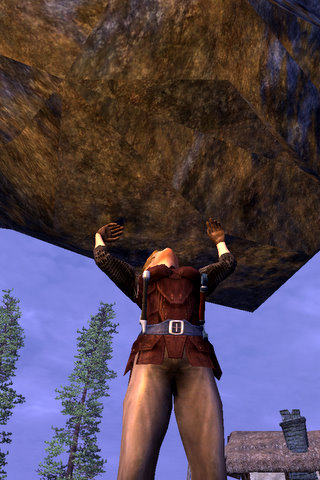
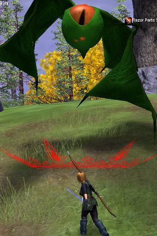
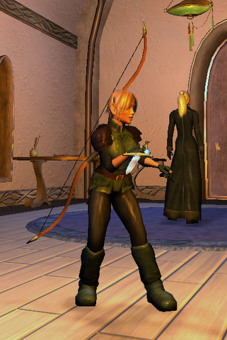

Back to: [West Karana](/posts/westkarana.md) > [2008](/posts/2008/westkarana.md) > [March](./westkarana.md)
# A very, very long look at Vanguard

*Posted by Tipa on 2008-03-10 11:45:14*

Stargrace had figured out how to talk between Vanguard and EQ2, so we were chatting. I was flitting between various characters looking for a group and a little bored. I'd two boxed the last of my armor quests for my (level 31) brigand earlier, and having made a bunch of mastercraft poisons with my alchemist and gotten her Adept 3 combat arts made with my jeweler, so I was ready to go kill and slay but... no groups!

There was possibly a group in CT for my 41 bruiser (named Tipa!), but I got a little derailed. While swapping accounts, I decided to check (just for fun!) if I still had Vanguard installed. I did, and after a bit of patching found myself once more in the world of Telon, in my persona as a level 5 halfling bard.

Yeah, real stretch.

I startled Stargrace half to death by sending her a tell (we'd JUST been talking, cross-game, with me in EQ2), and said I would not leave until I'd seen her house. So like, where is it?

"Um, East. WAY east. ALL THE WAY east."

So I took some sightings off the sun, took one last look at my compass, and headed east. Where I was swallowed by nasty critters.

Satia (as she's known there) took pity, and logged in an alt to show me the way to her home.
We took rented griffins there. It took me a little while to figure out how to work it.

Here's how I expected it to work: Rent griffin, you appear on a griffin, and then you start flying.

And here's how it actually worked: Rent griffin, get a harness in your inventory. Click harness. Go to the character screen. Click on the tab with the saddle icon on it. Click (or was it right click?) the griffon harness in the flying mount box. And you're ready to fly! It's JUST THAT SIMPLE! Hit the space bar twice (huh?) to take off and try to avoid nasty flying things.

But with that done, off we went, east and more east, until we landed at her comfy home. There were some weed-filled abandoned lots nearby that the developer really should keep cleared. You don't want ticks and fleas in your house.

Satia showed me her wonderful home, and it did really look nice and comfy. We had fun trying to sleep on the beds, but that was bugged.

That would be a recurring theme for me, unfortunately.

LOTS more after the jump.

Bugs. I hate bugs.

Satia left to continue her Shadowhound quest, and so I explored a bit, then gated back to the halfling starting village. Well, you can't keep a haffer on the farm when she's seen the city. I had the wanderlust on me and went out to seek my fortune in the world!

But first, there was a storehouse, filled with brownies, that needed clearing. Halfling + storehouse full of brownies = a month of desserts! Turned out, though, that they didn't mean fudge brownies, but little annoying creatures trying to lure young haffers to their dooms by promising them creamy chocolate goodness but instead giving them pain.

I soon fell prey to the "omg it's right in front of me but I can't hit it" bug, followed by the "omg I took two steps back to try and fix the bug and ran into more brownies and now I'm dead" tragedy. By this time I had leveled to seven and was introduced to the Vanguard death penalty -- plopped naked in the middle of a town (how embarrassing) with experience loss, experience debt, and no gear. It turns out that soulbound items stay with you, but as a newbie character, I had precious few of those. An axe and a couple pieces of armor.

Grumbling, I went to the vendors and bought all new gear and weapons, then headed back to the storehouse, and died again, and lost all my stuff again... and I didn't have enough money to buy all new gear another time. I don't really like to complain, but I did vent a little to Satia, and she mentioned that there were altars scattered about which would summon your tombstone to you, for an endurance penalty.

Oh. I guess I would have liked the game telling me handy things like that.

 

Satia also sent me some nice crafted gear and some bags, and this crafted gear had the wonderful property of being soulbound once equipped, so never again would I lose all my stuff :) As I adventured on, I would always choose to use less-powerful quest rewards, but soulbound, over the non-soulbound stuff I'd find.

This isn't an issue for most players; after a certain point, all your stuff will be soulbound. It's only really a problem for NEW players. On my own, I would not have been able to fill every slot with soulbound gear for several more levels. The auction house prices are far too high for new players. I have just over one gold now at level 13. Prices for good gear my level range from 5g to 1plat or more. The only solution is to find a friend (hi Satia!) or to learn to craft your own gear from the start.

 

With good gear and the discovery of the bard trainer and some facts about song composing I didn't know (like, you don't have to get the power cost to zero, and you can reuse song bits in different songs and often in the same song), I eventually cleared all my quests in Rindol Storehouse, and had the run of the place enough that I could show another player who was running through where a hidden quest NPC was.

A note about bard songs: It's cool that you can piece your own songs together, but by the end of the day I had three songs: a healing song, a running song and a fighting song. Each new song fragment got put into one of those three songs so, for me, it was just exactly like getting upgrades to existing songs like you would get in another game. In reality, you're not going to sacrifice the dps and stat buffs in your combat song to add a little run speed into it, or a bit of healing -- you're just going to switch to the healing song for healing and the speed song for running. It's just the same as the pre-written songs in other games. You're going to make songs that emphasize what you are needing the most, not songs that do a lot of things, but not very well.

Sunday was going to be a tough day for me anyway, with my son leaving for the Marine Corps, so rather than get involved in something in EQ2, I returned to Vanguard.

I wandered for hours across the continent, exploring the Fallen Academy, Leth Nurae and the Arcanium, a very short dungeon which was nonetheless challenging solo. Working through all those quests got me to level 13, and out the bottom of the Arcanium, past hordes of bugs, I was set on a path that brought me to Veskal's Exchange, where I proudly delivered the package I'd been given in Thrush. I think there might be a bard trainer in Veskal's Exchange, but no sentry will give me directions. I bumped into trainers for a lot of other classes, but not bards.

So my choice is to gate back to Thrush and then do the dwarven quests I was too low for before I set out for the Exchange but should be able to finish now (and also get a chance to train), or abandon those quests and just start a new life in Veskal with their quests.

Vanguard was more populous than I thought; plenty of people in Thrush. Leth Nurae was pretty empty; there was someone shouting for an hour for someone to help them make a guild there but they were gone by the time I found my way back (they were offering 10s... I could use that!) I met a couple of people in the Arcanium but they were not interested in grouping. Fallen Academy was entirely empty, which is too bad, as it had some nice drops for casters. Veskal's Exchange had some people in it, but the general sense I get of it is that people know where they are going and they aren't going to stop for anything.

The maps in Vanguard are terrible. They are topographic maps with shifting points of interest on them, generally for quests you have and little else. Satia asked me to meet her in Lakeside but that place was not on my map until we passed it on the griffin. They are absolutely useless for trying to figure out how to get someplace, which is what I'd like a map for. Roads, cities, where your trainer is (occasionally that will pop up on your map), where the auction house is... perhaps there is something like EQ2Maps for Vanguard, but even the stock maps in EQ2 show the roads and cities.

Even when you can see on a map where you want to go, it's impossible to figure out how to get there, even if there is a road leading straight to where it is. If Vanguard wanted to instill a feeling of being lost without a map, their map is a powerful step in that direction.

Vanguard is a game which doesn't go to a lot of effort to help the new player. It could be argued that EQ2 and WoW go a little too far there. The original EverQuest was, of course, far more primitive. There were no maps (you had to draw your own), you couldn't tell what direction was north, you were blind at night, and you lost all your gear when you died. So Vanguard definitely improves over its spiritual parent.

I feel it should take perhaps one step more. Useful, zoomable maps are a must. And for god's sake, fix the line-of-sight problem and the crashing while zoning problem. (Oops, I meant crashing while chunking problem. Vanguard doesn't have zones. It has chunks).

A lot has been written about Vanguard, always with the caveat "but it looks fantastic!". I don't know. It looks okay. Everyone is pretty plasticky. On the balance, it's about as good as EverQuest 2. The look reminds me more of Dark Age of Camelot than anything else. Now. there was a game which really did feel seamless, none of this constant zoning. I don't mind so much except that because it's not obvious where the zone lines are, you just suddenly freeze for a few seconds (and perhaps crash). At least EQ2 is honest about its zones; you know when you're about to hit one.

Level 13 is far from the endgame, but it's nearly to the point where people group. Unfortunately, when it comes time to group, I'll probably still be out of luck. Someone was shouting for more people for a KE group around my level. KE? No idea. And how would I get there? Again, no idea. It wouldn't be on my map. There are no roads to get there on the map, either. No griffin stations (on the map) where I could rent a flying mount. That was a group I would have liked to join, but I had to stay silent because I knew there was no way I'd be able to get from Leth Nurae to it, even if I knew where it was.

My lasting impression is that Vanguard might be a great game, but if you're just starting out there alone, it will be largely hidden from you. If I hadn't gotten some gear from Satia, then I doubt I would have come back to play it another day, so frustrating had repeatedly losing my gear become. Even now, I'm stuck in the middle of nowhere not sure how to get anywhere aside from gating back to the halfling starting area to train and running all the way back. I know there must be griffin stations around somewhere but again, I just have no idea where. And at 10s each, they put a powerful dent in the pocketbook, discouraging use.

People in the Thestra chat are actually pretty helpful, but there's a point past which it's just annoying to be having to ask questions all the time. 

After I left the Thush area, I just kept to myself, and when I came up to a camp with quests, did them and moved on. I learned how to use all the reaction moves (again lifted straight from DAoC) to take on stronger opponents, learned to pull mobs from their spawn points because of the insta-respawn bug... and the challenge led me on. I DO like being challenged in games, and Vanguard does hold challenge for the solo player. Death really is just around every corner (and I learned all about altars). You won't know where you are or where you are going. I did eventually discover the quest tracking feature which will (usually) place a red dot on your compass that shows where to go next for the quest. So if you need Maplewood Stalkers and don't know where they hang out, the quest will show you. If you're supposed to find it for yourself, it won't -- which is fair. I liked that feature and it made a lot of quests easier.

Even though I didn't deserve it, I got every single veteran reward they had. This turned out to be nearly exclusively furniture and fireworks. Since getting a house is a lengthy and expensive process, this seemed somewhat less than useful, and now my bank is filled with furniture enough to fill a four bedroom home.

I'd have just appreciated some maps.

I have to admit I did enjoy my weekend in Telon, on the balance. I did like exploring the very dangerous Arcanium, and the Rindol Storehouse was fairly well done for a level 5-8 dungeon. I've not been in an instance yet, which is a big boon to immersion. A bard is a decent solo class, and I don't think I would have any trouble finding enough things to do. Leveling so far is fairly speedy. I haven't looked at any Vanguard sites for help (except I did look up one quest in Rindol Storehouse). I probably will have to start; it's clear I'm missing at least half of the important stuff to know about the game just because I haven't happened across it. I haven't started with diplomacy yet because, as a solo trading card game a la FFVIII's Triple Triad, it's just inherently uninteresting to me, and as another source of grind, entirely unwanted. I haven't started on crafting because, well, if I am going to craft, I'll do it on EQ2 where all my characters can benefit (though Satia admitted that it is through crafting that you can become wealthy).

Every game has a feel. EQ2 feels like EQ to me, even though they are very different games. Vanguard, though, feels (and LOOKS) just exactly like Dark Age of Camelot to me, without the RvR. It's hard to see what its niche is, though. DAoC did have the RvR, after all. EQ2 and WoW are more complete games, with EQ2 being more the standard fantasy game, and WoW going off in a PvE/PvP direction. Lord of the Rings Online shares a lot of Vanguards advantages -- "seamless" world with exotic vistas, individually powerful character classes with a lot of complicated reaction things to keep track of, and few raids (though more instancing). Age of Conan will have bloodier, more strategic combat, and also boobies. Warhammer Online will be friendlier to noobs and gradually lead up to their world in conflict.

But with all that, Vanguard is its own game, with a strong community. It's hard to see how it will ever become popular, but there's places in the world for small games, after all, and you don't have to have ten million players to be a success.

## Comments!

**[Lishian](http://lishian.wordpress.com)** writes: If I remember correctly, KE is not far from the halfling and human starting area. It is an interesting and a very tough dungeon.

---

**João Carlos** writes: Soon(tm) they will launch the GU4. That will change some things you think annoying. They will improve the maps, but I think the maps will not get close enough to what you want. They will add NPCs near the rift crystals for give quests for that area level, and that will make directions go easier. And they will revamp the rift system, making transport easier.

I strongly advice to you look some Vanguard sites. That helps. I normally look at vgnecro site, but I am a necro, a gnome, the worse kind if you remember Evequest. I think there is a Vanguard bard site somewhere. Maybe they have some advices how to make diferent songs. I know that bards make quests for get special musical instruments, so I suppose that items make their songs more powerfull.

While you aren't interested at crafting, I advice you to try harvesting. It is a good money, because the higher tiers nodes are at higher level mobs areas, so crafters that don't try adventuring need buy the resources. You need advance your skill at harvesting and it is good begin while you are low level as adventurer. The skill goes up to 500, you need buy a book near each hundred skill points (around 80 if I am not wrong) for advance to the next tier of skill points. But above 200 skill you will make some money. Just waste some time while leveling, attacking the nodes at the area for advance the harvesting skill.

I too advice you to create other toons for see the other continents or you trip to the other continents. Currently you need trip to New Tagonor for get a teleport there for the other continents, but soon(tm), with GU4, you will use the rift system for go directly to other continents. Qalia and Kojan are a diferent visual experience.

---

**[stargrace](http://mmoquests.com)** writes: Maps: Get infomap. It's a life saver. Cities and towns are marked, as are all griffins, rifts, and alters, and bindstones.

I had a blast running around with you in any case, but the game is certainly lacking for 'new' players. The ones who have toughed it out, love it, and forget what it was like to be new. 

Veteran rewards: Bugged, they go by your SoE account currently, instead of by your VG specific account. Nice eh? Apparently they will be 'fixed' later. 

Any time I can nudge someone to play Vanguard, even for the briefest of periods, I will try. What can I say, I'm mean that way. *grins*

---

**[Caliga](http://www.mmogamers.freeblogit.com)** writes: I started playing Vanguard about 8 weeks ago. I'd played EQ2 for about 18mths, got bored of that and moved on to Tabula Rasa, Pirates of the Burning Sea, and decided to try Vanguard. I understand where you're coming from. It can be difficult to find your way around at first (don't even try going to another continent yet) but thankfully the community is patient and helpful. For me, I'm enjoying the challenge and discovery. I'm now level 30 on my high elf cleric and am enjoying the class. I need to go to Lakeview myself to start my Unicorn quest but it's not on my map either :)

Be sure to do some grouping before you give up. Khegan's End (KE) is a good dungeon and you can always find a group for there, and when you hit the 20s there's a popular quest line for Trengal Keep (TK).

---

**Noffin** writes: What server was you playing on??? I still have my cleric lingering somewhere on Xeth.

---

**[Tipa](https://chasingdings.com)** writes: Seradon, same as Satia.

---

**[Caliga](http://www.mmogamers.freeblogit.com)** writes: Ah, look me up then, I'm on Seradon also. Name's Regalus.

---

**[Openedge1](http://simple-n-complex.blogspot.com)** writes: NOOoooo....

I started reading and and thought "Tipa will sell the game to me..."

Or not

And now I am like
"Maybe I should wait til GU4"

This was awesome to see how someone who is familiar with EQ2 and EQ would feel about Vanguard...
Maybe I should join "strictly" to write about my misadventures....
I am not an EQ alum, and have only played EQ2 for 7 months. If what you say is true, it could be a good chance for someone who has not played this type of game (harsher penalties, more investigative) to point out what the game is like...
I am no MMO expert, but feel I understand the genre enough to write my blogging adventures for others to see...and maybe see if SOE has made progress....

I will make sure to come back and see if you have more to say (i.e: do you at least plan to play some more?)

Thanks

---

**João Carlos** writes: GU4 was today, 3/11

---

**[Tipa](https://chasingdings.com)** writes: I do plan to continue playing. It's more fun than Pirates of the Burning Sea, a game I wanted to like but just got too grindy. Of course, VG may well get too grindy as well. I hate teh grind. Grind makes me quit games. I did grind in EQ2 to level to 80, but I didn't enjoy it. I was motivated by the opportunity to join a good raid guild.

I'm also working on a new project I just started, so that's taken some of my free time from MMOs, but I think I'll be playing VG on the weekends until I know if it's a good game or not.

I will say that it's far better than my first and second impressions led me to believe.

---

**[Caliga](http://www.mmogamers.freeblogit.com)** writes: Good to hear Tipa. And Openedge, give it a try :)

GU4 is live and that should make for some easier travel, particularly with the rift system. And we now have helms, something players have been complaining the absence of for ages, only to now complain about the helms themselves. Damned if you do, damned if you don't.

---

**[Openedge1](http://simple-n-complex.blogspot.com)** writes: Okey doke...I had tried to grab a copy from Ebay...but, someone one click swindled it from under me with 5 secs to spare...sometimes just hate Ebay...
But, I do not want to put a big payment into it..and so far it still sells expensively at the shops locally or...cannot find at all. Direct 2 drive sells it for 40...and I am not willing to pay that when I can get it for 9 on Ebay...lol
So..looks like my "misadventures" have already begun..next blog post...

"The saga of the VG purchase..."...which should lead to part 2
"To hell and back...or how I learned to patch the VG"

Thanks

---

**[Tipa](https://chasingdings.com)** writes: Hmmm are you certain the VG you buy off eBay will be an unopened box with a valid key?

Call me dubious of buying previously owned subscription-based games off eBay.

I definitely would NOT buy it by download. You'll be downloading it for the next week. Huge? Yeah, kinda.

---

**Arboris** writes: Sorry for the late reply, but this is something that I found while googling, and I've similar experiences with Vanguard. I started playing 5 days ago, so I'm a newbie as well.
I was lucky to have some friends in-game already, but most of the stuff I had to discover myself. And, as a bard, it was quite easy to get through the first levels. The community isn't that bad, but that's maybe because I found myself a nice and good guild ;)
I also agree with your statement about the resemblence with DAoC; I used to be a minstrel in DAoC, and playing a bard is almost the same: a direct damage spell, mezz (flute), speed (drums) and healing (lute). I think in Vanguard, bards also get stealth, and a charm. And some combat abilities with medium armor...
What bothers me the most is the end-game. When you played DAoC, you had RvR. In WoW, there was raiding, and some pvp. I'm still wondering what the end-game of VG is. My friend said to me that there were dungeons, and when you were lv 50, you could raise your craft or diplomacy to 50 as well. This doesn't seem to be enough to keep players attracted to the game.

---

