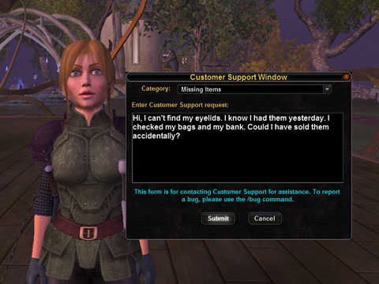

Back to: [West Karana](/posts/westkarana.md) > [2008](/posts/2008/westkarana.md) > [March](./westkarana.md)
# VG: Can I have my eyelids back?

*Posted by Tipa on 2008-03-12 07:39:06*

I didn't have long to spend in Vanguard last night after my raids in EQ2; just enough time to patch and run around a bit. Veskal's Exchange, where I was parked, was transformed -- they have a griffin flightmaster there, and one of the new riftstones there, which promised me that should I gate back to Thrusk, that I could do those quests and easily return to Veskal without that long, long run back to Leth Nurae and through the Arcanium again.

The map is still a useless topographic map, but the points of interest are now far more intelligently laid out; Lakeview is on it, and it clearly pointed out all the nearby dungeons in my level range, which will make it FAR easier to find things to do.

In the fifteen minutes I played before, alas, having to sleep, there was just one thing that really stood out... mmm BULGED out at me.

So, SOE/Sigil... is there any possible way I could get my eyelids back? That lidless stare is creeping me out.

More on Vanguard this weekend, when I hope to find a group and explore a dungeon or two. 

Ya know, maybe more people would do them if they were called "FUNgeons". I think I'll petition that, too.

## Comments!

**[stargrace](http://mmoquests.com)** writes: I'm so sorry about the missing eyelids. Someone else mentioned that their characters now look like they're being stared down by 6-dot (raid) mobs level 50. I can't help but agree, poor, poor, halflings (and humans.. and high elves.. and .. )

---

**[almagill](http://gudeman.co.uk)** writes: Bulging eyes? Maybe it's a thyroid problem?

I wonder if you can craft Optrex and eyebaths? There's got to be a market till they get this fixed...

---

**[almagill](http://gudeman.co.uk)** writes: Ok, so I logged in to check the vet rewards and, oh goodgriefwhat?

Not only do my guys have the boggly eye disorder but their beards float half an inch away from their faces and their moustaches sort of sink in...

Vanguards character models were never the prettiest around but I'm putting in an order for some brown paper bags to go over their heads for a while.

---

**[Tipa](https://chasingdings.com)** writes: I sense a new helmet idea!

---

**Einhorn** writes: WTB Deathfist Slop Bucket for VG.

Love the support request message, very droll.

I remember a guild member of mine from EQ 1 having a disturbingly long conversation with a GM after sending in a help ticket because she "Dropped her Cookie and it fell through the world".

The bulk of the conversation was the GM trying to understand what on Norrath she meant:

"Ok, so your alt named Cookie fell through the world? We can port her out to a safe location, no problem"

"No, I dropped my cookie! It was a great snack and now it's fallen to the Nine Hells!"

"Ok, so you're putting food in your bag and your character isn't eating it?"

"No!"

"You've dropped a food item on the ground and are having difficulty clicking it to pick it back up?"

"Please help get my cookie back!"

"Please adjust your clipping plane settings and you should be able to click on it if it's visible on the ground."

"It fell THROUGH the ground!"

"Did you have sufficient bag space when you attempted retrieval of this food item?"

"COOOOOOOKIIEEEE!"

"I'd like to remind you at this point that this is not a Role Play realm."

---

**[Tipa](https://chasingdings.com)** writes: lol... that's precious.

---

**[Captain Angry](http://www.captain-angry.com)** writes: "not a Role Play realm" yet 90% of GMs in these games have to ham it up. I couldn't tell you the last time I spoke with a GM in an MMO that didn't "Appear in a puff of red smoke" or speak to me by "a mysterious booming voice echoing in my mind" ooooOOOOOoooO!

---

**[Relmstein](http://relmstein.blogspot.com)** writes: Some of the stories about the classic EQ game masters are very entertaining. The old ones around the kunark/velious era were very fond of spawning themselves as copies of dragons but with funny names and then running amok in mid level zones. Still remember the great iksar slaughter in the Lake of Ill Omen one halloween.

Then apparently at one point they switched from an internal staff to an outsourced staff and you were lucky if they could understand english and didn't just copy and paste sentences from the game FAQ at you.

---

**[Caliga](http://www.mmogamers.freeblogit.com)** writes: GU4 reduced the number of "bones" in the facial structure to enable visible helms. It seems too big a price to pay IMO. From my experience in EQ2, the majority of people had their helms hidden, I can't imagine it'd be any different in VG.

---

**João Carlos** writes: "GU4 reduced the number of “bones” in the facial structure to enable visible helms. It seems too big a price to pay IMO."

No, the reason they lowere the number of bones is get better perfomance and less lag at cities and dungeons. The visible helms is the cookie we players get from the mess they made to our outfit.

But judging from some helmets I saw... it is a bad cookie.

---

**[Tipa](https://chasingdings.com)** writes: I show my helm in EQ2. It's a black mask. I love it! But yeah, helms tend to make you look even more anonymous. If you can't see the face and especially the hair -- well, not so much on VG, where they have very few hair styles to start and from what I understand, even fewer now.

Halflings should be plump. EQ1 did them well. EQ2 are okay, if you use the OLD, NON-SOGA models. LotRO has fantastic halflings, as you would expect. But EQ2 SOGA, and Vanguard... what were they thinking? Halflings aren't just shrunken humans (though it's true, Tolkein wrote that they would appear like children to non-human races).

I doubt there's anything VG can do for its character models now.

---

**[almagill](http://gudeman.co.uk)** writes: Little halfie was asking me something earlier. I couldn't concentrate on his question, just stare at his big bulging eyes and encephalitic head.

Seriously, if he'd got up on a fence and whipped out a banjo I wouldn't have been in the slightest surprised.

---

**[almagill](http://gudeman.co.uk)** writes: GMs... I was happily doing my Exile stuff when a GM came wandering up and announced his presence in the usual "GM-nottabot growls at you". So right away I'm thinking "OK, what've I done wrong? Was I exploiting and didn't realise? Does my shirt clash with my cloak?? eep!"

So, after he stared at me, winked at me, grinned at me and basically ran through all the emotes he could find I asked if there was something I could help him with. "Haha! That's MY line!"

I guess it's GM humour of some sort? 

Maybe they go funny in the head after a while?

---

**[Caliga](http://www.mmogamers.freeblogit.com)** writes: Caliga said "GU4 reduced the number of “bones” in the facial structure to enable visible helms. It seems too big a price to pay IMO. From my experience in EQ2, the majority of people had their helms hidden, I can’t imagine it’d be any different in VG."

João Carlos siad "No, the reason they lowere the number of bones is get better perfomance and less lag at cities and dungeons. The visible helms is the cookie we players get from the mess they made to our outfit."

No, they go hand in hand. Taken from the patch notes.
"By eliminating extra bones in the PC model faces we were able to add several visible helmets - which would have otherwise been interfered with by those extra bones"

---

