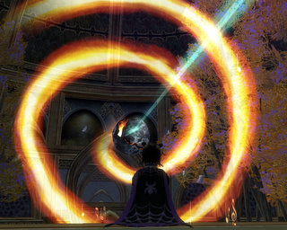

Back to: [West Karana](/posts/westkarana.md) > [2008](/posts/2008/westkarana.md) > [March](./westkarana.md)
# The next EQ2 expansion is...?

*Posted by Tipa on 2008-03-13 15:33:31*

  
*Image of Luclin in New Tunaria*

The SOE summit is over, the Community Influencers have been told what the next EQ2 expansion is, shown the concept art, and they're ready to influence us, but they can't tell us... yet...

The news that Rise of Kunark would be EQ2's fourth expansion came out about a year ago next month, so we're just weeks away from finding out where we will be playing next fall.

My guess? The Shattered Moon. There are lots of reasons why we might return to Luclin. People have been claiming the moon's pieces are drifting closer together. There is an image of the moon in the New Tunaria throne room, and it is part of the orrery in the Tower of Moon in Maj'Dul. It is possible the Sleeper, Kerafrym, fled there when he was woken and perhaps was the cause the moon blowed up. It's a fantastically ominous place of mystery, and who wouldn't want to know what's going on up there?

If we're still tracking EQ1 expansions, then the next in line would be the frozen continent of Velious. Frankly, I'm not looking forward to recycled content from old expansions, but there were lots of reasons to remember it. It had more raid content than you could shake a stick at, plus many of the more memorable (phew! sorry) experience zones in the game. It was the expansion that really tipped EQ into the hardcore area; after Velious, there was a real pressure to hit max level that hadn't existed before. Three warring factions meant there was always someone to piss off; fantastic and innovative loot always left you one more thing to get.

If the plan is to continue filling in the old world, well, there's always Odus. We know it's still around; the monks on the Isle of Mara talk about the pirates of Gunthak, and they are even here and there on the island itself. I can easily imagine Odus would have been an adventure pack if they were still doing adventure packs. It had a good city (Erudin), an evil city (Paineel), one of the best dungeons in the game (The Hole) that included a never-implemented portal to the Plane of Underfoot at the bottom; the whole of the EQ1 Legacy of Ykesha expansion; the Warrens -- the best low level dungeon in EQ1, bar none -- and it would be the perfect lead in to a Luclin expansion, given its lore.

Or perhaps they could re-open the planes. I wouldn't care for that. EQ2 should never become a game only enjoyed by raiders, and that's essentially what PoP was -- only enjoyed by raiders. EQ1 eventually developed a strong pickup raid community that could do the necessary keying fights, but if you just wanted to get to the two best xp zones in PoP -- the Planes of Earth and Fire -- then you had to raid.

Those are my guesses. Part of me wants to be surprised -- and not the "omg they did Gates of Discord!" kind of surprise, either -- nicely surprised.

Any expansion ideas I forgot to list?

## Comments!

**[Michael](http://www.mmognation.com)** writes: We weren't told what the EQ2 expansion was, actually. More's the pity. That would have been awesome.

---

**[Tipa](https://chasingdings.com)** writes: wtf, really?

What the heck DID they tell you?

Never mind, you can't.... but come on. Why invite CIs to give their comments on the direction of the game and then not tell them the direction of the game?

---

**[Grimwell](http://www.grimwell.com)** writes: Michael is telling the truth. The summit is not a game specific summit, and we don't always go into the details of each and every game during the flow of the summit time. We did have some informal mixing where members of every development team (in San Diego) were able to chat casually with people, and they may have talked about the next expansion; but it was not a formal agenda item.

The community summit is more focused on talking about SOE as a whole. Fan Faire is (currently) the best place to go if you want to sit in on panels where the nuts and bolts of the game are talked about. Fan Faire is much more about the players and connecting them to the specific games.

Why invite people? Because their feedback on what we do show them is high mileage.

---

**[Tipa](https://chasingdings.com)** writes: Did you tell them SOE was days away from moving to SCEI? :)

By the time Fan Faire rolls around, the name of the next expansion will be old news. When can you tell us?

---

**Einhorn** writes: New Expansion:

Journey to Luclin: A Lidless Endeavor

Join the thrilling ascent into the very heavens above Norrath for an exciting return to the shattered moon. Discover what really happened there, and how it will ultimately affect the worlds below it's dismal visage. But the moon is not a safe place, as expected. Deathly radiation seeps out of every nook and crater, the aftermath of Kerafyrm's explosions of rage. Adventurers lingering too long on the barren, rocky surfaces will find their own health at risk in the form of horrible mutations. Long-time moon moguls will be easily recognized by others as their eyelids will completely disappear from the fallout. Blinking becomes a luxury of the past for those who stay on the orbiting nightmare rock for too long. But the keen minds of Norrath always have a solution to every problem: partake in an all new tradeskill challenge with Cosmetic Surgery. Restore the lids and the lore to the peoples of old in this amazing expansion - Journey to Luclin - A Lidless Endeavor.

Oh yea, also Beastlords....and Othmir are playable.

---

**[Tipa](https://chasingdings.com)** writes: lol... lidless? This must be the shared EQ2/VG expansion.

I got a reply to my petition, I'll post it.

---

**Einhorn** writes: Yes I was referencing the missing eyelid joke =)

Can't wait to see the reply! I hope it frustrated the GM as much as the missing cookie that fell through the world.

---

**[Wydow](http://wydow.homeip.net/)** writes: I think you could be spot on the money with it being the expansion for Luclin. I remember completing a quest in Jasarth Wastes where I needed to collect "fragments of Luclin". Perhaps this is a subtle hint?

---

**[Cyanbane](http://www.eq2-daily.com)** writes: I hope it is something different personally. The nostalgia theme is getting old and smells of autopilot mode.

---

**Zygwen** writes: I think they need to take Tipa to the next Community Summit! :)

---

**[Tipa](https://chasingdings.com)** writes: Oh, I agree :) Now if I can only get 10x the traffic by next winter :P

---

**[Michael](http://www.mmognation.com)** writes: I actually really like the idea of delving into old expansions with a new eye. (Hopefully lidded.) I never got to 'experience' a lot of the EQ1 content the first time around, and "like the old days but way better" has a big appeal to me.

---

**[Tipa](https://chasingdings.com)** writes: Well, those of us who did play them when they came out would like something new; after all... we've done all this before. And Kunark, at least, was *not* better. The experience was horrid, several favorite dungeons -- Kurns, Kaesora, Dalnir, and Droga are missing entirely, and Nurga has become something smaller. All of this expansion was smaller -- I think it may have been the smallest expansion yet, whereas EQ1s expansions went from strength to strength, until Planes of Power and Gates of Discord put signs on the expansions shouting "RAIDERS ONLY!" Omens of War changed that somewhat, but EQ had hit its peak and the only thing to do for most people was to wait for WoW to come.

Delving into nostalgia may please people new to EQ, and even old EQ1ers may stop by to see the differences, but to attract NEW people, they are going to have to do something very original. EQ1 revolutionized and invigorated their game with Lost Dungeons of Norrath, which gave near-raid gear to casual players in much the same way WoW's battlegrounds and arena battles do. Well, not through PvP, but getting a guaranteed reward for grouping. And it even adapted to the size of your group and had two or three difficulty levels.

That's the sort of innovation EQ2 needs. Something that people will buy the game for. Giving us what we got seven years ago won't cut it, and it won't bring in people who have heard nothing but bad about EQ2 from other people.

Each EQ2 expansion has to do something incredible and new. Because if you aren't pushing the envelope, you're dying.

That's why I'm so eager to hear about the next expansion. I want them to blow me away so much that I am writing all my EQ1 friends who went to WoW and tell them they better get their butts into EQ2 NOW so they'll be ready to be utterly blown away as well.

---

**[Kendricke](http://www.clockworkgamer.com)** writes: Though I agree with some of your criticisms, you lose me when you start basing your conclusions on assumptions that the subscriptions aren't increasing. Though that may be the case, it's not something you're able to prove or reference -and so it's just an assumption, one which may not even be correct.

---

**[Tipa](https://chasingdings.com)** writes: I didn't mention subscription numbers. I certainly hope they are increasing. EQ2 is my favorite game and I want it to do well.

---

**[Taymar](http://www.mmorpg-info.org)** writes: Probably Luclin, though I think Gunthak is a contender, with all the pirate flags they've been spreading around. Cobalt Scar would be awesome.

I loved the feeling of "oh wow, I remember that" on Kunark - and although I did see some people comment that they felt they might be missing something, having not played eq1, I don't think they actually minded. Or rather, they mainly felt that way because me and other eq1 people wouldn't shut up. :)

I'd not noticed that it has gone very silent about Kurns until yesterday's reference to upping the faction for the Bellywhumper repeatable.

---

**[Tipa](https://chasingdings.com)** writes: I'm betting Kurn's comes out as free content. Maybe we'll finally find out what that mysterious room in the top was for. I never did get a sense of the lore of the place in EQ1, likely because I never played an Iksar through there so I didn't have any quests there.

---

**[Openedge1](http://simple-n-complex.blogspot.com)** writes: My preference

EQ2 - No Crash

Exciting adventures await you ye of new hardware and updated OS's. No more of the evils of the CTD or the "Blue Screen of Death", a 4 gig raid quest using only your 8800 and X-Fi's...

Step further into the nether reaches of the dungeon called Vista, and feel the glory of stability and no stutter...for hours on end, and not minutes as you experience now...

Yep...there is my expansion!

Who am I kidding...I will still buy it, download whatever it is, and play it to death...
Which reminds me...more HQ's to do...later!

---

**[Steve](http://devgamer.blogspot.com)** writes: Actually we found out about the scei deal the same day the rest of the world did.

---

**[Tipa](https://chasingdings.com)** writes: lol :P

---

**Minnie** writes: I heart Grimwell.........that is all. =D /minnie blows Grimwell a kiss.

---

