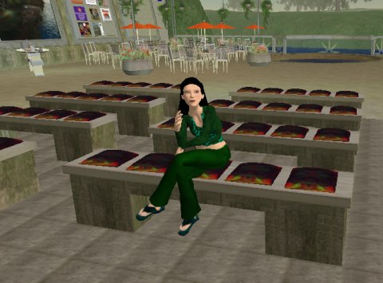
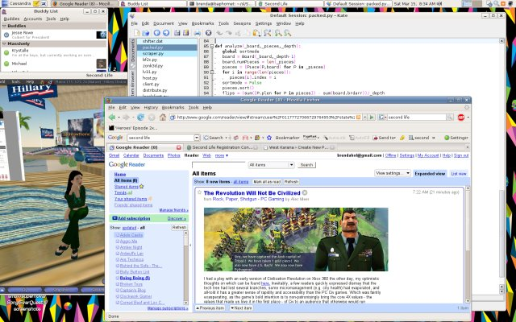
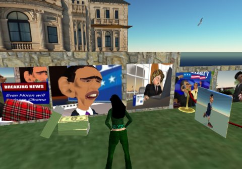

Back to: [West Karana](/posts/westkarana.md) > [2008](/posts/2008/westkarana.md) > [March](./westkarana.md)
# Yes, I'd love to hear more about Second Life

*Posted by Tipa on 2008-03-15 08:58:12*

  
*Tipa Hawthorne at the NPR Science Friday Pavilion*

I think this blog could use a lot more news about Second Life, don't you?

I haven't run Second Life for quite awhile; according to my blog, I was still insanely running Gentoo Linux because I thought I was this hardcore Linux guru, which I am not. I'm just a happy Linux USER. I've been on Ubuntu or its variants (Linux Mint at the moment) for years, because I'm all about the USING Linux instead of FIDDLING with it.

Anyway, whereas getting SL running on Gentoo was frustrating (though eventually successful), this latest installation on Linux Mint went like a breeze -- assuming you know your way around bunzip2, tar and a shell. And if you don't, why the heck are you using Linux?

Sheesh.

Since it runs on Linux, my main game machine is free for, you know, gaming, while on my faithful, extremely low tech Linux box (1 gig of memory, nVidia 6600 GT video card, some old crappy AMD processor I rescued from another computer), I can wait for someone -- ANYONE -- to show up at Hillary Clinton's headquarters (why they don't have a Hillary Clinton pants suit available to copy... and that hairstyle... I can't understand. Missed opportunity). Since nothing is happening there, I can IM people, check my feeds and dive into some juicy Python code... while on the OTHER screen, have GIMP running to fix up any screenshots I might want to make.

Linux is such a better OS for gaming...

Anyway.

Since last I played, SL has gotten big into the multimedia. Movies play, you can browse... you can do pretty much everything in game that you could do out of game.

Clinton's HQ is boring. Let's check out Barack's.

Barack's is even MORE boring! Not even the most basic Geraldine Ferraro effigy to slap. MORE missed opportunities! It does, however, have kiosks explaining his positions on various issues, something not found in Clinton's HQ. His views on the use of megaprims were, alas, not represented here.

Oh, just for the heck of it. Let's fly off to McCain's HQ.

Oh dear. McCain doesn't have a Second Life site. Um, welcome to the 21st century, Senator. Oh wait, you're still back in the 20th?

I did find a cool caricature island which has a picture of him wearing an army helmet and trying to install Vista on his laptop or something. This same island has caricatures of all the other candidates, plus James Brown, Jesus, and other celebrities.

Why all this sudden interest in Second Life?

No reason! No reason at all.

  
*Computer, locate Mr. Spock!*

Some Dutch player said he wanted me to be his Deanna Troi. Awwwww....

## Comments!

**[Deep Semaphore](http://www.play2train.org)** writes: ok here's a piece of info
http://video.google.com/videoplay?docid=-8030309534366354943&hl=en

---

**[Tipa](https://chasingdings.com)** writes: That... was incredibly amazing. I urge everyone to watch.

---

