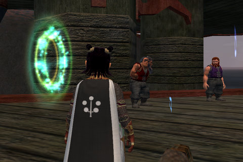
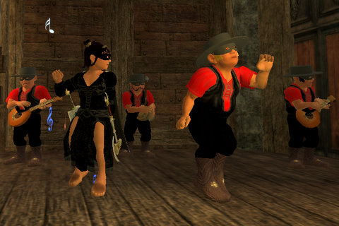

Back to: [West Karana](/posts/westkarana.md) > [2008](/posts/2008/westkarana.md) > [March](./westkarana.md)
# EQ2: Brell day!

*Posted by Tipa on 2008-03-15 22:13:04*

Nothing screams "fun!" like a crowd of drunken dwarves heaving up their (presumably liquid) dinners in front of a Mysteriously Glowing Portal (a MGP, as pro MMOGites say). Hey, I mean that. I come from the family that kept [Milwaukee's Best](http://www.milbestlight.com/default_age.aspx) in business. So naturally, I headed right in -- to Brell's Bar, the drinking establishment of the God of Below himself.

The place was HOPPING! Bardo and the Burglars were in town for Brell's Day; I put on my best dress, got up there, and danced a couple of tunes with Bardo himself. I wonder what he looks like under that mask... heck, I wonder if he wonders what I look like under MY mask...! Well, he had a show to do and I had some brew to make.

The brewer needed water from all over Norrath; Commonlands, Nektulos, Thundering Steppes and Antonica. Spring water? I asked. Sure! Natural, mineralized, spring water, fresh from cold mountain snows? Yup, that's the stuff we want. So I just went and filled up four bottles from the tap. Heck, works in real life, why not the game?

It worked wonderfully! *

Unfortunately, when it came time to put it all together, it done came out wrong, and I had to pray to Brell in order to get a special magical stein to mix it all together -- one used by Brell himself!

The bartender warned me that Brell used to use the stein to bop people on the noggin with, so it wouldn't be very fancy.

Which stein? Which stein would be fit for a god? Could it be... the Grail shaped one? But I thought back to Indiana Jones and the Last Crusade and throught to myself, WWID? And picked the right one. "You have chosen wisely," intoned the spectral paladin who guarded the steins, and I was returned swiftly to the bar where I was rewarded with this lovely cloak. I'd been two boxing my Fury, Verd, and so he picked the keg. We'd both also done the quest offered by a gnome in the bar for another keg, and I set them next to my altar to Bristlebane as sort of a matching altar to Brell.

Then I took a swig from each keg and couldn't see straight for an hour.

That's some good stuff.

Happy Brell Day!

* okay, in reality I actually went to all those places and got the stupid water. It SHOULD have let me just shine it on though :P

## Comments!

**[almagill](http://gudeman.co.uk)** writes: Ah wus jusht on my way back tae town, honeshtly, when these dwarfsh DRAGGED me through a glowing portal...

Oh the times I've used that excuse. 

Now excuse me, need to find an alchemist to see if he can give me something to settle my stomach. Must have been something in those halfling pies I ate.

---

**Lessling** writes: Just to ask if you have popped to Antonica and seen the Avatar (from down below I think) wandering there? Quite an enjoyable quest with a nice fluffy reward at the end of it!

---

**[Tipa](https://chasingdings.com)** writes: The Avatar of Below? No, haven't seen him... Someday I hope to battle one or more of the Avatars...

---

**John** writes: No he meant did you do the avatar quest For Brew DAy. Its a brew day quest that starts froma vatar in antonica.

---

**[Tipa](https://chasingdings.com)** writes: Oh!? No, didn't know about that. I'll try it when I get home.

Thanks!!!

---

