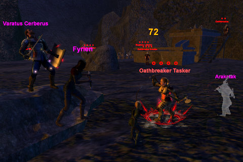
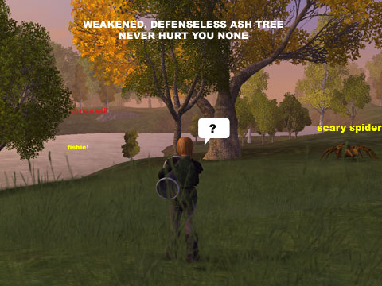

Back to: [West Karana](/posts/westkarana.md) > [2008](/posts/2008/westkarana.md) > [March](./westkarana.md)
# VG: My first group -- Khegor's End

*Posted by Tipa on 2008-03-16 19:47:55*

Armed with a map that was at least semi-useful, I set out in Telon to get some levels, some loot, and some amazing screenshots.

Meh. I got two of the three.

My quest log is stuffed to overflowing with quests for Veskal's Exchange... I *really* need to get back there and do some of them before all the quests go gray on me. Fate wanted me near Tursh, though. [Satia](http://mmoquests.com) guided me to a harvesting trainer, and so I was taught the mysteries of ... felling weakened ash trees and looting logs from its corpse.

I was engaging in a little mini game called "wru weak trees and metal nodes???" when I saw a call for more for Khegor's End. Now I'd been wanting to head there since I first heard about it last weekend; I sent the tell, got the group, and we met up by the dam where the cleric shared all the quests for which a lowly 13 bard was eligible.

Off we went!

We'd been in the dungeon almost an hour when the first comment came about me needing pretty much everything that I could wear. It was true! I had to admit to them that this was my first character and that I had only been playing a week... and that this was my first group, besides!

They didn't say anything, but the talk of what they'd been doing all weekend on their mains kinda tapered off a bit. I guess I had this hope that I wouldn't be the only new player in the group, but nope, I was the only main in a group of alts.

Still was a lot of fun, and I DID need the upgrades and got them, finished a bunch of quests and came out of it two levels richer. Finishing up the dwarven quests -- the ones I could do alone, anyway -- was easy.

Next weekend? Back to Veskal's Exchange!

## Comments!

**[Mike](http://tripleb.co.uk)** writes: Ah this brings back memories for me. During Beta this was one of the first dungeons I led my guild through, the level range of Khegor's being such that I spent every Friday for a month running both my guildies and those of our allied guild through. Oddly though we never made it beyond the initial run down to the cavern floor.

Haekemesh's Excavation on Qalia was another favourite at this level, though that was mostly because these were the only dungeons active in the game at the time for this level range. :-)

---

**João Carlos** writes: Remember, harvesting is a good way to get money. Get your axe and go cut that trees!

---

**[Tipa](https://chasingdings.com)** writes: But the trees WHINE so much when I do it :(

---

**Einhorn** writes: Stay away from Scary Spider! He cons "Mailbox" to you, so just run!

---

**[Openedge1](http://simple-n-complex.blogspot.com)** writes: Wait...you were the only noob? And they were all alts?
Oh brother...better get my copy real quick, as another noob needs to get cracking then...
But, everyone on my blog looks like they keep telling me..NO!...(lol)

I am a glutton for punishment though!

---

**[Tipa](https://chasingdings.com)** writes: Heh... yeah, start up! Wandering around the world by myself is getting old :P Be nice to have a friend to play with.

---

**[stargrace](http://mmoquests.com)** writes: .... 

I see how it is!

How come no one ever asks me if I wanna trample around Telon WITH them hmms? Am I really that big and mean and scary? Borgio, Mayadhros, Anakh, Lunestra, and a few other readers have all joined Save Haven (guild I'm in of course) but rarely ever do they want to adventure with me! I swear, I don't bite.. hard..

I'm obviously a pretty crappy gamer or something. -.-

---

**Mayadhros** writes: LOL stargrace, I would LOVE to adventure with you, but you are so damned high level to me!

Find some way to lose a few levels and we will talk :> Or just wait till I catch up.

---

**[stargrace](http://mmoquests.com)** writes: Mayadhros, you don't know me well. I have alts for all occasions. =p

---

**[Tipa](https://chasingdings.com)** writes: You're always doing important stuff!

Not many people just want to wander around the world, seeing what trouble they can get into.

I need to find some people to play with :P

---

**Mayadhros** writes: Tipa just look me up when I am on. I've been simply leveling up but would like to just relax with some actualy people in my party instead of just me!

Stargrace, bring em on! :>

---

**[Tipa](https://chasingdings.com)** writes: Guess I should start adding people to my friends list so I know when people I know are on!

One of the nice things about being new to the game, and not knowing ANYTHING -- not having read the forums, not having read the guides, not having all the add-ons which tell you where everything is -- in essence, being the perfect example of a noob -- is that all this stuff is new to me. I don't know the best places to go, I am sure I miss 90% of the content; but on the other hand, I never know what's around the next corner. I don't have anyone telling me where to go next, how to do things.

All I have are my eyes and the Thestra regional channel, and sometimes Satia (but I don't like bugging her so usually I leave her alone so she can get stuff done!). And this pretty much matches what EQ1 and EQ2 were like for me. It was not, pointedly, how WoW was for me. Everyone in WoW beta used Thottbot, and before the game was ever released, people knew EXACTLY where to go for EVERYTHING, and the game itself led you around just in case you forgot what you were supposed to be doing.

WoW was a "rails" experience. EQ2 has come to be somewhat on rails as well -- Rise of Kunark was entirely on rails. Maybe if I knew more about Vanguard, I would know exactly where to go and when, and I would know where the loot is and what I should be looking for, and which are the best songs and stuff, and so become the "perfect" player playing the most "perfect" way.

That would be nice!

Everyone I have met in VG, though, has read all the forums, has high level characters, and knows all about the perfect way to do everything, so why should I bother?

Maybe it's best that I just play the game by myself. The disappointment of finding out just how poor a player I have been would be a little much.

---

**Mayadhros** writes: I hate to add unnecessary comments but my english skills in the last post was really.....cruel. 

I charge $5 to add me to a friends list.

---

**[Tipa](https://chasingdings.com)** writes: Ah, then I will be sure not to :( Not like I could spell (or even pronounce) your name :P

---

**[stargrace](http://mmoquests.com)** writes: !!! See, it's not just me! (I call him Bob in vent, because I have no idea how to pronounce it properly) 

... important? 

Oh yes, I forgot. Grinding out those 220 granite bricks was so necessary to the well being of Telon... 

I like to adventure too *pouts* I like being a newb, and I have no one to feed my alt fetish! *wanders off to do something 'important' like crafting a new Thestran granite fireplace.. * Mmmm fireplaces...

---

**Mayadhros** writes: Ok, you "alt" it tonight, and Tipa and I will "main" it. And there will be fun for all!

---

**Mayadhros** writes: Pronounce it May-Ah-Drose.

I wanted to spell it Maedhros as in Lord of the Rings. But it was taken.

---

**[stargrace](http://mmoquests.com)** writes: .. I can't tonight =x 
And Tipa doesn't play VG during the weekdays =p

---

**[Tipa](https://chasingdings.com)** writes: Life of the EQ2 raider! By the time I finish up all the stuff I have to do around the apartment, it's time to log in and raid.

I actually got concerned recently that I don't write about EQ2 enough; people might forget that it is, after all, my main game, so today I decided to break the silence and talk about raiding. I'm reluctant to do much of that because guilds have an interest in keeping their strats secret, but now that I have seen that strats flow from the devs to the top guilds to the rest of us, I no longer have that concern. There's no discovery involved, it's just like WoW. You know the script, you just have to learn to run it.

So why not talk about raiding?

---

**Thanlar** writes: Heya everyone. I've been reading WestKarana.com everyday for a few months now... but this is my first comment. I want to thank Tipa for expressing so many of my personal feelings about games and their future. I'm not able to write as eloquently as she, but I can't agree with her more!

That being said... I've been meaning to post for a while now. After reading Tipa's comments on Vanguard and her experiences so far, I actually went out and bought it on Thursday of last week. I was in closed beta for a bit (got up to adventure lvl 9 and diplomat lvl 6)... and that's pretty much where I am right now. I know very little about the game and that is exactly why I'm enjoying it. I'm trying to persuade my wife to start up a toon and explore Telon with me... but she seems reluctant to put EQ2 on the shelf for a bit. We play with some family and a couple friends, but all of our play times vary. We've never raided in EQ2 nor will we. (It's been awesome to read about your raiding endeavors Tipa!)

So why have I posted??? Meh, dunno... but it just seems like I should say something instead of lurking in the shadows for months on end! Therefore, I'm on the same server as Tipa, Satia, and the others (I think it's Seradon)... so if you are on and don't mind hanging out with another true noob... send a tell to Thanlar. He's a very low-key gnomish necro who REALLY enjoys diplomacy :) I believe he's a lvl 8 adv and 6 diplo.

I'm starting to ramble! Probably ought to cut this "short"! Thanks for letting me post and send a tell if you see me pop online.

Later folks,

Thanlar

---

**João Carlos** writes: "But the trees WHINE so much when I do it :( "

Tipa, when the trees fall is wonderfull. Remember to shout out before a tree fall or someone can be hit.

And if you don't like the trees whining, go get wood from some vegetable mobs, like treants. Remember to kill them before use your axe, because they don't whine, they hurt...

And while you harvest, think one word: "MONEY!"

---

**[Openedge1](http://simple-n-complex.blogspot.com)** writes: Well...
 My copy is officially on the way. I will be looking forward to playing around in VG. I have another person in our guild who has debated about goofing off here also...
 Guess we just need to coordinate times...and make it a VG party. And to Stargrace, I will make sure to look you up, as I assume I will need all the help I can get, and it sure would be nice to have someone willing to give some input..
Thanks everyone

---

**[Caliga](http://www.mmogamers.freeblogit.com)** writes: Yay Openedge1, finally. Come to Seradan when you do log in. And Tipa, I'm a noob too, with my cleric hitting lvl 32 last night. And the way the levelling has slowed down it wouldn't suprise me if you caught up.

Look me up you two. Regalus.

---

