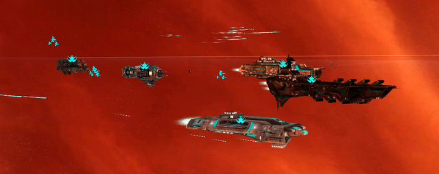

Back to: [West Karana](/posts/westkarana.md) > [2008](/posts/2008/westkarana.md) > [March](./westkarana.md)
# Sins of a Solar Empire

*Posted by Tipa on 2008-03-25 08:05:26*

I just want to start right out with a warning: *Sins of a Solar Empire* and *sleep* are incompatible. You can have one or the other; not both.

Sins is three games rolled into a yummy package. It's a [4X](http://en.wikipedia.org/wiki/4X) game (eXplore, eXpand, eXploit and eXterminate) where you start out in control of a single planet and grow until the galaxy is yours. It's an RTS in that you have to mine resources and increase your population. And it's a standard level-based RPG, with tanks, healers and mages and stuff.

You don't see that very often in a RTS, but it is all part of the *Sins* mix. I'll explain.

You start the game barely able to control your own planet, much less others, and there's always the threat of pirate attack even from very near the start of the game. And yet you must expand. Your tech tree is limited by the number of research stations and labs you can build, and each planet can usually have a very few of these, so unless you immediately start scouting the surrounding systems, you will be too weak to fend off any attacks.

Because you will never, ever win until you begin making capital ships.

If you think of capital ships -- the big battleships, liners, carriers and dreadnoughts -- as an MMO group, you'll be on your way to victory in Sins. You have your tank, a ship with massive shields and a heavy punch. You have your warlock, who hits enemy fleets with AE dots. You have your mage with missile-battery pets, your healer that fixes shields and repairs damage, your debuffer that stips enemy shields... Each of these ships can field squadrons of fighting craft and you quickly come to understand that the game is all about building a fleet of capital ships and support craft (cruisers that have their own flotilla of fighters and bombers and others that help keep the group alive), tracking the enemy back to their home planets and making them cry.

Best thing is, the capital ships level up. There's nothing quite like seeing a two kilometer long battleship ding in the middle of a battle. Since capital ships are the only ships that level up, you can see that one of your first actions in Sins is to make your tank battlecruiser so you can start leveling up the shields.

You must also quickly stamp out the spread of alien culture within your empire; if all the ensigns are wearing Nikes and rocking to their iPods, you've already lost your planets, your ships and the entire war without a shot being fired.

So some tips after a sleepless play of the game: Battleship as soon as possible. Your tank needs shields and experience to beat back the Nike-wearing, iPod-listening crowds. Fully exploit any planet you come across -- search it for alien tech, make it as livable as you can. Learn to pull. I TOLD you this was an RPG, right? When the enemy attacks, they will coyly stay at system's edge and bombard your planet out of range of your defense platforms. Go get them and bring them back to your fleet, safely within range of your defense and repair platforms (this probably won't work against human opponents... if you can find any that are looking forward to a ten hour game...). Focus fire works quite well; your fighter and bomber squadrons will keep the rest of the enemy in the fight while you take care of the larger ships. Use cheap scout ships to keep track of enemy movements. Discovering the hidden pirate base is a good thing, but don't attack it. Instead, generously cede the planets a jump away to the enemy. They will be so busy fending off pirate attacks that they won't have a chance to worry about you. The pirates can be your friends...!

*Portal* was my game of the year last year. *Sins of a Solar Empire* is well on its way to taking that title for 2008. It's cheap, it's from an indie game studio, and any reader of this blog will instantly "get" the RPG strategies for fleet building and deployment.

This is a triumph :)

## Comments!

**[Relmstein](http://relmstein.blogspot.com)** writes: I just picked this game up over the weekend. Still working my way through the four tutorials but it seems like it will consume a lot of my free time.

---

**[CrazyKinux](http://www.crazykinux.com)** writes: Downloaded the demo over the week-end, though I did not get a chance to give a go. After reading your post, I know exactly what I'll be doing later tonight.

---

**[mbp](http://www.mindbendingpuzzles.blogspot.com)** writes: Hmm...must check this out. I am going through a single player game phase anyway. You mention RPG elements, is that just unit veterancy or are there stronger elements?

---

**[Tipa](https://chasingdings.com)** writes: Well, in that the various capital ships fulfill different roles. RPG elements such as loot are not present. You could make the case that taking over an enemy's capital world is analogous to a boss battle, but that would be a stretch. I was just pleased as punch that the ships had well-defined classes, leveled up, and had their own talent trees separate from your empire's tech tree.

You can also research and build support cruisers in order to increase the soloability of your capital ships, which you will certainly need to do as it takes quite awhile to get the necessary research done in order to have a decent fleet of capital ships. So a group might consist of a battleship, a selection of carrier cruisers (they carry a squadron apiece) and robotic cruisers (patch you up in battle, some debuffing), and a cloud of more or less disposable frigates.

One thing the "tank" class capital ships need is a taunt. When you come across a hostile system, all the carriers and capital ships release their fighter swarms which swoop in and harass the enemy as they gather to meet the fleet. What you want to do is for the battleship to pull them with an AE flak burst and hope they decide to attack the battleship. Worst case is they pick off the frigates and your support ships and more or less ignore the capital ships, then they focus on one capital ship. If that happens, you may lose a battlecruiser, as I did. It was level 4, I was trying to pull it away but those ships move *slowly* in-system and they took it down.

Also, I only played the demo. I may find out more stuff once I start on the real game.

---

**[haslo](http://www.haslo.ch/)** writes: Some of the capital ships (of certain races, don't remember which ships of what races those are though) definitely do have taunt-like abilities :) Not sure if they're in the demo though...

---

