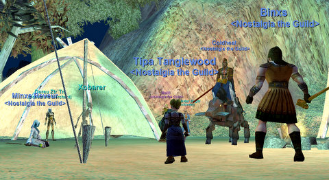
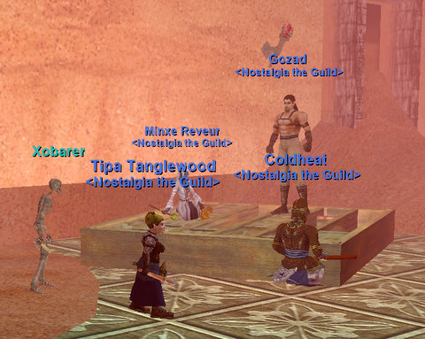

Back to: [West Karana](/posts/westkarana.md) > [2008](/posts/2008/westkarana.md) > [May](./westkarana.md)
# Lost Adventurers of Norrath

*Posted by Tipa on 2008-05-03 09:37:39*

Hard to believe tonight was just the third meeting of our Nostalgia-fueled progression group! We're trying to slow down our progression so that we have the chance to see everything, and we're looking to the Lost Dungeons of Norrath to give us instant, instanced fun, challenges and decent loot.

Gozad was the big winner. He started off as a 17 monk, and quickly won a huge weapon upgrade, a nice cloak and a Legends of Norrath Starter Pack and ended the night a hair from 19. Because of Moors questing, I was one kill from 21 and ended the night about a third of the way through 24 and with a booster deck of my own.

We were again short a tank, and so I tanked for the second group. Props go to Coldheat for keeping me alive so well! Our only real tragedy was when I tested a locked chest and KILLED EVERYONE! It points out just how important having a good class balance is in EverQuest. We could have done so much more, so much faster, and gotten some more loot, if we'd had a rogue.

A couple of the people had never done LDoNs before! Astounding, as LDoN was the expansion that became SOE's love letter to casual pickup groups. You could bring a wide variety of group builds in, from just three players to a full group of six, and the dungeon would adjust itself to the number of people and their levels. The loot was excellent, the experience decent, the time commitment was low, and it was easy to find groups. LDoNs were what EQ meant to casual players until Dragons of Norrath updated it for higher levels and better loot.

Given that we really have no idea who will show up on progression nights and yet still wanting to get out there and have fun, LDoNs are a perfect way to spend the evening.

We started out with an easy LDoN, and then another one. When we heard the other group was doing hards, well, we decided to finish off with a hard one as well. It was a little harder, but Coldheat's "Soothe" spell made splitting difficult rooms easy.

It was a great night :) Next week -- we explore Solusek's Eye.

Stargrace did [an excellent writeup](http://mmoquests.com/2008/05/03/north-ro-ldon-and-nostalgia/) of this, and got it in sooner than I did :) I do want to point out that we are still looking for more EQ1 nostalgia nuts who want to see the old world with friends. We're starting a new progression group on Tuesday evenings, but there's still time to join the Friday group if you don't mind a couple of days of grinding to hit level 20 (it really goes incredibly fast these days). Check us out at the [Nostalgia the Guild Forums](http://nostalgiatheguild.org).
## Comments!

**[stargrace](http://mmoquests.com)** writes: Great post as always!

Gozad sure did walk away the big winner of the night! He actually got from level 17-21 in the time we were there! Fantastic that the lower levels can catch up while the higher levels exp slows down a bit. Looking forward to Sol eye!

---

**[Davic](http://www.dcstanton.com/EQ2blog)** writes: Dang every time I read one of these makes me want to play just a little bit more.

---

**[Bryzon](http://bryzon.blogspot.com)** writes: Oh man, I remember the LDON days. Having groups go through about 10 a day, just for augment drops.

---

**Malfi** writes: Group Sexxy had a great time too, and got lots of dings! But no amazing loot. All three of our instances (easy, hard, easy) were named mob free. But we had a great time and are looking forward to this week!

---

**Einhorn** writes: Well gee I'm glad Group 1 had such a nice time. All Group 2 got was some points and cash. No loot whatsoever. LDON, for me at least, felt a little dry. We did an 2 easies and 1 hard mode, there was little difference between the hard and easy modes - we made short work of entire rooms (and had to most of the time). The pulls were usually large, likely because my pulling technique involved heaving a fistful of gravel blindly into the room after kicking the door in and burping.

We rarely died, I think we only had 3 deaths total - none of them were Malfi or myself. And the only thing that really killed more than one person was a trap. I thought my pulling technique would be the best way to open a barrel, but I didn't realize it was full of SARS-infected bees and nitroglycerin.

I'm looking forward to Solusek. That will whet my appetite a little bit better. LDON felt like EQ was making love to me, but wouldn't look at me during. Slowly and mechanically it plugged away, and never even said thank you.

---

**[Tipa](https://chasingdings.com)** writes: One of the advantages of being a tracker is that I knew where all the nameds in the dungeon were :) Eventually... still have to raise tracking more. I'm pretty sure we never missed a named in any of our LDoN runs.

Sol A will be fun for sure. That place was always just a little too dangerous.

---

