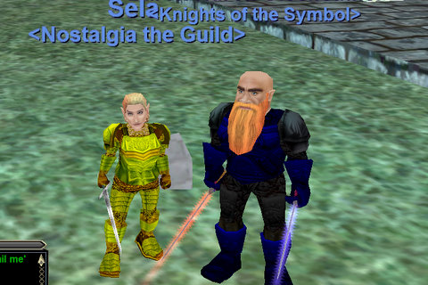

Back to: [West Karana](/posts/westkarana.md) > [2008](/posts/2008/westkarana.md) > [May](./westkarana.md)
# EQ: All armored up!

*Posted by Tipa on 2008-05-08 00:21:23*

The leader of the Tuesday group said we should finish our racial armor quests before next week; I figured I'd get them out of the way today. A variety of wolf furs, various yellowjacket drops, and some iron bricks from goblins.

I started at around 6, finished at 11:30. OUCH. Okay, I thought that would go faster. I did take a couple of breaks. I peeked into the Bazaar to see if I could find any sort of shield that would work for me and wouldn't be considered twinked. But all of them, even the cheapest, were well beyond what we're allowed to use. Same for weapons. Even assuming I had that sort of cash... it would have just been too much.

I had a Lodizal shield on my cleric I wanted to hand to my paladin but that would just be the same thing. In the end, I camped the Shiny Brass Shield. And got a Ghoulbane along with it.

Shiny Brass Shield drops in Crushbone and Ghoulbane in Upper Guk (or via a quest in Butcherblock). How could I get them at the same time?

Well, nobody wants to camp Ghoulbane these days. The Upper Guk camp is tedious and will make your life pretty tough once you become KoS to live frogs. The quest is less tedious, but still involves a fair amount of camping, and is often broken. Oh, turns out there is an NPC in Felwithe that drops both the SBS and the Ghoulbane.

Now, he's not going to waste any time with a level 15 paladin. But against a 75 cleric... no chance. There was someone building faction by handing batwings to one the caster guildmasters, and the person came over to check out what I was doing. Well, since I was going to camp over to Sela once I'd killed it, and didn't want to get into a clickwar with a ninja looter, I zoned it and came back in a few minutes, did the deed, and Sela was well-geared.

Is it twinking? Yeah. But only a little. If Upper Guk groups existed, I could have camped it. If I felt like spending another four hours camping gray mobs, I could have got it that way. Instead, I got it by having a high level character get it for me. But this char is a tank. Befallen proved how bad things get when the tank isn't properly geared. The sword and shield are appropriate for her level, are necessary to hold aggro, and could easily have been (and probably was) worn by level 15-20 paladins seven years ago. This sort of thing would have been what you'd be expected to bring to a group, as a tank. People leveled far more slowly, and had a chance to camp their gear. Even a nostalgia guild can only take it so far.

I don't like bending the rules, so full disclosure here.

I did camp the armor components legit, though as the night wore on, I cared less and less about beating down mobs to make wasps spawn, and more and more about just getting it done ASAP. So I would gather up a dozen mobs and bring them to the guards at The Wall. When the guards had finished them off, I would bring more. And more. And then the wasps started coming back. Thanks guards :)

Shout out to Kuron, who finally finished his warrior epic 1.0 after what was it, six years? This nostalgia thing is pretty powerful! Big grats to the big guy. I dashed into the picture to show off my racial quest armor as well :)

Two days until Solusek's Eye! I don't want to have to tank with my ranger, but I bet I'll end up doing so. It'll still be fun :)

## Comments!

**[rmckee78](http://otherlivesthanthisone.blogspot.com/)** writes: Glad you got a good shield and sword. Any idea about what kind druid weapon might fill that slot for that time period? I have been looking through items on Allakhazam but have no way of knowing which ones are appropriate for 7 years ago. Is there a stat range that is a good guide?

I do the same thing to get the giant wood spiders to pop in Misty Thicket. I train just about everything else in the zone to the guards so I don't get aggrod by those stupid Giant Scarabs while I am fighting. The spiders still take forever to pop.

---

**[Tipa](https://chasingdings.com)** writes: Staff of the Observers is what I used at your level, well, I was in my early 20s I guess. This is a Runnyeye-based quest, and my guild took two or three groups in to do that quest and a couple of others. Before that, I used a Wee Harvester, which was a Rivervale quest for a 2H shovel. One of my banner pictures shows my original halfling druid character (Etha, she's on Luclin now) with her shovel and scarab armor.

Traditionally, low level druids did that wisdom book quest in Highpass, and the Kerra Paw of Opolla quest for the offhand. This was more or less the standard gear for druids through their thirties. I know Lockjaw in Oasis drops some druid stuff as well. Since South Ro (where Oasis is now) is a hot zone ANYWAY, camping Lockjaw for the Foreman's Tunic and that staff he drops would be very appropriate for people our level. I'd be glad to help anytime, though I think it would be better if I used Tipa, since Lockjaw is pretty hard for level 15 groups.

Past that, the traditional next upgrades were all in Sol B, with the brown chitin protector, black chitin leggings, and the runed mithril bracers. We will (I hope) be seriously farming Sol B when we get to that level. It is just chock full of good gear, from the kobolds, through to the bugs, and on to the fire giants. With a detour through Dojorn for the Golden Efreeti Boots, another druid item (but good for many).

I remember my run through the levels in 1999-2000 pretty well, but I don't really know what they have for current weapons. Given the epic is a 1HS scimitar, keeping your 1HS skill up wouldn't be a bad idea.

---

**Einhorn** writes: Some nice fella gave me the Ball of Everliving Golem MQ for 5K - I originally offered 20K, but after he heard my story about returning after a 4 year absence and always regretting having never finished it, he said "MERRY CHRISTMAS".

.....

After a long pause I said "What does that mean?" and he said "Oh, it means I'll give it to you for 5K". I was delighted, but said "Sir, I understand how hard these are to get, I wouldn't mind paying 20K, and I insist I still do." He laughed and refused. Nice fella.

Oh, and immediately upon completion I had my Sword of Runes ready to go - SPLOIT! - two red swords! Damn it feels good to be a haxor!

---

**[Relmstein](http://relmstein.blogspot.com)** writes: I logged in last Saturday morning to find Lockjaw staring at me. Unfortunately he conned red to me at level 20 and I was the only Nostalgian on at the time so he got to live. 

I feel a little guilty because I've been buying whatever I can in the bazaar every time I save up 50pp. Most of my armor is still the PoK quest armor though I now have a pair of polished steel ulaks. Maybe I could replace them with splintering clubs for this friday night. :-)

---

**[Tipa](https://chasingdings.com)** writes: lol... PSUs are fine as far as I care. If the Blightfire quests and random drops hadn't equipped my ranger so well, I might have spent more time in the Bazaar, but I'm happy with her gear at this level. As goes the paladin, well, it would have been ludicrous to give her the sort of gear that was available. Ghoulbane and SBS were exactly what she needed for gear her level.

Now, if you were dual wielding trance sticks...

We'll get Lockjaw. His loot is too nice to ignore.

---

**Graktar** writes: Lol, EQ has definitely changed a lot. Back when I played it (I think dinosaurs still roamed the earth then) Ghoulbane was ultra-rare and generally only held by level 35+ paladins. Now its a 15-20 thing? Sheesh. My paladin didn't get it until level 30, and even that was technically twinking :p

---

**[Tipa](https://chasingdings.com)** writes: My rogue was in her late teens when she got into an upper guk ghoulbane group back in 2001 or 2002, and the pally there got one. I don't remember the level of the group. I was kinda low for it but I don't think anyone was above their low 20s. Anyway, few people even go to upper guk because of the faction hits and because it's just a really old zone, the ogre/troll newbie dungeon as it is. Back in the day we used Combine weapons. That just won't cut it today.

---

**brellson** writes: hey you hussy ----

who's that dorf on your arm? i thought we were an item.

---

**[Tipa](https://chasingdings.com)** writes: The dwarf in my arms can never replace the dwarf in my heart :)

---

