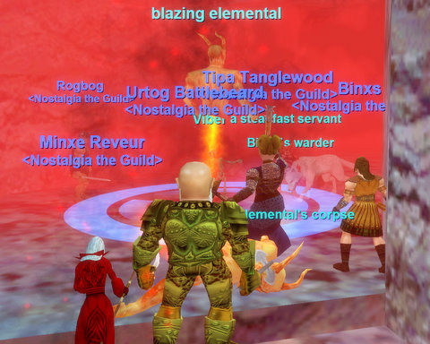

Back to: [West Karana](/posts/westkarana.md) > [2008](/posts/2008/westkarana.md) > [May](./westkarana.md)
# EQ: Death by Goblin

*Posted by Tipa on 2008-05-10 01:50:57*

The goblin spawner got stopped up. That's the only explanation why we were sitting in the King room in Sol A, mindin our own business, when suddenly seven, eight, ten goblins were dancing on our lower intestines. Between sudden goblin drop ships landing troops wherever we happened to be, having to keep apart from the other group, and the powerlevelers who used the place as their private reserve... well, by the end of the evening, corpses were piled high at the entrance, the goblins were very well fed, but most of us were pushing 30... and we had fun.

Sol A was the first place we've gone where we weren't the only people there. To their credit, the powerlevelers tried to stay out of our way, but there were so many of them...

In a pickup group, dying so many of times could only have ended in a lot of bad feelings. With a group of friends, taking risks, having fun... it was great. And for all the times we died, there were three times we might have died, but managed to pull it off, and those kinds of battles pay for the rest.

Next week is Butcherblock LDoN, and the week after... Mistmoore Castle.

## Comments!

**[MmoQuests.com » Larger Then Life](http://mmoquests.com/2008/05/10/larger-then-life/)** writes: [...] made a comment on her post about the evening, “In a pickup group, dying so many of times could only have ended in a lot of bad feelings. With a gro...,” which is exactly right. Sure after the third death in a row maybe we were feeling it [...]

---

**[Davic](http://www.dcstanton.com/EQ2blog)** writes: It was a good time though I am really growing to hate the way lots of stuff in EQ has this massive fog everywhere. Even with the clip plane all the way up its still hard to see in some places. I guess its part of EQ's charm but its really part I could live with out lol

---

**[Relmstein](http://relmstein.blogspot.com)** writes: My group had better luck at the bar in SolA though we had a couple of our lower levels die on the way there. Once we had it cleared it out though we got a couple people close to 30 and our low level 19 made it to 26 I think. After the bar camp didn't produce any rares we headed back out and managed to get the Goblin Foreman and Kindle. The Foreman's tunic was actually an upgrade for 3 people and we had a nice /rand 100 moment. We got a little greedy after Kindle and tried to speed it to the Goblin Guard Captain's room before someone had to leave. Ended up with a bad fight with a at least one goblin healer and had to succor(right spell name?). All in all we left few bodies at the entrance of the zone.

---

**[Tipa](https://chasingdings.com)** writes: Heh.... yeah, we were envious of you guys. You had two healers, which was lucky. Coldheat was overwhelmed.

Well, I hope we don't blow through the 30s in two weeks. I'd like to go to Dalnir or Droga before we hit the 40s, and we already have BB LDoN and MM before then. 40s, of course, will be Sol B, LGuk, ToFS and Kaesora!!! 50s Karnor's, the Hole, Velk's, Howling Stones and Old Sebilis. 60s... Kael, BoT, I dunno. We'll be merged with the server population by then.

---

**[Relmstein](http://relmstein.blogspot.com)** writes: I'm having a surprising amount of fun and will probably keep my subscription active even with AoC going live. Just having an active group experience where everyone is leveling around the same pace makes these games a lot of fun. I'm deffinitely looking forward to Mistmoore, Kaesora, ToFS and The Hole. I can't for the life of me remember what zone Velk's is though it sounds faintly Velious like.

---

**[Tipa](https://chasingdings.com)** writes: Velketor's Labyrinth is in the Great Divide in Velious. Invisible spiders and slippery ramps in front, ice kobolds above and below, golems and giants in the back. It was "the" place to be in the high 40s -- lower 50s.

I'm definitely having a blast :)

---

