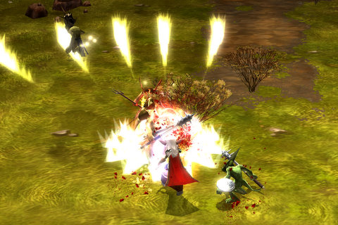

Back to: [West Karana](/posts/westkarana.md) > [2008](/posts/2008/westkarana.md) > [May](./westkarana.md)
# Sucked in by Mythos again

*Posted by Tipa on 2008-05-12 08:07:19*

There's a fine line between 'research' and 'ah, what the heck. game on!'. I crossed that line several times yesterday.

Wanting to check out any recent Mythos changes (and there are some coming soon), I logged on, intending just to run around. But I wasn't the same person that was just casually playing and had been stalled at level 20 for the past few weeks. I have Kanthalos at [MMOre Insight](http://mmoreinsight.wordpress.com/2008/04/28/new-mythos-review-42808/) to blame for this. I'd originally built my Bloodletter up the Crimson Hand (pet) line and hadn't really branched out from that. This turned out to be an ever less of a good idea, since I spent ever more of my time keeping my pets alive and resummoning them. Eventually I would just wade into melee myself and just ignore the pets. When Mythos added skill respecs, I respecced to Martialist, the weapon spec. That's when my hybrid spec really started to hurt, since I couldn't wear the best armor or wield the best weapons.

But I'd been playing all wrong ANYWAY. My pet spec had taught me to carefully weigh my pulls and to not get over my head. My NEW spec -- where rays of death power strike mobs, who then send out their own rays of death power -- rewards over pulling. Pull enough, and even the worst boss mob dies, instantly. Aside from certain Zone 3 dungeons where mobs snare you and silence you, preventing magic or potion use, clearing a mob-filled dungeon room was as simple as running a circle around it, then firing a single blast into the center. Mopping up strays took just a few more seconds.

I got three levels in about as many hours. I'd mostly skipped Zone 2, but Zone 3 is annoying with those snare/silence mobs and Zone 2 was there to help :)

The other thing Kanthalos taught me was how to game the Briss quests -- these are repeatable, randomly generated quests which offer one of three random rewards. Usually they are junk, but occasionally he has something nice. I used to grab one occasionally, do it, get the crappy reward and sell it immediately. Turns out you can accept and abandon his quest (and those of other similar quest givers), and keep on asking for a new one until something you like is offered. Since I have very little luck going -- most of my gear has either strength, dexterity or both on it to support my hybrid spec -- I don't get very much purpose+ quality loot in the normal course of a dungeon run. Briss and his friends made sure I was well-geared... except for the pants.

Those are a problem. So I respecced my crafting line to legs and am farming the components for the best pants I can make. Unfortunately, it will be tough making pants with all that strength on them...

I completed another couple crafting quests. I'm currently on one requiring a specific kind of ectoplasm, of which I have found precisely one. I think I need about twenty... and it only drops in Zone 3 dungeons to boot.

I have never grouped with anyone in Mythos. Mythos' major failing in my opinion is that it plays just like a single player game. Flagship is going to be making it more MMO-ish, but with no reason to group, why would I? I've soloed lower level epic maps. It's still the same game. I don't think I have even ever spoken to another person in game, aside from asking questions in the general channel.

Of course, I was trained by Diablo II to see other players as cheating semi-literate jerks, who would alternately reward you with duped loot or kill you where you stood. Still, there is as little need to group in Mythos as there was in D2, and so, solo I'll stay. Perhaps if I was playing on Elite mode, as so many players seem to be these days, then the need to group would come along with it.

After the character wipe, I might give Elite mode a shot.

## Comments!

**[Tipa](https://chasingdings.com)** writes: Here's the post I was alluding to above:

http://www.massively.com/2008/05/12/whats-coming-for-mythos/

---

**[Genda](http://www.thegrouchygamer.com)** writes: I haven't really been following this. When is it supposed to go live?

---

**[Lishian](http://lishian.wordpress.com)** writes: Mythos chics are hot

---

**[Tipa](https://chasingdings.com)** writes: No clue. It's been in beta for ages. I imagine open beta will coincide with all the new changes, though I hope they give us closed beta testers a week or so to try it out before going open. They've been advertising open beta as "Real Soon Now" for at least a month. I'm guessing a June or July launch, but that is purely a guess, nothing more.

---

**[thallian](http://thallians.blogspot.com/)** writes: kewl shots! I have been meaning to try this game out.

---

**[Rick](http://slashrandom.wordpress.com)** writes: This is the one beta I haven't been able to get into, darn it. I'm looking forward to checking it out eventually.

---

**[Kanthalos](http://mmoreinsight.wordpress.com)** writes: Thanks for linking me :) As for elite mode, I prefer it. It's much more fast-paced and exciting than regular (not to say that regular can't be fun.) I'm glad you're enjoying yourself, and hopefully I'll catch you in game some time. What are your toons names?

---

**[Tipa](https://chasingdings.com)** writes: My character's name is Nashuya. My Gadgeteer is Dinara, but I rarely play her.

---

