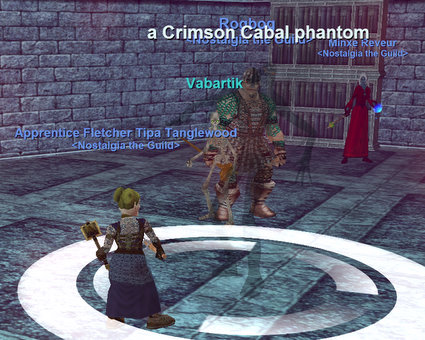
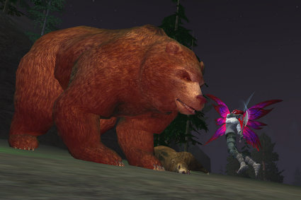

Back to: [West Karana](/posts/westkarana.md) > [2008](/posts/2008/westkarana.md) > [May](./westkarana.md)
# Nostalgia: Paludal Caverns, Mistmoore LDoNs and ... Darklight Woods?

*Posted by Tipa on 2008-05-17 08:34:20*

Last Tuesday, the second progression gathered for our second time in Paludal Caverns. Back In The Day... I start out so many sentences about the EQ groups that way? And yet, you really can't go to these old places without saying that a lot. Every camp we moved to carried with it a dozen memories. Here's the place I ran into Jaasur who restarted on Stromm when it opened, same as I did, but didn't stay with it. Over here was the bandit camp where I really learned how to play a cleric. Here's the small rise where two groups would chain pull the bandits. Here's that icky disease crud that made clerics (again) so incredibly popular in PC. In all the time we were there, we were the only group.

We had just one death, when we accidentally left an AFK person behind and he got Teh Killt by the fast-respawning fungus monsters. For the rest of the night, we'd use his looted corpse, tied to a stout rope, to lure monsters out of hiding. Nothing brings monsters to the table like the sniff of high elf pâté. 

Experience in the caverns was as good as ever, and after a slow start, more people arrived and we ended up with a full and very fast- and over- pulling group. Most of us ended the night in the area of level 20; even though I took an hour break in the middle, I still ended up over the weekly level limit at 21. Hakiko, the Tuesday progression group leader, has allowed Blightfire quest armor for next time, when we explore the Estate of Unrest. So that's something I'll have to get working on.

The Mistmoore LDoNs didn't disappoint. They aren't the most challenging LDoNs -- that honor goes to the Guk LDoNs -- but they always have been the most intense. We didn't have enough for two groups to start, but as we did our first run -- a normal difficulty romp -- enough people showed up to start a second group. Relm, as usual, graciously took over the tanking duties for the second group, and as usual, completed two LDoNs while we in the first group were dragging our feet through a hard difficulty number.

Afterward, enough people had to leave (or get food) that we were able to do one final hard run. One particularly bad fight was saved by our dear old friend, the Chaotic Jester. Coldheat the cleric, and Minxes the necro, were both entirely out of power and we still had several mobs of an overpull to take down. I summoned the jester, and the first thing he did was restore all of Coldheat's mana. And then he did the same for Minxes. And then he tried to get us to eat poisonous bread because, of course, he [giveth with one hand and taketh away with the other](http://www.giantitp.com/comics/oots0557.html).

Even though EQ2 is perhaps too new to really succumb to Nostalgia, still, I'll never turn away a chance to create another alt, so I cloned my Arasai, Winterwing, once again, and brought her into the world of Norrath anew as an Arasai assassin, Brightknife. She fights by flickering in and out of visibility, flitting about, and striking from a dozen directions at once. Her dps is pretty incredible, but when it comes to tanking, well, let's just say I'm desperately waiting for Cheap Shot -- the brief stun -- to come back up so I can get behind and unleash a devastating backstab-stealth-BIG backstab combo that is usually all that separates me and humiliating defeat. Only have the armor and weapons picked up from Darklight Woods quests and apprentice I combat arts, though I hope for that to change if I can ever get SOE to transfer my necro/jeweler over. It keeps FAILING. So she still is entirely untwinked, sitting at 13 with 3 AAs, and thinking about heading over to Timorous Deep.

I'm skipping out on the latest games because I'm still having fun with the old ones. I do understand why people want to be playing the new shinies. They're new and shiny! I want to as well! But a game has to be EXACTLY what I want before I'd be willing to give up games and friends in order to start entirely over. And I just don't get that feeling with this year's offerings. If Spellborn is as incredible as it looks, I may try to entice some friends into giving it a shot with me, but that's not something I need to worry about until next year. Spellborn is scheduled to come out THIS year, but we'll see. I'm skeptical. Or maybe I just want it to come out next year so I have this year for EverQuest 1 & 2.

If SOE DOES announce an EQ3 for the PlayStation 3, that would be the reason for me to finally buy one. I've been hooked on EQ since 1999; I'm in it for the long haul.

## Comments!

**[stargrace](http://mmoquests.com)** writes: I had a lot of fun (as always) and feel like you do about the new games coming out. There's nothing that really catches my fancy enough to want to give up the $30 station access for the three games I already play (well.. lets face it, two lately. EQ1 and EQ2 have a firm grasp on me). I'm always good to be dragged along to new games with a group of friends though. ;)

---

**[Bryzon](http://bryzon.blogspot.com)** writes: I agree, an EQ3 for the PS3 would be the only way for me to buy a PS3, but hopefully, it'll be pc aswell.

---

**[Openedge1](http://simple-n-complex.blogspot.com)** writes: I played EQ2 today..even though I also have started Age of Conan.
Conan is personally a blast, and quite enjoyable to play. It runs well, and is something new (playwise as well as looks wise)
But, at the end of the day EQ2 is still my game...and it allows me to see if AoC and EQ2 can both be played by such a casual player as myself..
I put in a good 12+ hours this weekend on AoC and have two characters with one at level 11 as the highest...lol....sounds like I got my moneys worth..

Now...EQ3 on PS3?...Yea...been wanting one of those consoles...but the games have been less than admirable..sons xbox 360 still rocks...but, an MMO on one of these would be the ticket to having one of my own..

We will see

Laters

---

**[Relmstein](http://relmstein.blogspot.com)** writes: I wish I could have done a couple more runs of runs, we were blowing through them very quickly. But I was called away for a goodbye to WoW party with some friends. 

http://relmstein.blogspot.com/2008/05/goodbye-to-wow-at-least-for-now.html

In other news Age of Conan early access was extremely stable for me and its turning out to be a lot of fun. I'm mostly sticking with my melee characters Conqueror/Assassin but I have a friend who is liking his Necromancer.

---

**[Crookshankz](http://crookshankz.blogspot.com)** writes: I'll look for you over my next few days off on Najena. If you need anything let me know!

---

**[Tipa](https://chasingdings.com)** writes: I'll probably be finishing up DLW on Brightblade and then moving through TD to get the better armor and some more AAs.

---

