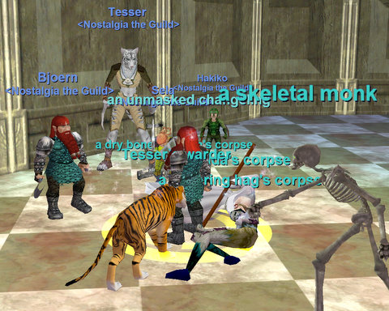

Back to: [West Karana](/posts/westkarana.md) > [2008](/posts/2008/westkarana.md) > [May](./westkarana.md)
# The Estate of Unrest

*Posted by Tipa on 2008-05-21 07:55:55*

Able was I ere I saw Unrest?

This zone has always been a killer and is a killer still. We came for xp and we got the most stressful adventuring night yet. These old world dungeons are nothing but punishment. But, a GOOD kind of punishment.

Hakiko and I spent some time just sniping the occasional mob from inside the mansion as people showed. Aside from a lack of DPS, no problem! How hard could it be? Well, not really that hard... until we went upstairs to camp the Bar. The Bar was one of the first real Unrest camps back in the day -- pro groups would camp the Tower on the floor above, and pull the Bar and surroundings there. Well, we camped the Bar and pulled Tower, so not that much difference.

Breaking in was hard. There's only one safe spot in the entire room, and if anyone strays outside it, Bad Things happen. Fada died, again. Wherever we go, mobs have a special love for Fada. I had just dinged 22 on my paladin and had the ability to rez, if not the spell. Fada bought me the spell on the way back so I could at least call dead players back to their bodies for rezzes later. Once Fada returned, we fought our way back out, having dinged a couple of levels on bar mobs. I ran over my daughter's clerc, Lytia, gave rezzes and temperance all around, and back in we went. This time, nothing would stop us until we reached the basement and had shiny new pairs of Dwarven Work Boots for everyone!

Our first real basement pull was five or six mobs, two or three of them a bright, cheery red. Somehow we survived. It was the night's greatest victory. We came to the blood pool with the illusory floor and just as I finished reminding the group that in EQ1 the middle is trapped while the edges are fine (it's the opposite in EQ2), I stepped in the pool, fell through, brought back an add which brought a couple more and then we got some from behind and despite that all, we did really well.

But then things started going less well, and Hakiko took us back to the zone. Saved with just slivers of life left. Nobody died, and that's about all we could say about that. We spent the rest of the night just pulling mobs to the back room and killing for xp.

Bjeorn the Berserker killed his doppelganger twice; it dropped a nice aug both times. Those augs and a bunch of LoN playing cards were the major loot for the night, though we did get a mage epic bit (hmmm, did Fada loot that? I hope he did) and some Festering Cloaks.

Fun night! Sounds like next week, we delve into Najena's dungeon in Lavastorm. That was one of my faves. Here's hoping Drelzna and Najena have their bags packed and their loot arranged in nice piles. Just less painful that way for everyone.

## Comments!

**[stargrace](http://mmoquests.com)** writes: Wow. 
Sounds like it was incredible fun!

---

**[MmoQuests.com » Dainty - The Rogue](http://mmoquests.com/2008/05/21/dainty-the-rogue/)** writes: [...] was also the Tuesday night Nostalgia run, they headed to Unrest and you can find Tipa’s amazing write up of the event. There’s still some time to join both the Friday and the Tuesday groups - and [...]

---

**Einhorn** writes: Great, now every time I come to the blood pool I'm not going to be able to remember where to stand. Heh.

---

**[Tipa](https://chasingdings.com)** writes: EQ1: Walk around the edges.

EQ2: Walk through the middle.

:)

---

**Loredena** writes: Sisca (Bjoern) and I (Tesser) had a blast! I had forgotten how much I enjoyed Unrest. Funnily enough, we spent a lot of time in the bar and the tower, but I don't really remember the basement. I didn't remember that pool at all.

---

**[Tipa](https://chasingdings.com)** writes: Not far from where we ended are a couple of rooms of tentacle terrors and other nasties, and the the ghost dwarf who drops either the Jagged Band or Dwarven Work Boots, both of which were highly prized back in the day; the DWBs slightly more. Joining a group in the basement meant waiting for the groups along the way to clear it of mobs. Usually a group would make it there and start the camp, then as time wore on, people would start to leave (someone winning DWB would have a RL problem come up forcing them to leave within minutes), and then the group would eventually wipe because they couldn't find replacements who could get there and couldn't keep up with the spawns. This would usually end with someone training the ghost and every spawn along the way out to the courtyard, where they would be killed, after which the ghost would merrily float around the zone killing everyone until players got organized enough to take him down.

---

**thed** writes: man that is good stuff, I just came back to eq and started up a bard and am planning to hit up Unrest. I haven't played in about 4 years, but figured it would be fun and reading your posts bring back good memories. back in 99 I received my surname from the GM in Unrest, and then promptly got trained =) DWB were amazing. I envy yall for doing the nostalgia run.

---

