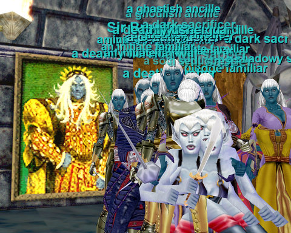

Back to: [West Karana](/posts/westkarana.md) > [2008](/posts/2008/westkarana.md) > [May](./westkarana.md)
# Return to Mistmoore Castle

*Posted by Tipa on 2008-05-25 15:03:35*

Something I've seen time and again as we revisit the happy memories of long ago: The more things change, the more they remain the same. Sure, we're older, wiser, more expert players; but put a couple groups of characters in regular gear in an old zone and all the old problems are going to crop right up.

There's one of our smaller pulls in Mistmoore, up above.

The place is a slaughterhouse. Tantalized by easy pickings near the zone, we moved cautiously in, not knowing that the main healer for one of the groups was AFK and the 25 shaman was doing his level best to keep people alive. Stargrace, who had leveled a rogue at top speed from 1-35 in about two days to join the group, had to sit her out and play her cleric. After many wipes and people having to leave, we eventually were down to just one group... and we did our best... but there's just no way of pulling just two or three without a feign death puller. Well, I guess I could have invis'd up and gotten lull targets for Ishbel, but we were pretty frustrated by all the deaths.

I'd hoped to have one group go do the royals/garden and another head toward the maid/butler area, but none of us got anywhere near our goal.

Mistmoore Castle > Nostalgia.

We gave up and finished out the night with a hard Mistmoore LDoN, which also handed us a wipe at one point. But we DID finish it. In the end, I gained two levels when five is normal. I doubt anyone else did better. We might have done better if we'd moved together as two groups, and that's something we may do in the future.

So long, Mistmoore. I don't think we will return.

See, what gets me is that I remember just running through these places and just kicking butt. But I may have been in my 40s at the time.

Nonetheless, level 38 isn't anything to sneeze at. We are approaching the halfway point of our journey.

Afterward, I logged in my cleric. Brita, and joined Stargrace on her enchanter and Kuron the warrior, and we did unmentionable things to the Queen in Stonehive. Death, death, death to the Queen. She died lots (she respawns in 15-20 minutes). We took on her Advisor, the Wing Commander (IV?), and Alchemist for Kameeko's Drakkin illusion... anything we could find. And this morning I logged in and proved to myself I could kill her alone. It was slow, but I did it.

Brita > Bixie Queen. And the cheers were heard all the way to Misty Thicket.

## Comments!

**[stargrace](http://mmoquests.com)** writes: Stone Hive was awesome. 
I wants to play more.. 

LOVE the trains.. wait.. no.. not love.. 
Used to them though, I suppose.

---

**[Toldain](http://toldaintalks.blogspot.com)** writes: It's been maybe 4 years since I've been in there, but I don't think I would have dared going into the main castle Mistmoore below level 45 or so. At level 50ish we could manage it with 3 people or so, in part because the aggro radius of the mobs there was so much smaller by then, and in part because I had pacify and mez.

---

**Graktar** writes: I'm continually boggled by how quickly you guys are leveling. I played a paladin in EQ from shortly after release for about a year before finally quitting in frustration at how slow it all was. I got to level 33 in all that time. A year later I found myself unemployed for 3-4 months and with nothing better to do resubscribed and started leveling a ranger. I got to level 30. Now you can get to level 35 in 2 days?!

---

**[Tipa](https://chasingdings.com)** writes: We are actively and sometimes fruitlessly trying to SLOW DOWN leveling. EverQuest is not the game it was. Leveling has been greatly speeded.

Yeah, I'm 43 and got two levels yesterday BY ACCIDENT. How wild is THAT.

---

**Graktar** writes: Yeah I read that in the other post. That's CRAZY. My friends and I might have kept playing had it been as easy as that. Most of us aren't gluttons for punishment (except one friend who stuck with his druid for over 2 years). Alas, we've long moved on at this point.

---

