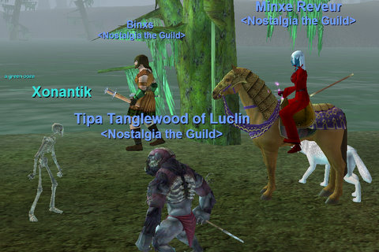

Back to: [West Karana](/posts/westkarana.md) > [2008](/posts/2008/westkarana.md) > [May](./westkarana.md)
# A Shrouded Experience

*Posted by Tipa on 2008-05-27 22:39:32*

Because people occasionally miss our Nostalgia nights, those who make all of them have outleveled those who do not. I, alas, not only not missed a night, but I sometimes do quests and group with guildies on other nights. The result: Some people were still at level 30 when I hit 40 and 41.

I wasn't sure how to get back in level range. Dying a million times to delevel isn't something I ever want to do. What I want to do is just turn off xp, or have it all go to AAs, but you can't do that at 41.

The solution turned out to be pretty obvious, once I thought about it. Use EQ's Spirit Shroud system to transform into a lower level character. I spent a long time looking over the suggestions, and decided upon the Kobold Cleric. It levels into a Kobold Rogue, a Minotaur Warrior and lastly, a Minotaur Berserker. I could definitely play a minotaur swinging a massive axe.

There was a group forming in the Moors, so I shrouded down to a 30 cleric, shoved all my monster points into direct damage and improved healing, and ported down. Stargrace on her necro was right there, and Woous who refuses to join the guild was with her. Malfi joined us as soon as he turned in some armor quests, and Binxs came along soon after. It was a kick-butt Nostalgia group, and the Moors is a hot zone, so we set down to killing.

I was getting xp messages. but my bar wasn't moving. "Groovy," I thought. "I must be too high a level, so I am getting no xp!". My shroud was xping slowly -- ending at 24% through the rogue shroud -- but it was all good until we finished and I removed the shroud. And dinged TWICE. Level 43 now, worse than ever. I am going to have to shroud continually until everyone catches up.

Sigh.

Well, at least they DO have the shroud. I can choose a level 35 shroud Friday, hopefully having the rogue by then. I can't wait until everyone is 51 so I don't have to worry about leveling. We'll be able to set hard limits and make them STICK.

Until then... don't be surprised if I look like a kobold in screenshots.

## Comments!

**[Karen](http://www.journeyswithjaye.com)** writes: Heya Brenda. I have a few EQ2 questions for you, but I can't seem to find an email to contact you. Can you drop me a line when you have a chance? I'd like to pick your EQ2 brain a bit if you don't mind. Thanks!

---

**[stargrace](http://mmoquests.com)** writes: Eek it's a kobold squish it squish it! 

I had a blast last night, as always. Having so many alts has its benefits, though I most certainly am eager to be able to concentrate on just one character, and not four. Really looking forward to 51, as well.

---

**[stargrace](http://mmoquests.com)** writes: Oh, and I'm working on Woosao. Slowly. I think he's been scared by previous EQ1 guilds, or something. Didn't have an issue joining the EQ2 Nostalgia guild, or the guild in Vanguard! Just EQ1 he's hesitant at. Sucks, because he's on every Friday, too.

---

**Einhorn** writes: I'm going to be a bear for the rest of my EQ1 career.

---

**[Tipa](https://chasingdings.com)** writes: Keep your personal life out of this, please.

---

**[Relmstein](http://relmstein.blogspot.com)** writes: Must .... pull.... myself .... away from Age of Conan to catch up. 

In all honesty where's the best place to level in the mid thirties? I think I might have to buy the rest of the expansions since everyone keeps talking about this Cresent place I don't have access to.

---

**[Tipa](https://chasingdings.com)** writes: It's part of The Serpent's Spine expansion and is the best place to level in the thirties. Blightfire Moors and a level 35+ zone connected to it, Stone Hive, are both hot zones and if you're trying to level, why go anywhere else? It seemed to take about ten minutes a level fighting in our group last night.

The Secrets of Faydwer expansion contains every previous expansion. We'll probably be starting Dragons of Norrath missions at 50 instead of LDoNs, so it will be good to have all expansions. And who knows what the next expansion, Seeds of Destruction, will bring for low levels like us?

---

**Malfi** writes: Good times last night! I too am looking forward to 51 and turning off the xp. Then we'll be able to spend as much time as we want in whatever zones we like the most. I forsee LOTS of LDoNs in our future!

---

**[Rob](http://www.lostaneighth.com)** writes: Must ... resist ... urge to play EQ1 again. Who am I kidding? I have never been known for heroic levels of restraint. Just out of curiosity, is it still possible to join the guild? I wouldn't expect anyone to wait for me to level up or anything silly like that, but having a group of like minded folk to chat with while in game would be very nice.

---

**[stargrace](http://mmoquests.com)** writes: Of course! There's always room for more, http://nostalgiatheguild.org/ and register on the forums, and say hello! There's typically always someone around to invite.

---

**[Tipa](https://chasingdings.com)** writes: We have new people join all the time, but leveling is so fast it typically doesn't take long to catch up. We have two different progression groups, and the lower one is at level 25 at the moment. It takes only a couple of hours to get there (with help) these days.

---

**Loredena** writes: Looks like you all had fun! How does the shroud work? Is there something you need to purchase (besides the expansions) to do it? My cleric is on another account -- might be interesting to shroud her down with Callendra and Soaridor one night, and see if that lets her gain AAs.

---

**[Tipa](https://chasingdings.com)** writes: Nothing to purchase. You can /claim a special gargoyle shroud. But you just hail the spirit shroud giver (of which there are several in PoK) and you can choose among the base forms and the ones you have unlocked. I am working on unlocking the kobold rogue for Friday. You can shroud down in increments of five levels up to your current level.

---

