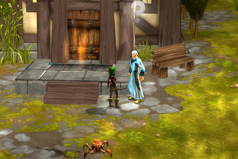

Back to: [West Karana](/posts/westkarana.md) > [2008](/posts/2008/westkarana.md) > [May](./westkarana.md)
# Mythos' Overworld goes into test

*Posted by Tipa on 2008-05-29 10:58:46*

Spent some time in IRC and on the forums waiting with a lot of other Mythos fans for the rumored arrival of Mythos' Overworld, which turns the heavily-instanced game into a game which rewards exploration and wandering about in the same way Oblivion does.

I managed to get it patched (finally), play it for awhile and [do a quick write-up about it](http://www.massively.com/2008/05/29/a-first-look-at-mythos-overworld/) before I collapsed into bed. [So check it out](http://www.massively.com/2008/05/29/a-first-look-at-mythos-overworld/) :) I'm really excited about this game.

I'm recovering from a tooth extraction before I return to work :/

## Comments!

**[stargrace](http://mmoquests.com)** writes: *hugs* Hope you're feeling better soon, the tooth extraction bit doesn't sound fun at all.

---

**[rmckee78](http://www.otherlivesthanthisone.blogspot.com)** writes: I did not know they were going to do this. This is very exciting, lack of an overworld was my only real complaint with this game.

---

**[Tipa](https://chasingdings.com)** writes: Still kinda woozy from the drugs. If I start feeling anything when the drugs wear off, I brought a bottle of Tylenol to work with me :)

---

**Einhorn** writes: *shudders* Looks too much like WoW...me no like...BAD JUJU! *slashes rose thorns across own face to thwart evil Loa*

I hope you feel better soon. I'm going to kill Margyl Darklin and fetch you a Golden Bandit Tooth to replace it with!

---

**[Tipa](https://chasingdings.com)** writes: Well, I have no problem with WoW graphics. In fact, while playing, I don't really notice graphics, as long as they are past a certain point. I think EQ graphics look great -- even the pre-Luclin models had a weird low-poly charm. I still would like the camera to be closer to the action.

---

**Gnewton** writes: I had to do a double-take at the screenie! I agree with Einhorn... Bad Juju indeed!

Get feeling better Tipa!

---

**Graktar** writes: Actually playing the game it looks nothing like WoW though, the only similarities are relatively low polygon count and bright colors. That's it. No, really.

I'm glad the overworld finally went in. I thought they had patched it earlier in the week and logged in (after a big patch) looking forward to it, only to find it the same as before. I thought I was bugged or something . . .

---

**[Bildo](http://bildos.blogspot.com)** writes: I got some time in with this on vacation, Tipa, and WOW. Talk about a major improvement over the old world.

I can see a lot of lost hours coming with this one.

---

