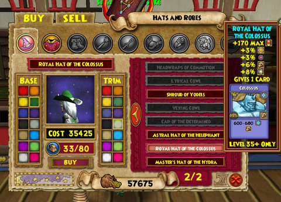

Back to: [West Karana](/posts/westkarana.md) > [2008](/posts/2008/westkarana.md) > [November](./westkarana.md)
# Wizard 101: October 30 update and the Cave of Sorrows

*Posted by Tipa on 2008-11-01 11:22:27*

Still working on Shoshuni Village quests. I cleared out all the quests in the Cave of Sorrows, a place of treacherous paths and ramps and stuff that you have to cross dozens of times, and am now purifying the shrines in the other zone off Shoshuni, Kimise(?) Village. That is home to three shrines that will, when cleansed, weaken the Plague Oni enough so that I can defeat it.

I am 95% certain that the end result of this Life school quest will be the Dryad spell -- a spell that heals for more depending on how many pips you spend on it; the Life school's answer to Balance's Judgment, maybe. I don't even have any heals in my battle deck, and the population in Moo Shu has REALLY thinned out so that I'm lucky to get one or two groups a night, so the only reason to have heals in my deck -- to keep group mates alive -- isn't really a factor.

Guardian Sprite is all I need so far. Now, if Moolinda Wu hands me an upgrade to the Guardian Sprite... I will be EXTREMELY happy. She's absolutely fantastic just the way she is, but in groups I have to use a healing deck which really cuts down on my damage. so the more healing I can pass on to the Sprite, the happier I am.

About halfway through level 40. Since the instance xp nerf makes it nearly impossible to hit 50 (quests run out around 45; you can re-run any instance once more for half xp, after that, no xp aside from killing things for vastly lower xp -- 1000 spiders, anyone?); I figure I'm about halfway through Moo Shu. Dragonspyre is said to be coming soon which will likely raise the level cap (I'd assume) to at least 55, and I just want to be ready for it when it gets here.

All the people now sitting around, done with Moo Shu, waiting for Dragonspyre will all be running the new zone when it opens. I'd rather be able to run through it with people, rather than largely soloing, as in Moo Shu. It was easy to find groups from Wizard City through Marleybone, but MS, perhaps because it is so spread out, just feels empty.

Good news for RMT haters. As of the most recent patch, all the regular RMT clothes Zeke the Shill sells are now available for purchase with regular gold. So now, there's no reason not to have the best outfits you can afford.

The prices are somewhat steep -- the level 35 hat I'm looking at above costs in the neighborhood of 35,000 gold, dyed in the colors of my school. I only had around 50,000 gold (and the gold cap is 99,999), but what else am I going to spend it on? So I bought the hat. I couldn't afford the shoes, but my regular old shoes are nearly as good, so I'm not anxious about it.

Special holiday items or other rarer things will still be sold only by Zeke or his pop-up window loving friend, Spooky Bob. But for all those people who wanted the RMT gear but didn't feel like paying extra for it -- you can buy it with gold.

This is a fantastic solution to the problem. The best stuff is available to everyone. Those who want to spend a little, can just get them without having to farm gold. Not that you need to; once past level 5 or so, you never have enough things to buy that would put a dent in your gold, unless you rely heavily on treasure cards or just must have every pet in the store...

There were a bunch of cosmetic changes and a slight redesign of the quest journal to make it easier to deal with multi-part quests, so it's all good.

Number one question on everyone's mind is, though -- when is Dragonspyre opening? Lots of people are sitting in the Spiral buildings with their Dragonspyre keys gripped tightly as they wait for the mysterious door to open...

## Comments!

**[Tesh](http://tishtoshtesh.wordpress.com/)** writes: I figured it was only a matter of time before they made the Prospector items purchasable with gold. Looks like I'll have ot dip back into the game. Good to see someone else enjoying it!

---

**[The Friendly Necromancer](http://thefriendlynecromancer.blogspot.com)** writes: I like your screenshot of the Cave of Sorrows, Tipa. I was there this morning and had a good time trying to figure out the pathing of the mobs there.

---

**[Tipa](https://chasingdings.com)** writes: Yeah, that was tricky. I finally realized the mobs were mostly blind, and you could easily walk in the footsteps of one without catching the eye of the one following. Though I did get caught, once or twice. Or three times.

---

**Demon** writes: how do you get there?

---

