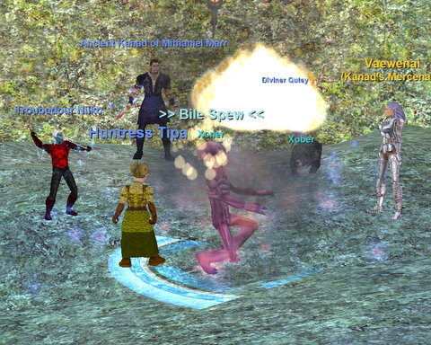

Back to: [West Karana](/posts/westkarana.md) > [2008](/posts/2008/westkarana.md) > [November](./westkarana.md)
# EQ: Nostalgia enters Vex Thal!

*Posted by Tipa on 2008-11-01 13:29:35*

Yup, last night we entered Vex Thal for the first time as a guild. Aten Ha Ra, your days are numbered, etc. (I don't have to mention that we were trying to zone off a train, right? Good!)

I've always had a deep and abiding affection for Vex Thal. What's not to love? A city devoted to the worship of a four-armed goddess who dresses like a Rocky Horror refugee and uses her moon as a footrest for her spike-heeled, black leather boots?

|  |  |  |  |
| --- | --- | --- | --- |
|
  |

  |

  |

  |

Since we'd been doing a lot of xp nights recently, we thought it was time to just have a fun night. Not about loot or xp so much, but just about going to some of the fun, old places we remembered. So last night, we traveled to Luclin's high level xp zone, Umbral Plains.

As well as being the gateway to the raid zone of Vex Thal, Umbral Plains is just littered with named mobs. Back in the day, their loot was pretty sweet. Unfortunately, it hasn't been upgraded for a very long time -- never, really -- and it wasn't a surprise to find ourselves the only people in the zone.

But even given all the nameds we killed, the night really belonged to the mercenaries.

As in, "What's up with the stupid MERCENARY?"

We were very impressed when, on the first named of the night, Gantru Moltar, the mercenary warrior (one of the many who share our Main Tank position) turned off her attacks when the mob enraged and even turned her back to it. When enrage ended, she turned around and began tanking again.

It takes PC warriors MONTHS to learn that! You could always tell the new raid warriors because they would all die simultaneously when the mob enraged. Some of them would even yell the traditional warrior battle cry as their life dropped instantly from 100% to 0% -- "WHERE'S MY HEALS? ARE YOU FUGGIN CLERICS AFK?"

Not the merc, though. She handled it great. I was curious how two mercs would handle rampage...

After that great start, though, things went less well with them. We had maybe six adds at one point; with two enchanters, that wasn't a problem; but it totally confused the mercenary, who eventually just gave up and refused to fight any more. (I imagine plat was still being charged, though). We eventually coaxed her back to the front, and she reluctantly, I thought, started to do her job again.

On our way to the fire caves, someone got aggro from the elementals outside Vex Thal, and that sparked our run into VT -- past Rumblecrush. That ended in death for some. I could get Sejal's corpse, but Qutey had gone link dead and after a bit, decided not to try coming back in.

That left us without our main healer, and a corpse. Once Qutey left the group, though, we had an opening for the mercenary I had hired before heading to Umbral Plains -- a dark elf cleric. She joined the group, buffed me, rezzed Sejal and buffed him, and for the rest of the evening, did her job superbly.

The warrior, though... really wasn't in the mood to fight. Looked to me like he'd gone AFK, and I (and Sejal) ended up tanking more often than I liked. He did eventually cheer up for the boss and do his job/ I guess that's the "Confidence" score -- if they feel they can't do well, they do nothing? The first time a merc cleric decides she isn't interested in healing any more is the last time I hire a merc cleric.

At least I can still tank somewhat.

Anyway, a fun night all around. Next week -- either XP or the Temple of Cazic Thule.

## Comments!

**[Hudson](http://hudshideout.blogspot.com/)** writes: Do you still need to be keyed for that zone?

---

**[Tipa](https://chasingdings.com)** writes: Not to enter, but you do need to be keyed to walk around freely in the palace. As I found while collecting screenshots for this post :P My rogue (and screen-shotter extraordinare) has all three of the interior keys, but couldn't get through the locked, inner door without using them.

Vex Thal still has some unique loot, umatched ever today as far as I know. I can't say it would be FUN to do it these days, because it was always a boring slog and without doing tricks with rogues dragging mage corpses and rezzing with a rez stick, having to kill ALL that trash -- /shudder.

Almost everything there spawned a mob when it died. SOOOOO BORING.

---

**[Ogrebears](http://www.ogrebear.com)** writes: I never did get to see that zone.... and i am starting to feel a little jealous

---

**Sejal** writes: VT was one of my favorite zones.. Never a dull moment for a chanter there!

---

**Egat** writes: I joined CE during it's VT days and still miss the fun and excitement. Yes, I said fun and excitement. Killing trash is fun!

---

**[wilhelm2451](http://tagn.wordpress.com/)** writes: Wow, sounds like the mercs are working out well.

Do you have to buy the new expansion to use them, or are they available to cheapskates as well?

---

**[Kasul](http://shatteredblog.wordpress.com)** writes: I don't miss VT, feel like I got all that I wanted from there... but that doesn't mean I wouldn't be up for clearing through it with a small group to see how far we could go. A night in VT used to be a long night, but for nostalgia's sake I think it would be fun!

Probably a bit easier than doing a planes of power raid too. Several of those require offtanking, and excellent crowd control in addition to well organized heals.

---

**Sejal** writes: "and excellent crowd control"

Trying to say something? :(

---

**[Tipa](https://chasingdings.com)** writes: lol :P

@wilhelm -- they are for expansion owners only. But you can be grouped with one without having the expansion, you just can't hire one.

As to whether or not we'll actually be raiding VT -- if we get more people, who knows? We have the crowd control -- and it IS excellent -- but we need dps and LOTS of it. Just to get the key to open the front door requires a fight that took a two group mini raid fifteen minutes back in the day.

---

**[wilhelm2451](http://tagn.wordpress.com/)** writes: Fine, make me buy another EverQuest expansion. Why should I stop now?

---

**Sol** writes: Is Nostalgia dead? No love from Tipa's updates since November =(

---

