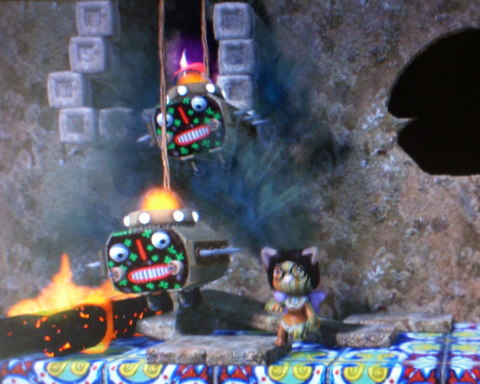
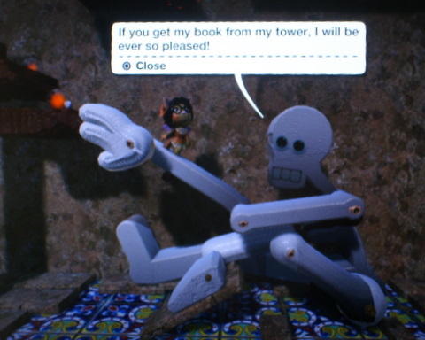

Back to: [West Karana](/posts/westkarana.md) > [2008](/posts/2008/westkarana.md) > [November](./westkarana.md)
# LittleBigPlanet Befallen: Day 1

*Posted by Tipa on 2008-11-02 11:50:19*

What LittleBigPlanet REALLY needs is a command where you can shift EVERYTHING up and over to the right.

Creating a level in LittleBigPlanet is just the same as playing a really good game, because, where DOES that time go? Fiddling with the difficulty of puzzles, figuring out just HOW to make bats drop on someone just after they managed to get past the slamming door, getting elevators to work properly, trying to make it dangerous enough to be fun but not frustrating, playing the damn thing over and over and over again ... it was 3 AM before I went to bed this morning.

Knowing that I'll have to do it all over again for the real dungeon is kind of depressing, because I've put hours of work into it this far. But just like writing (and a [shout](http://mmoquests.com) [out](http://ardwulfslair.wordpress.com/2008/10/30/a-new-project/) to all my NaNoWriMo-participating friends!), I have to admit that everything will be better when I do it all over again.

Hey! Of COURSE it has quests! I had a long explanation for why the skeleton needs his book and how he came to be sitting down here and what happened to his tower, but that didn't fit and was probably boring anyway, so I just shortened the quest to "Get book, I'll help you." One of the pacing problems is that you don't yet NEED his help. The well that he helps you cross is a screen past him, you can't see it from where he sits. That will be fixed in the real one, as well as the little feature where if you jump out of his tower, you land past the well. You could play the entire level and never see the feature that is supposed to be the central challenge of all levels of my version of Befallen.

So, yeah.

That said, creating levels and trying to figure out all the tricks and mechanisms of the game is amazingly fun. And also amazingly frustrating. WHY does the piston that slams the door disappear if I nail the entrance portal to the wall? LittleBigPlanet's subtitle should be "Unintended side-effects".

Stargrace came by and ran through part of it this morning. It was weird seeing someone else play it. I could see she was having trouble with the skeleton puzzle. I tremendously simplified it from how it started, since it was virtually impossible to do, even for me. It's CLOSE to where I want it, now.

I would very much like to import stickers and other art assets from the PC, though. Though maybe it's better this way.

## Comments!

**[Stargrace](http://www.mmoquests.com)** writes: Omg I had so much fun playing through the first portions of Befallen this morning, even though I felt like a dork getting stuck on rocks and getting killed by that bat a million times. Looking forward to getting to play more with it! It's a very surreal feeling to play in a zone that someone else I know has created. 

So, when can I get your autograph??

---

**[Tipa](https://chasingdings.com)** writes: No weirder than reading your novel will be!

---

**[Sente](http://adingworld.wordpress.com)** writes: Sounds like quite good fun both creating and playing it ;)

LBP is not released here yet, will be on Friday. I am definitely going to pick it up next weekend.

---

**TheRemedy** writes: You can take pictures with the playstation eye and make them stickers.

---

**[Lars](http://mmomentofzen.blogspot.com/)** writes: Is your dungeon public? I'd like to try it. I'm getting pretty addicted to LBP now... :)

---

**[Ardwulf](http://ardwulfslair.wordpress.com)** writes: I'm not actually participating in NaNoWriMo - I'm just writing on my own. Up to 2100 or so words as of today. My dialogue is very flat.

---

**[Tipa](https://chasingdings.com)** writes: Writing is hard :) Good luck with it!

---

**[Tipa](https://chasingdings.com)** writes: @Lars No, and it won't be; this was a trial run. I learned a lot from it. But last night, instead of working on it more (I was getting frustrated with the Commonlands intro; I couldn't make my fire beetles work right), I made some dippy birds for a level I am thinking of, though they have to be redone -- they don't scale correctly.

If you see me online (TipaDaKnife) I'll show ya around, though.

---

**TheRemedy** writes: http://www.destructoid.com/image-importing-coming-to-lbp-this-christmas-110154.phtml

---

**TheRemedy** writes: I jumped the gun a lil bit... :(

http://www.1up.com/do/newsStory?cId=3171082

...Sorry

---

**[Tipa](https://chasingdings.com)** writes: Had me excited, there :P

---

