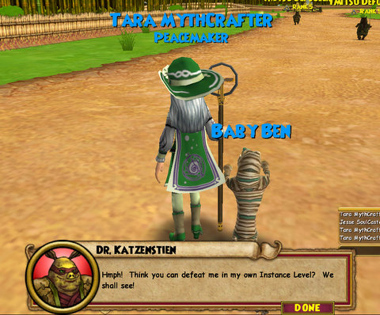
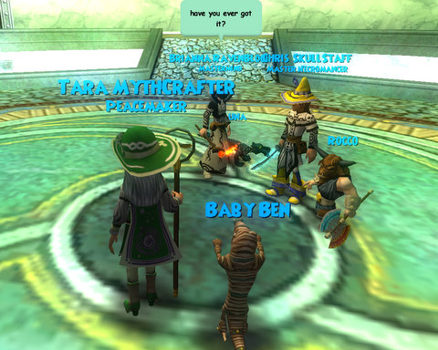

Back to: [West Karana](/posts/westkarana.md) > [2008](/posts/2008/westkarana.md) > [November](./westkarana.md)
# Wizard 101: Shiritaki Temple and the Plague Oni

*Posted by Tipa on 2008-11-03 09:51:20*

Well, apparently, all the demons in Wizard 101 are elephants. Who knew? The Plague Oni went down in the concentrated fire of three wizards after a long, long instance.

I found out why Moo Shu is so dead for me. I was in a low population realm -- AKA server. Unlike SOME games, you can change servers any time you like just by selecting your new server from a list. Wow, changing servers without having $25-50 deducted from my checking account. How is that even possible?

Anyway, I selected the most crowded server, Ambrose, and Moo Shu was suddenly full of life. I finished up my Kishibe Village quests, and sat myself down in front of Shiritakai Temple while I went and got a snack. When I returned, there were bunches of people (um, three) in front of the instance pads; I stepped on, they did the same, and we were ported into the instance.

Dr. Katzenstein greeted us with a warning. With a...? WHO? I thought I killed you back in Marleybone! Oh well, looks like even pretty well polished games like Wizard 101 still has some bugs.

I like to hold off on "Kill X" quests in W101 because you often end up fighting things that count toward that total; sometimes as guards in boss fights, sometimes because you went left instead of right and found yourself in a battle. That was the case in Shiritakai, when some elemental fights cleared out a couple of quests I hadn't done yet. It's nice when things work out that way.

It's a long, long level, so we split into two groups for some smaller fights and then teleported to each other when finished. That saved a LOT of time. Now that I'm in my 40s (41), it's really cool to see how high level players work together. It's such an incredibly different game. Everyone has pretty much all their spells, so you see the big guns, HUGE magics... and my heals. I got some centaurs out, but they are my last damage spell!

Anyway, even with a nearly full group (someone left along the way), it still took an hour to do the instance. The group leader got his rare sword (you can see him holding it), and I got my penultimate Life spell, which was Dryad, as I guessed. Another spell for the "do not use, ever" deck. Well, it does replace Fairy, it's true, but I don't use Fairy, either. It's usually better to kill faster than to waste pips in heals while the monsters continue to beat on you, I find.

My last spell, which I will get next level, is Sanctuary, a spell that makes all Life spells more powerful for the duration of the battle. Yours, AND the monster's. Put that right next to Dryad in my "do not use, ever" deck. Sure, it would be handy, but not at the cost in pips. Kill faster, less healing needed.

I changed up my outfit a little. Redyed some items to look classier. I was admiring people's outfits in that Plague Oni group, and I was a little embarrassed to be seen in my crappy clothes and unimaginative colors, so I did something about it.

This ties in to what I like and dislike about MMOs. I felt my time, ultimately, in EverQuest and especially World of Warcraft was wasted because I did nothing but play the game the designers decided I would play. WoW is so on rails. Just knowing that I was doing the same things in EXACTLY the same way as millions of other people disgusted me. I was paying $15/month just to move from Point A to Point B and hit Button C for Treat D. Rats in a maze. Rats in a maze. That's all we were. Devs gleefully snickering and rubbing their hands together as we did our parts and sent them our money, just like the people ahead of us had done and the people behind us were about to do.

In Wizard 101, you can look however you like, but more importantly, you can PLAY how you like. Since training points may be freely spent to learn spells from other schools, or to learn utility spells available to anyone, HOW you play is uniquely you. Though as a Life wizard, I have an edge in healing -- I can heal other people, and with power pips can play better heals faster than people who just bought the spells from the trainer -- that's just part of what I can do. In fact, I've mentioned time and again that I don't do all that much healing. By playing my Fire spells, I can become a fairly decent Fire wizard any time I want to play that way. And I'm thinking about picking up some necromancy as well.

Nobody plays like I do, because nobody has the same sort of character I do.

My MMO car has run off the rails, but it's pretty amazing what you find when you leave the tracks. There's a whole 'nother world out there.

## Comments!

**[Tipa](https://chasingdings.com)** writes: Actually, I would use Sanctuary, sometimes. The Jade Oni reportedly has 7,500 health. Assuming I can't find anyone to help (unlikely, he has good drops, but just assuming), then I'll need every point of damage.

And for just running around, I probably will use Dryad. It's a heal you can cast your very first round of battle, which is nice when joining someone's group where they may have low health.

---

