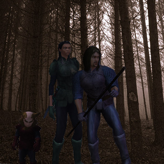

Back to: [West Karana](/posts/westkarana.md) > [2008](/posts/2008/westkarana.md) > [November](./westkarana.md)
# Stout Henry, NaNoWriMo edition: Kneed Before Greed

*Posted by Tipa on 2008-11-04 08:00:37*

*In honor of my friends and fellow bloggers either taking part in the [National Novel Writing Month](http://www.nanowrimo.org/) (NaNoWriMo) or just writing for the pleasure of it, here is a special NaNoWriMo-sized entry. I now have even more appreciation for what those writers are going through :) 29 more like this one? Maybe next year!*

---

Nodding Fields was not the sort of place known for its nightlife. It wasn't all that exciting during the day, either. If it hadn't been Tournament week, even the most tenacious barfly would have stumbled his or her way back home before dark.

“Because of the werewolves?” asked Stout Henry, as he and the thief who had found him stumbling through the forest walked along the cobbled road toward the center of town.

“Werewolves?” said Marta, keeping her footsteps as quiet as she could make them, though given Stout Henry's loud footsteps and louder talk, she needn't have bothered. Habits are hard to break. “What an odd thing to say. Do they have many of those where you come from?”

“Where I come from, we have no werewolves,” said Stout Henry. “I used to live just outside Cotsberry, and we haven't had werewolves in oh, ten years of more. Nope. Vampires ate 'em all, and then the vamps were quite a problem until the, uh, trolls smooshed 'em. Trolls,” repeated Stout Henry, with disgust. “I hate trolls. They take all the good women.”

“Uh huh,” said Marta. “Trolls. Right.”

There didn't seem to be much to say after that, and so they both fell silent. The noises of the night rose around them. The loud croaks, the rapid clicks, the squawks, the rustling of something running through the undergrowth, the rhythmic crashing as something tore through the trees...

“Well, THAT doesn't sound good,” said Stout Henry. He removed his staff from the leather sheathe harnessed to his back, swung it expertly a few times

“Maybe we should have kept talking,” muttered Marta, as she faded into the shadows.

“Aw, come back,” said Stout Henry. “We were just getting to the good part,” he said. “The A/S/L part.” He sighed. “Nobody ever stays for the A/S/L part.”

A small, gnome-shaped shadow separated itself from the forest darkness. “Hello, Stout Henry,” said Daryl. The gnome looked haggard and scared.

“Ognob!” said Stout Henry, suddenly remembering the gnome whom he'd left in the forest, if not his name. “There's more to the quest?”

“The quest?” said the gnome. “You moron. Unless you consider dumping me in the middle of Owlshead Wood was how ANY quest I would EVER give ANYONE would end. 'Yeah, accept this quest, oh ye weary traveler, to abandon me in some random fugging clearing in the middle of Ass Nowhere.' Does that sound like something I, or ANYONE, would ever say?”

“You're right,” said Stout Henry. “I wasn't thinking. You didn't give me gold or treasure or anything. What kind of quest is that?” He leaned on his staff as he thought for a moment. “So, you came to give me the gold?”

“For saving your life, you should be paying ME,” said Daryl. “But, no. I'd gladly leave you – leave you to your DOOM – but that... THING... brought me here to give you a message.”

“So you DID come to give me a quest,” said Stout Henry. “Even though you haven't paid me for leaving you in the forest, yet. What's the message? Kill all the rats in someone's cellar? I like those kinds of messages. You never know what you might find in someone's cellar after the rats are gone.”

“No, I'm to tell you... you know what? Forget it. I'm not playing. I'm going home. Duke doesn't want ME dead, after all. I have no reason to be out here, in the dark.”

“And the cold,” said Marta, who had silently joined the two while they argued.

“Oh yes, and the cold. You know, Marta, you have this REALLY annoying habit of joining people's conversations.”

Marta shrugged.

Stout Henry looked from thief to gnome and back again. “You know her?”

“Of course I know her, moron,” said Daryl. “I'm married to her. Why do you THINK she was following us around in the Wood?”

“Um. Why did she leave you there, then?”

“Oh, she's really good at leaving people,” said Daryl. “Especially me.”

“Really, Daryl,” said Marta. “I knew you'd be fine. Wasn't anything around but that... THING.”

“You could have warned me,” said Daryl. “That... THING snuck right up on me. I never knew that... THING could move so quietly.”

“Heh,” snorted Marta. “That... THING is full of surprises.”

“What is that thing?” asked Stout Henry. Daryl and Marta stared at him blankly. “The what?” asked Daryl, finally.

“I think he means that... THING,” said Marta.

“Well, why didn't he say so?” demanded Daryl. “Anyway, it's dark and cold and I'm leaving. If you want to talk to that... THING, it's waiting for you over on the edge of the forest. I'm done with it AND with you. If you need me, just sit on a rock and spin.” Daryl stomped off up the cobbled road toward the bright lights of Nodding Fields.

“I better go with him,” said Marta. “Best of luck to you.”

“Aw,” pouted Stout Henry. “I was hoping you'd undress, later.”

“Not much to see!” shouted Daryl from up the path. “Marta!”

Marta shrugged at Stout Henry. “It's the ears,” she confided, before padding silently up the road to catch up with her short husband.

The dark closed around Henry like a fist. Even the bright starlight only dimly lit the road. The dark seemed even darker near the trees.

That... THING waited silently for Stout Henry.

Henry started toward the edge of the wood to see what was in store for him.

---

The Cold Beer Inn-side Inn wasn't the best pub in Nodding Fields, nor the cheapest, nor even well furnished. The waiters were unemployed actors who tried their best to be surly and obstinate, but could only manage to snarl half-remembered lines from plays they had been fired from. The owner of the pub had thought to cleverly subvert the advertising of the other pubs by insisting the sandwich board signs advertising “cold beer inside” that stood outside the better establishments, were really advertisements for the Cold Beer Inn-side Inn.

It wasn't the most successful ad campaign ever, but the pub was noisy and crowded despite it. The revelers in town for the Tournament had pushed most of the regulars out of the good places, and so they had come to the Cold Beer Inn-side Inn, where the beer was warm, the waiters yelled poetry (badly), the drinks were watered and overpriced and the floors sticky.

Stout Henry had a haunted, scared look in his eyes as he raised his fingers for another pint. The bartender set another half full glass next to the three others that sat, undrunk, in front of Henry. Daryl and Marta were sitting in a booth by the back wall, arguing about something. Henry ignored them. The bartender demanded payment for the four (still undrunk) pints. Henry looked inside his bag. “Would you take, um, six wolf ears and three toe bones?”

The bartender snorted. “We use gold here in Nodding Fields,” he said. Henry shrugged. “Okay,” said the bartender, “let me see those wolf ears.”

Henry handed them over. The bartender looked at them, turning them over and felt their leathery furriness, then put them in a drawer and headed down the bar to help another patron.

“Ding,” muttered Henry, miserably.

“HENRY!” shouted Daryl. Even seated, Henry towered over the gnome. He pretended not to hear him. “Marta and I are kinda surprised you made it here. I guess your meeting with that...”

“Don't say it,” muttered Henry. “That's really getting old. You could have told me that...”

Daryl smiled sympathetically. “Why do you think they call this Nodding Fields? Look, I know I was a little, um, tall with you back there on the road. Come join me and Marta if you want to talk about it.” The gnome took three of Henry's pints and returned to his booth.

After a few moments, Henry drained the remaining ale and joined the gnome and his leather-clad wife in their booth, taking seat across from the mismatched couple. Daryl pushed a glass over to Henry's side of the table.

Stout Henry sipped at it.

“This is not easy,” said Henry, after awhile.

Marta glanced at her husband, but neither said anything.

“No walkthrough,” continued Henry. “No hints or clues.”

“What did it say?” asked Daryl.

“Say?” echoed Henry. “Did it say anything? I don't know. It was dark. I just kept yelling 'Accept!' at it until it went away.”

“It said I have to join the Tournament tomorrow,” he said, after a pause.

“But,” said Daryl, “you were planning on doing that anyway, after I pulled you out of the hangman's noose.”

“It went on,” said Stout Henry. “It said I can't cheat.”

“Ah,” sighed Marta, sounding distracted as she watched a waiter shout something with a lot of “thees” and “forsooths” at a customer.

“And,” continued Henry, “I can't just skip town, it said.”

Daryl stared up at Henry. “So. You're going to fight, then?”

Henry grinned. “Oh, hell no. I'm skipping town. It told me that I had to go win all but the final round, and then lose. WTF is up with that? I'm not gonna skip out on a ring event right before the boss mob. Nah, I'm gone.”

Daryl shook his head sadly. “It won't go easy with you. I'm sorry.”

Henry shrugged, “It's okay. I pretended to be you.”

Daryl boggled at Henry, and even Marta took interest again. “You WHAT?”

“Yeah, I got down and walked around on my knees. I was really annoying and shouted a lot, just like you. So, enjoy the Tournament, and remember, I'm betting on you to take that fall tomorrow.” Henry's mood lifted. He finished his ale in one swallow, stood up, winked at Marta and saluted the gnome, and went off to the common dormitory in the back to grab a few hours sleep before sneaking out in the pre-dawn hours.

He was roughly dumped off his cot in the middle of the night and hustled out of the inn by four burly men wearing Duke Ferd's green-and-gold livery.

“Aw, F**K” he said. “That shoulda worked! Back to the pokey, eh, boys?”

The men looked at each other and grinned. “Oh, no. No, we have different orders. You're going to that Tournament tomorrow, and you're going to do it just the way that... THING wants it. See, Ferd doesn't pay us enough to put up with the likes of you all the way back to Cotsberry. Nah, you're going to be following a new plan. And at the end of it, you'll be dead, that... THING will be happy, the Duke will be happy, we'll be happy, everyone will be happy! We love it when things work out like that.”

“My friends won't be happy,” said Henry.

“You mean, the gnome and the chick? Who do you think gave us your name?”

---

*What is that... THING? Will Daryl and Marta decide to help Henry? Will Henry bribe Ferd's men with toe bones? The answers to these and many other questions may be answered next week in "Stout Henry: LIVE! From NODDING FIELDS!"*
## Comments!

**[Stargrace](http://www.mmoquests.com)** writes: Hahahaha!
You completely out did yourself with this edition hon, LOVED it. Loving it! Going to re-read it for a second time.

---

**Linato** writes: Just awesome. Really glad I stopped in while having lunch. Keep it up!

---

**[Tipa](https://chasingdings.com)** writes: Thanks :))

---

