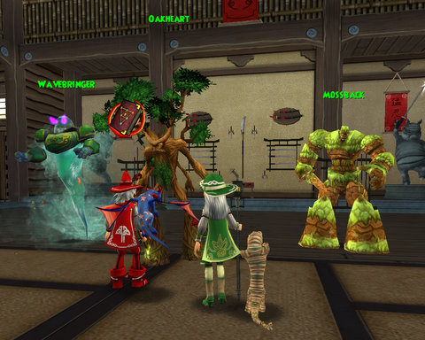

Back to: [West Karana](/posts/westkarana.md) > [2008](/posts/2008/westkarana.md) > [November](./westkarana.md)
# Wizard 101: So, this is what addiction feels like

*Posted by Tipa on 2008-11-06 08:17:18*

I really didn't INTEND to play Wizard 101 all night.

I just thought I'd log on and farm the Jade Oni a bit for my epic robe while watching the disc of Buffy Netflix sent me. Takes over half an hour for me to solo it (it being a 7500 health Life mob that resists most spells I cast at it).

There was someone about to kill her, so I joined in, then I spawned her again and killed her solo. A friend asked for help with Crusher and Meowiarty in Big Ben, so I ported to her and helped with those. After, I returned to the Jade Palace and there was someone hanging around, bored. We got to talking about the end game and the Kensington instance and stuff and he offered to help kill the Oni again (way easier with two people), and yay, got my robe :)

Then he said these dangerous words -- "So, what do you want to do now?"

Correct answer, of course, would have been to say "Oh, I have to log out, lots of other stuff to do!"

Instead, what I said was, "Oh, I have a couple of Village of Sorrows quests to finish up, and you said you needed to finish some optional quests in the Tree of Life?"

And that was pretty much it for the evening. Turns out that Jade Oni isn't the highest health mob in Moo Shu; there's an 8000 health mob in the Tree of Life that I'd never seen before. 

It was getting kinda late after we brought the Death Oni down, so i took my leave and chatted with a friend on Xfire for awhile.

W101 progress: Dinged 44, 45 is definitely within reach, got my epic robe and boots. Somewhat disappointed that the new robes share a model with the RMT robes, just a different color. The boots, though, are nice and are an excellent upgrade from the Marleybone boots I have been wearing.

No new pets, staffs or swords. 

I did sign up for the Shin Megami Tensei ("New -- Goddess Reincarnation") beta, hope I get in :)

## Comments!

**[Beau Turkey](http://www.voyagesofvanguard.com)** writes: I played W101 for a bit and thought it's art direction was SO nice. I didn't get a chance to really get into it, so are you finding that it has depth, and not just a grind? 

 Seemed to me the game was so charming that playing it was worth it to look around! :)

 And anyway, you're and EQ player..you should know what addiction feels like! lol

 Beau Turkey
 www.mmocam.com 

 (I stream my game playing on that site, I think I'll stream some W101 today! :) )

---

**[Tipa](https://chasingdings.com)** writes: I find it fun :) I can't say it's not a grind; after you receive three "Kill X" quests in a row, the word "grind" comes to mind, but since you can't level just by killing mobs, and the number of quests is finite, it's a game which does have a natural ending. It's a chapter based story, and the card game battles are still really interesting. I like the challenge of going up against a Life mob and having to completely change the way I play. I just started working Storm magic into my deck for even more choices in gameplay.

lol yeah... my title was a little late... EQ and WoW after it both had me addicted well before W101 :P

I can't check out your MMO Cam at work, but will check in and see if I can catch you playing W101 when I get home from work tonight :)

---

**[Jaletn](http://www.downloadonlygamer.com)** writes: Tipa, I have to kindly request you stop writing about Wizard 101! I was happy to keep it as a game I play with my kids but if you keep it up I am going to end up jumping in deeper than I have the time for! Ha!

@Beau - a mmocam, what a fun idea!

---

**[Tipa](https://chasingdings.com)** writes: lol... as soon as it stops being fun, I'll stop writing about it :)

Note to self: Use a death magic wand to strip the Jade Oni's death shields. 

Analysis:

The Jade Oni almost completely resists my main school of magic, Life. It is very weak against Death, and I have prism cards I can play which makes the next Life spell I cast against it do Death damage. But it also casts bunches of Death shields, reducing damage from Death magic by 80%. I've had to deal with this by casting prisms (I have only six for the entire fight, the maximum) and letting my Sprite Guardian cast a Rank 1 Imp which triggers the prism and the death shield without making me have to use one of my precious damage spells to do so. Problem is, it still uses up one of my prisms. If I switch to a death wand, which can give up to eight small death attacks that are ADDED to my deck, I can erase the death shields before using a prism/lifeblade/centaur combo to deal upwards of 1K damage. If I buy a death trap, I can increase that to a 2K+ hit with one spell.

---

**Wolf hexweave** writes: Hey,

Can you please help me find a boss that drops the Balance lot? I also need a new Dragonspyre sword please?

I have Malistares Balance cloak, and I dont know if he drops a hat and some boots. Could you please answer that?

Want to meet on Wizard101? Just email me and let me know!

Wolf Hexweave, lvl 49, Balance Sorcerer

Pet: Hydra
Pet name: Boomer
Colossus boots.

---

