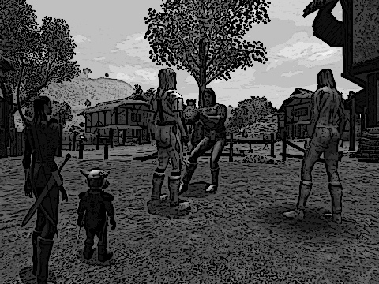

Back to: [West Karana](/posts/westkarana.md) > [2008](/posts/2008/westkarana.md) > [November](./westkarana.md)
# Stout Henry: LIVE! From Nodding Fields!

*Posted by Tipa on 2008-11-14 00:07:00*

Ferd's guards, sent to apprehend Stout Henry and bring him back to face his sentence -- death -- had decided instead to have him face the penalty meted out by the mysterious that... THING that lived in Owlshead Forest. Which was, to enter the Tournament that had filled all the inns of Nodding Fields with contestants and the crowds who had come from all over the Southlands to take part in the many battle royales that would give bragging rights to the villages and towns who'd sent their best to compete.

The Keeper of the Lists, though, wasn't having any of it.

"The Tournament has been going on for a week, now. This is the very last day. The people fighting today are the very best. Half the people within a dozen leagues are here today to cheer on their teams. And you think you can just enter this... this... I hesitate to call him a fighter. Just what ARE you?"

"I," said Stout Henry, "am an adventurer!" His voice was strong and proud, and though showing the signs of a fairly enthusiastic and recent beating, he gave a good imitation of a bow. "I advent! And I do it well!"

The Keeper of the Lists sneered. "Well, we don't do a lot of adventing here. Mostly it's shouting..."

"I can shout!" said Stout Henry.

"Yes, shouting and hitting each other and things like that. Look, it can't be done. It just can't."

The leader of the Duke's men disagreed. "I say it can. Look, Keeper, I don't want to have to tell Duke Ferd that his favorite adventer, the very pride of Cotsberry, couldn't compete just because someone wouldn't put his name on a list."

"I'm not afraid of you," said the Keeper. "There's a dozen men, twice your size, who don't really want to be fighting a disheveled, drunken lout who smells like he's been sleeping in a midden for the past year. Perhaps you could set some dogs on him?" The Keeper shrugged. "Besides, there are already several competitors from Cotsberry. I'm sure the good people of Cotsberry have no desire to be represented by such a one as this. No, I'm afraid it's impossible."

"Well, I'm crushed," said Stout Henry, brightly. "And I was so looking forward to it. Good Keeper, my men and I apologize for wasting your time. I'm afraid I must be off." As the Duke's men blocked his way, he shrugged. "Look, friends, we all just want to do what's right, right? And this good officer has said we must change our plans. Shall we stop by for a drink at the tavern?"

"You seem mighty cheery for a man facing a death sentence," said the guard leader. "But where there's a will... Shall we speak to the good people from Cotsberry?"

Stout Henry was walked rudely toward the tents from the poles of which hung the bright purple banners of Cotsberry, showing a branch heavy with said cotsberries with three golden birds sitting atop it, in memory of the three birds that were shot with a single arrow by the village's founder, Winston Cots, who took that as a sacred sign to build his home at that very spot.

The villagers from Cotsberry greeted their new guest silently.

"Ah," said Stout Henry. "Farmer Jonas. How pleasant to see you again." The farmer said nothing, but his jaw was clamped so tight that the sound of his teeth grinding together almost echoed through the silence. "Have you come for the competition? Or to buy a new hound? Because that old one had a twisted paw. I thought you should know."

"You," growled the farmer, "were supposed to have been hanged?"

Stout Henry blinked. "Was I? For killing your dog? I hardly consider that a hanging offense, and besides, I had a quest."

"No," spat the farmer. "For slaughtering the people at Cotsberry Chapel." The farmer ripped off his simple jacket, and threw it to the ground. The villagers, who had gathered silently around the two moved back, and gave them room. "If the Duke won't make you pay, well, then I suppose it's up to me."

Duke Ferd's men shrugged. "Close enough," said their leader, as he shoved Henry into the center of the ring. "There'll be no tricks this time. Go on, then."

"What," said Stout Henry. "Without my staff?"

"Take his," suggested the guard leader, nodding at Farmer Jonas, who had taken up a particularly nasty looking staff, with a heel of black iron and a sharpened blade bound to the top.

"I dunno," said Henry. "I made mine myself. His looks scary. Well, let's get on with it, then."

Daryl the gnome sat atop his roguely wife Marta's shoulders as they watched from not far away. "I can't believe he is actually going to fight," said Daryl.

"What," said Marta. "You aren't going to use your little time stopper to save him, this time?"

Daryl shook his head. "Not unless you see any dogs who wish they had fewer feet running around. Well, hopping, I guess. I'm still looking for a better power source... but... he does deserve to die, you know."

"Of that, I've no doubt," said Marta. "But he could still be useful. Still, though, it would be nice to see him actually fight. He goes on all the time about how skilled he is, but we've never seen him do ANYTHING."

"Agreed," nodded Daryl, and they edged a little closer. If Stout Henry saw them, he gave no sign.

---

Unbeknown to all his doubters, Stout Henry could, indeed, fight. He'd learned his technique from a passing master who'd seen something in the younger Henry that nobody before had recognized. A willingness to live his own way, by his own rules, despite what others might say.

He'd been walking along a road when he noticed a younger Henry carefully removing rocks from a field. "Hoy there!" called the Master. "Farm boy!"

Henry kept picking up rocks, and placing them carefully into a canvas bag he wore around his shoulder.

"Hoy there!" shouted the Master, again.

Henry turned toward the older man, an exasperated look on his face. "WHAT?" he shouted.

He made no effort to come closer. Sighing, the Master crossed into the field and walked up to Henry. "Clearing rocks from this field -- that's good, honest work. Is this farm yours?"

"What farm?" asked Henry. "Nah, I'm not clearing this field. I'm harvesting!"

"Harvesting?" asked the Master, as he looked askance at Henry. "Rocks? You planted these?"

"Shhh!" said Henry, dropping his voice low. "No, I just FOUND them! Isn't that amazing? All these rocks, just sitting here for the taking. I," he continued, proudly, "am camping this field. And if you want any of these rocks, old man, well... you'll just have to buy them from me!"

"And why, pray tell, would I want to buy your rocks?"

"Oh, I dunno," said Henry. "Maybe you want to make magic weapons. Maybe you want to make spells. Maybe you would want to sell them to dwarfs so they could build amazing things from them. No end to the kinds of things you can do with them. With rocks."

"You can't be serious," said the Master.

Henry shrugged. "When I'm rich and you're still some old dude walking around in the middle of nowhere, you'll wish you'd had gotten yourself some rocks." Henry shot the master a measured look. "From some OTHER field. I'm camping this one."

"I like you," said the Master.

"That's not going to get you any of my rocks," warned Henry.

"I would never even think of taking them from you," said the Master, smiling. "When you are done camping this field, I will be at the Pennywise Inn up the road a league. Stop by, and perhaps we can talk."

"Pennywise Inn? I know it," said Henry. "I might show. Depends on how many rocks you want to buy. I can get a hundred gold for these in Greenswold, you know."

"Oh yes," said the Master. "I wouldn't dream of asking you to leave your rocks behind."

---

Stout Henry slowly circled Farmer Jonas. The farmer expertly swung the bladed staff even as he sputtered muffled curses from between his clenched teeth.

"Still not seeing any fighting," remarked Daryl.

"Not yet," said Marta, as she knelt to the ground so her gnome husband could clamber off. "I'm just glad that interlude didn't turn into a training montage."

"Why won't he FIGHT?" said Daryl.

---

"Why won't you FIGHT?" growled Farmer Jonas.

"How can I?" said Henry. "I didn't train in hand to staff combat!"

"That makes no sense," said Jonas. "What's to learn about fighting with your hands? Just make a fist and punch. Come on, then. These good people want to see you dead before lunchtime."

"No, no, NO!" shouted Henry. "You CAN'T fight with your HANDS until you TRAIN."

Jonas swung the blade at Henry's belly. Henry jumped out of the way, and kept hopping, as he circled Jonas faster.

"Hopping?" asked Jonas, as swung the staff in wide circles, trying to catch Henry as he hit the ground between hops. "Why are you hopping, now?"

"So," said Henry, "you. can't. hit. me."

"Where'd you hear THAT from?" asked Jonas.

---

Henry had shown up at Pennywise Inn that next morning, a full bag of rocks over each shoulder. He could barely move from the weight, and he set them down in front of the innkeeper with a huge sigh of relief.

"Now, good innkeeper, how much for these rocks?"

"We don't buy rocks here, farmboy," said the innkeeper, not even bothering to look up from his account book. "I told you that last time you came."

"Ah, but that was then," said Henry. "I sold them to an innkeeper in Greenswold for a hundred gold pieces, and he said he'd buy as many as I could bring. For you -- half price, so I don't have to carry them all that way, or hire a servant to carry them," he said. "And a coach for the servant."

"Don't do me any favors," said the innkeeper.

Henry just grinned. "Ah, but these aren't for you, anyway. I am looking for an old dude who said he was coming here. He said he'd buy these rocks for TWO hundred gold, and I don't have to walk anywhere at all. But I can let you have this bag here for just twenty-five."

"Ah, the old master who came by," said the innkeeper. "You'll find him in the common room, unless he's left. And take your rocks with you."

The Master had taken Henry to the grazing field
 behind the inn to teach him the basic points of battle. "You must always be in motion," said the Master. "Never stop. If you move fast enough, nothing will be able to hit you."

"Where'd you hear THAT from?" asked Henry.

The Master just smiled, and said nothing.

"Now, find a stout branch, remove the bark, and I will show you how to disarm your opponent with one swift move."

Henry looked at the Master quizzically. "Why would I want to remove their arms?"

---

"I'm telling you," said Marta. "It's going to be training montage pretty soon."

"That's pretty cheap," said Daryl.

Stout Henry stopped hopping a length away from the Farmer, and rushed him at speed as Jonas tried to stop the swing of the staff and bring it shod heel of it to bear. Henry collided with him, and they both fell to the ground.

Henry grabbed the polearm and twisted it from Farmer Jonas' stunned hands.

"Staff fighting, though, I HAVE trained," he said. He slammed the heel of the staff into Jonas' throat, swiftly spun it with his hands, and plunged the blade into Jonas' chest."

The leader of the Duke's guard clamped a massive hand on Henry's shoulder, and smiled as he looked around at the stunned and shocked crowd. "So," he said. "Might we assume the Cotsberry team has an opening?"

---

*Wow, that took a long time! I finally had to turn to an app called Write or Die, which punishes you if you stop typing. That forced me to work through Blank Page Syndrome and write the episode. But, oh my God, Stout Henry has killed again! Will the Cotsberry team accept their new member? Will we see more of the Master? What kind of fighting do they DO in the Tournament anyway? Come back next week for Stout Henry: LIVE! From Nodding Fields! Part II, where you may find answers to these and many more questions!
*
## Comments!

**[almagill](http://almagill.livejournal.com)** writes: <3 Stout Henry!

---

**Sejal** writes: Stout Henry needs a graphic novel

---

**freemmogamer** writes: Hi!
Cool blog! Do you want to trade links?

my is freemmogamer.com Send me email!

Kind Regards

---

**[Tipa](https://chasingdings.com)** writes: Sure!

---

**Azy** writes: I really enjoy Stout Henry stories =)

---

**[Tipa](https://chasingdings.com)** writes: Thanks, everyone :)

---

