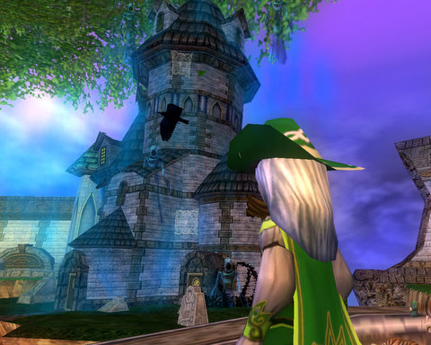

Back to: [West Karana](/posts/westkarana.md) > [2008](/posts/2008/westkarana.md) > [November](./westkarana.md)
# Wizard 101: I am finally free.

*Posted by Tipa on 2008-11-14 10:00:57*

No, really. Since I learned that the Master's Tower, one of the three towers in that floating castle, dropped an extremely rare pet, I've had just one goal in Wizard 101: Continually run that tower in the hopes of getting that rare pet.

I even made an alt to help run that tower. I don't know how many times I ran the tower, never got the pet. I definitely would have liked to have gotten the pet, but recently, I was really resenting those STUPID FIRE MOBS with those STUPID FIRE DOTS. Hate them SO MUCH.

I even pared down my deck so it only contained maybe a dozen cards, but those cards were tuned to winning the various battles I knew so well extremely quickly. There is not one instance in Wizard 101 I know as well as the Master Tower. There may not be even one instance in ANY MMO EVER that I know so well.

[The Friendly Necromancer](http://thefriendlynecromancer.blogspot.com/) reports that Friday, Wizard City will redecorate for the Harvest Festival and Halloween and all its adventures will disappear.

Personally, I'm happy. I'll be able to go back to farming the Onis for gear I'll actually use, and spend some time leveling my alt so she'll be ready to help when Dragonspyre opens. There's currently [a small debate](https://www.wizard101.com/site/posts/list/2528.ftl) on the Wizard 101 forums about whether subscriptions or pay-as-you-go is the better deal, so I'll have to wait for more news from the devs on this before I decide what to do with the alt.

Still, finally, no more Master Towers. I'd have loved the Clockwork Spider pet. But like that lady who [sent $400,000 to a Nigerian email scammer](http://www.katu.com/news/34292654.html), I always thought that maybe the NEXT time I ran the tower, I'd get the pet, so I could hardly stop NOW.

Happy Harvest Festival, everyone! I'll be the one running the Wizard Farm a thousand times for the Clockwork Turkey.

## Comments!

**[Ysharros](http://stylishcorpse.wordpress.com/)** writes: Noooooo! No more clockwork pet chances? Okay, I had no idea how to get any of those cool Halloween pets so I haven't even been trying, but I'll sniffle a bit anyway. I like pets.

On the other hand, that strange burning NEED to do the same thing over and over on the tiny chance you'll get a drop... it drove me away from WoW years ago (stupid weeks spent trying to get those stupid black whelps back in 2004!), so it's probably a good thing it sort of passed me by in W101.

---

**[Tipa](https://chasingdings.com)** writes: I remember the whelps :) I used to solo Deadmines for parrots, too.

Well, anyway, I didn't get the Halloween pet, and now I can move on. Very happy about that :)

---

**[Cow Nose the 50 Pound Cat](http://cownosethe50poundcat.blogspot.com)** writes: Lol I hope your kidding about that clockwork turkey!

---

**[Tipa](https://chasingdings.com)** writes: Well, if they turn out to have one, I'll be farming it :P

---

**[Cow Nose the 50 Pound Cat](http://cownosethe50poundcat.blogspot.com)** writes: Oh and thanks for linking that thread about the access passes. It's something I have of course thought a lot about. I think the last person to post said it pretty good, comparing access pass or subscription to a condo or an apartment. The way I see it is, how fast am I burning through content and how much $ did I pay that month. So far I only payed $5 this month in crowns and I still haven't seen 1/2 the stuff I bought (fireside alley and cyclops lane). As long as I am paying around $5 a month in micropayments then I'll be pretty happy with the pay-per-zone thing.

---

