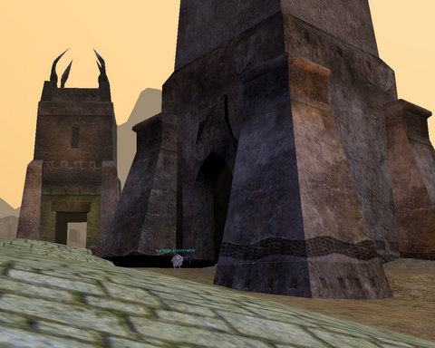
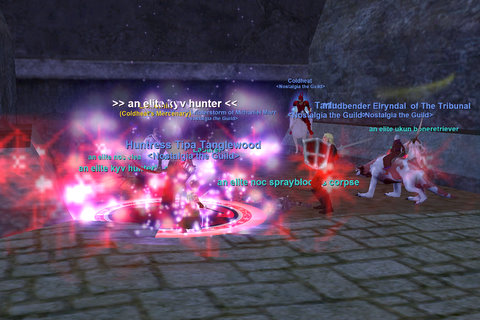

Back to: [West Karana](/posts/westkarana.md) > [2008](/posts/2008/westkarana.md) > [November](./westkarana.md)
# EQ: The Wall of Slaughter

*Posted by Tipa on 2008-11-15 01:05:02*

Being a Drogorn civic planner must be the most interesting job in the world. I can just imagine the presentation at the planning meeting:

"Well, Jim, what do you have for us today?"

"Well, today -- something really exciting -- here's the plans for the new Elementary school!"

"Oh, very good. Very good. This covered walkway -- very interesting, that. Protect the kids from foul weather! Quite considerate."

"Ah yes, I am very proud of that, indeed. I call it 'The Wall of Slaughter'."

"The Wall of ... WHAT did you say?"

"Sorry? Bad name? I suppose I could call it the 'Hallway of Vivisection', if you think that would flow better."

"!"

"The 'Corridor of Crucifixion?'"

---

Anyway, Nostalgia's tour of a small percentage of EverQuest's 1500 zones continued this week with a trip to the throbbing nerve center of the Omens of War expansion, the Wall of Slaughter, which connects Noble's Causeway, an excellent spot for mid 50s folks, with the Muramite Proving Grounds, an experience spot for 65+ folks, and the Citadel of Anguish, the expansion's single locked raid zone. It was a good turnout; for a time, we had a full group of real people and no mercenaries! But our little electronic friends were there when we needed them. Turned out, in fact, that EVERYONE had a mercenary in their pocket!

You see them everywhere in EQ now. It's amazing how much the game has been changed by mercenaries. They aren't just used by us lowbies.

It was also one of our most deadly nights. Our first wipe came when Niiko accidentally pulled a raid mob, Velktorin, to the group. Velktorin isn't that tough of a kill, we used to kill him while gathering for Anguish, but he's a little beyond a single group. Our single group, anyway.

But Azeroth has a greater pull on his heart than Norrath, so he was soon back in Warcraft, leaving me to pull, which went well, for awhile, until I pulled that stupid discordling with that 1200 point AE, PLUS several friends. 

So that wasn't great.

Aside from those slip-ups, we did fairly well. I dinged 64, Coldheat dinged 63, Mantis' newly transferred enchanter Elryndal got 6 AAs, and our new pally tank Talfu got several AAs as well. Talfu also got a nice 40/40 aug and a Muramite Rune for his last 68 disc; I got a 40/40 aug of my own; and Coldheat got a nice upgrade to his helm.

There were scattered groups throughout the zone. Not nearly as busy as it once was, but not entirely dead, either. Perhaps they were all on their way to Riftseeker's Sanctum, which is a hot zone (and well above our level).

Next week, we're going to take a trip to the Plane of Earth and see if there's any fun to be had there.

## Comments!

**rmckee78** writes: Hey kids,
Sorry I fell off the face of the internet. Turns out law school is a lot of work. I just turned in my semester paper (literally like an hour ago) and I am slowly re-integrating myself with the magical world connected by tubes that allow people to talk to each other. I have no idea when I will be able to play again, but for now I am working my way through a huge backlog of blogs and podcasts. I am glad to see that Nostalgia is still going and I am really sorry I just vanished. Hope everyone is doing well.

---

**Stompn** writes: Heya WK readers/tipa. I've been reading this blog for the past couple of weeks (think i wandered here on a wizard 101 search, though it could've been one of the WAR ones) and it has lead me back to EQ. Sad day in some ways to know that every time i try another game it only holds my attention for a short time before i am back to EQ but oh well. Now, more to the meat of the subject.

I was stomping around in EQ for the first time in ~ 6 months, and i'm guessing over a year for this account, (and collecting that cheap elaborate armor to upgrades) and thinking about what I could do. Well, going out and finding a group was out of the question (i guess i'm not too terribly geared for a level 75 but of course i had nothing set up, was slightly rusty on my memory of the abilities and ZERO knowledge of where anyone goes to level these days (though that was quickly fixed by a /who 73-78 search.) But i was without the knowledge i felt i needed to tank these lands reasonably anymore (a useless tank! omg) Anyway, feeling suddenly useless, lost and like EQ was way too big again i decided to wander back to some old grounds of fun to just mash a few abilities and maybe bring back some latent memories. 

So, off I clicked to start my journey towards south karana (probably have some of my longest lasting memories from PAW and those spires- between there and DL.) Time to go and smash some heads! While running around in SK i suddenly had an idea, there is so much more to these zones than many people see during their times in EQ. 

Exactly what you said eh? Well I want to take it one step farther, though it may be a bit painful, and enter into the experiences of EQ realms. That's the real reason we enjoyed these games isn't it? not for the looks of the old zones but rather the experiences they brought as you went through them.

So, to be more exact, I am writing this while camping a SINGLE spire in SK. As a level 75 warrior, plenty of time to smell the roses eh? What am I going to do next? probably go camp the hill in DL but who knows.... 

So, what are the biggest experiences in your EQ career? What places do you remember fondly (or not so much) and why? Then maybe you could go hit those places for the experiences?

---

**Joniboy** writes: Hi there,

Great blog, have enjoyed reading the most recent EQ articles. Sorry if this post appears somewhat off topic for this article but, unless I am mistaken, this blog is written by a veteran EQ player seemingly nostalgic of the 'old' EQ and this is precisely what I want to talk about. I am a former EQ player, played from the release of SoV to just before the release of DoN. I got my druid to 60 and Epiced and my ranger to 55ish close to epiced. I am seriously considering picking up EQ again I am however quite scared as to what to expect. From what I have read all over (I've been browsing a lot through EQ dedicated pages etc) EQ seems to me to be very low to mid-level unfriendly (anything under 60-65 nowadays I guess). Does EQ still attract new players? Have the numerous expansions pumped out so much gear that walking around wielding 2 Ykesha short swords (are they still around) at lvl 20 is now the norm? Will I be able to find groups before lvl 50 or so? I have very fond memories of EQ, oddly enough most of them of my low to mid-level adventures (Oasis of Marr, The Karanas, Crushbone and the orc shoulderpads quest, High Hold Keep at 25+, OT, Fighting Hill Giants for Loot...), will all these memories be ruined as I fail to relive them because of a radical change in gameplay and zones? Sorry for ranting on.

P.S I am somewhat shocked that it is now possible to simply walk in Planes such a PoT, I undertook a couple of Plane raids before PoP and that was pretty much considered hitting the top, from the screenies and stories you have posted I get the impression people now walk into the Planes soloing dragon lords and gods of old.

---

**[Tipa](https://chasingdings.com)** writes: @Stompn & Joniboy -- Reliving the fun times of old EverQuest was exactly the reason a bunch of us got together last spring and made new characters on a new server and leveled from level 1 to where we are now, the low-mid 60s, playing basically just one day a week. We could have played more days and gone faster, but what's the rush?

When we were entering our 30s, SOE added new armor, Defiant armor, as part of their Living Legacy program. For just a few plat now, you can pick up armor better than Tier 2 Omens of War quest armor for the level. I have that in mind because we were getting OoW quest armor drops in Wall of Slaughter the other night and looked up the stats. At which point everyone lost interest in the stuff.

The Defiant plate helm that dropped, though, was snapped right up. SOE was supposed to remove the Defiant armor and weapons from the drop tables after Living Legacy ended, but they didn't, and now that is the new baseline for armor and weapons.

So, @Joniboy, unfortunately, SSoYs are valueless. Level 20s are walking around with raid level gear and weapons, if there were any level 20 raids. Defiant armor has made a new baseline for gear. On the other hand, and this is why they added the stuff in the first place, it is very, very easy to get decently geared if you weren't raid geared before you stopped playing. Level 85 people can probably solo a lot of the older content, but most of the PoP+ raids (and even lots of Luclin+ raids) require additional people, no matter how uber, because of having to do multiple things at once. For instance, no matter how uber someone is, they aren't going to be taking down the Arch Magus or OMM in Anguish. Trash mobs that hit for 80K+ will eat through any armor pretty fast.

@Stompn Well, as long as you're in SK *anyway*, you might as well camp the Pegasus cloak. I spent days doing that :) And the hermit ("I will kill you"), and the bard (oops, goodbye ability to safely go into any town), and the centaurs, and the treants... but the reason those places were so much fun was the whole community thing, with people joking and telling stories in /ooc, shouting out the dings, knowing that the next zone up would likely be the Temple of Cazic-Thule -- a REAL DUNGEON! -- assuming you hadn't spent that much time gingerly killing the stuff nearest zone out in Splitpaw.

We're always looking for folks in Nostalgia, btw. Any level is okay, but most of us are in our 60s. After we get to 70, we're going to try and recruit some more people and see if we can do some fun stuff in some of the later (though not the latest) expansions -- PoP through to Depths of Darkhollow. Would love to do some of the Luclin raids as well.

---

**Joniboy** writes: Great, Thanks

I have read up on Defiant and from what I gather once you have round 5sp you just buy the summon spell and gear yourself up that way. I have another question (sorry!), on the latest char you started, did you twink him? if not (and even if you did) how did your char progression go? is there any point in questing about for items at very low to mid level? any point in finding out which mob drops a pretty good item for your level range, grouping up and taking it out? or would playing this way result in being severely under-geared and the laughing stock of other same lvl players? Tbh I'm quite aprehensive of starting EQ over again, kick-start a Barb Shammy (Always wanted to try one out) and start hunting polar bears hoping for a High Quality Bear skin to sell for 30pp only to get laughed at by some twinked alt telling me no-1 has played like that since like forever.

P.S If I play again will be more than happy to join as the Principle of Nostalgia is pretty much the main drive behind my renewed interest for EQ, you guys play on Luclin server right?

---

**[Tipa](https://chasingdings.com)** writes: @Joniboy -- well, unless SOE opens up a new, no-transfer server, I doubt it will be possible to play in the old way. The Defiant gear makes all other gear pretty worthless. We had a no-twink suggestion with Nostalgia, but when Defiant gear started dropping, we abandoned it, because there was no way you could twink better than the gear that dropped everywhere.

We did begin our leveling in newer zones, like The Serpent's Spine expansion, but started swapping that with older zones like Sol A, Sol B, Befallen, etc. The only way this was possible was because we all started together and had strict limits on leveling in order to ensure we all stayed close together.

It is nearly always possible to find people grouping in the game's hot zones; I first started grouping outside of guild in Nadox in my low 50s. Since then, I've never really had trouble finding groups when looking for them. Before then, it was more or less impossible.

All that said, the addition in the latest expansion of mercenaries for hire means you don't really need a group at low levels. That's definitely a lonely way to play, and I don't recommend it as a way to solo (though lots of EQ players are using it exactly for that; I can't count the number of people I've seen running around in xp zones trailed by a yellow-named mercenary). We in Nostalgia use them to fill out our groups.

All in all, unless (as I mentioned) SOE makes a new EQ server, the old EQ is dead and gone. Even we Nostalgians are saddened by the empty zones, though (since we are 60+) we encounter other players now instead of always being the only people in the zones we adventured in. The new EQ caters mostly to people at or near the level cap. There are new players now and then, met a few in the tutorial, but unless they are extensively supported by other people, they're not going to stay.

That said, the old game can still be found here and there, in forgotten nooks and crannies, and the addition of hot zones and mercenaries still brings life to the old world. If you happen to find yourself on Luclin, we'd be overjoyed to meet you. Our current level cap is 70, and I'm really hoping we can find the kind of people who think raiding Emperor Ssra and Vex Thal and Terris Thule would be kind of a fun thing to do. Kunark and Velious bosses, unfortunately, can now be soloed and thusly aren't available for groups to do. Only the level 52 cap on players let us take out Nagafen and Vox so many times on our way through the levels.

---

**Joniboy** writes: Thanks for all that information. I feared EQ had become precisely what you described, what about EQ2? does that still attract new players? I'm looking for an-EQ like MMO (although EQ is pretty unique) that still attracts new players and where even low level zones are slightly overcrowded, WAR intrigues me but not yet convinced, WoW I tried for a couple of months but it never really grew on me, one fun and free one I used to play, not sure you've heard about it, was Rose online. I would love to play EQ again but I feel it might not quite be the game for me as I have little time to devote to EQ, maybe 2hours a day at most and more time on the weekends, so that pretty much cancels out raiding on a regular basis which seems to be precisely what EQ is now geared towards.

---

**[Tipa](https://chasingdings.com)** writes: I don't think you will find any well-established MMO where there are crowds in the newbie grounds. Definitely not EQ or WoW. Not really EQ2, either. Warhammer (which I don't play) is said to still have crowds in the lower tiers, though as people level up, they also spread out, so it's harder to find groups of people running around and adventuring, especially as the game moves toward instanced battlegrounds in the higher tiers.

Free to play games usually are extremely crowded in the low end -- because that's as far as most people ever get. But I can't think of any that are very much like EverQuest.

Wizard 101 is very good and is pretty crowded all the way through, except for the last world. Instant travel, though, means it's easy to join with friends and get something going no matter where you are. It's definitely nothing like EverQuest.

Spellborn may fit the bill, and it is scheduled to be released soon, but we North American players have grave doubts that it will be coming out at all, or at least, this year. So, I dunno.

EQ is still a fun game, and with mercenaries can be played without a group, you just have to realize you'll be playing by yourself for the first fifty levels -- and that can be tough.

---

**Joniboy** writes: Thanks again :)

Sorry for hijacking this thread, I'm very grateful to you that you pretty much confirmed my initial suspicions. I'm afraid these suspicions are enough to put me off, I think I'd rather cherish the moments spent on EQ in the past and move on rather than try to relive them and, ultimately, fail. As for other MMO's I read on this blog that FFXI is quite group friendly and enables a good level of social interaction so it seems quite appealing to me. Have you ever tried it out? Any blogs on your bloglist related to it? I have played a number of FF games in the series, my favourite so far being FFIX, and the races and classes available seem like a good blast.

---

**[Tipa](https://chasingdings.com)** writes: I don't know the current state of FFXI Online. When I played it, there were plenty of people at low levels, but when I got to my high thirties/low forties, groups dried up almost entirely due to the draconian restrictions on groups set by the devs. It was fun, but like a lot of Asian imports, was dominated by farmers and gold sellers and every city was drowned in the yells of farmers selling their farmed items and gold (gil).

I can't really think of a recent game, besides WAR, with a crowded newbie community. WAR is a very game-y (as opposed to sandbox-y) iteration of EverQuest, built around quick action with little or no exploration or discovery. Age of Conan is said to have an excellent newbie experience. Lord of the Rings Online has built up a great community.

I had logged in my level 23 Assassin one day, and was almost immediately swept into a group that was doing quests all over Norrath. There is a low level community in EQ2 -- but you may end up soloing quite a lot between those groups.

I think EQ2 is excellent, and regular groups can be found from the 20s on, assuming you don't get bored of popular dungeons easily. Low level grouping is quite heavy on Stormhold and Fallen Gate :) But they are awesome dungeons!

---

