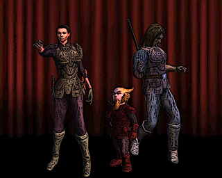

Back to: [West Karana](/posts/westkarana.md) > [2008](/posts/2008/westkarana.md) > [November](./westkarana.md)
# Stout Henry: LIVE! At Nodding Fields! Part 2

*Posted by Tipa on 2008-11-18 00:00:54*

Stout Henry pulled the blade of the staff from Farmer Jonas' chest. The crowd of Cotsberry competitors, families and fans from the small farming town were silent, but for some weeping.

"Did ya SEE THAT?" yelled Stout Henry. "Circle Strafe Left, Disarming Block, Crushing Blow and Swift Impale, 1 2 3 4 and it was OVAH!" He looked around at the crowd of silent people.

"Well, come on," said Henry. "I won! I mean, aren't you glad you found out what a noob he was before he got in the Tournament? No way you'd win. Weak link and all. So, I'm in, right? Because we're going to have to change things up around here."

A woman dressed in bright green with yellow ribbons entwined in her sleeves and bodice rushed to Jonas' body -- crying, but still, eerily silent. She felt for Jonas' pulse, found none, and looked at Henry with bitter hatred in her eyes.

Silently, four men arrived with a board, lifted Jonas' body onto it, and carried it gently into the bed of a wagon. Others in the contingent began striking the tents and the tables. All around, the Cotsberry folk made preparations to leave.

"You cannot leave!" yelled the leader of Ferd's guardsmen, who had been hoping to enter Stout Henry in the Tournament, where he would fight to his death. "Who's going to represent Cotsberry?"

The woman who had tended to Jonas' body turned, and said the only word any of the folk had said in the long minutes since Henry had slain Jonas in their short, bloody, duel. "We won't share a field or a stage with a murderer. Hell be with you all. It's more than you deserve."

---

"Well, that could have gone better," said Stout Henry. "See, Ferd-guy, it just wasn't meant to be."

"You're fighting," growled the guard. "Don't think a little death is going to let you out. You will die before this day is out -- that, I guarantee. I have a little of the Sight from my aunt, she is wise about these sorts of things, and I am, too. You won't see tomorrow morning."

"Don't think I haven't had my death promised before, many times," said Stout Henry. "But each morning, I find myself alive. So who's the wise one, now?" Henry sighed. "Well, at least this is fairly amusing, though I do wish the loot were better. What now, oh wise Ferd-man who has an aunt?"

"Why," said the guard, "I guess you, sir, are the Cotsberry team! And if you don't happen to make it to the end, why, we won't shed a tear. On, you, let us see if yon Keeper of the Lists has had a change of heart, regarding your case."

Stout Henry and Ferd's guardsmen returned to the Keeper of Lists. Henry smiled and winked at the people he passed, darkening the guardsmen's moods.

---

The Keeper of Lists sighed when he saw Stout Henry again. "What is it THIS TIME," grumbled the Keeper. "I TOLD you there are NO last minute substitutions and that. Means. YOU."

"Good Keeper!" said Henry, brightly. "The gracious people of Cotsberry have nominated me, Stout Henry, to be their sole representative in the Tournament. I, uh, I don't like to brag," confided Henry, "but me and their champ had a good talking and at the end, well, they saw reason!"

"I heard they left," said the Keeper, not looking up from the tally sheets upon which he made many cryptic notations.

"Yes, well, with their champion -- indisposed, they immediately cheered me -- as one, it was really quite wonderful," said Stout Henry, lost for a moment in pleasant memory. "Why, they even said I should stand for Mayor at the next election! And free ale, whenever I want it! I think I have never been happier, actually."

"Izzat right," said the Keeper, now looking up from his tallies. "You are the entire Cotsberry team, and they have such confidence in you that they don't even feel any need to stay to watch you win gloriously."

"That," said Stout Henry, "is precisely the case. I think you have hit it right on the nose. Hard."

The Keeper of the Lists cleaned the nib of his quill pen on a scrap of heavily inked cloth. "Where is the rest of your team?"

"Why, you are looking at him. I have no need of others to hold me back, or hold me up. Cotsberry rah rah! Sign me up, guv!"

"I cannot do that," sighed the Keeper of the Lists, exasperated. "There are rules. It is my entire and sole purpose to enforce those rules. Every team must field seven players. Any more or fewer destroys the luck of everyone. And unless you have six brothers, SIR, you will not play today, and Cotsberry must forfeit its place in this Tournament as, by their leaving, they clearly intended."

Stout Henry turned to the the leader of Ferd's guards, a broad smile on his face. "You see, good sir, I have tried my best, but this fine officer will not let me compete. Can we just say it was a good try and give me, say, ten minutes head start? I promise you'll have no trouble from me."

The guard's face was twisted in fury. "I... WE...", he said, including the other three guardsmen, "will be the Cotsberry team. Now sign us in, or face the Duke's wrath!"

The Keeper gulped, but held firm. "There must be seven! Stout Henry and your group -- that is only five!"

"Fine!" shouted the guard leader. He looked around quickly, then stopped, and a smile broke his face. "Them as well. They will play for Cotsberry." The Keeper followed the guard's eye to a mismatched couple who were following the argument from a safe distance. Both the gnome and the dark-clad woman he stood with had identical 'Who? ME?' expressions on their faces.

---

"How did this happen, again?" asked Daryl, as Marta was bound into the Tournament gear.

"You have a sick fascination for that man," said Marta. "Has that done anything BUT get you into trouble? I said to ignore him, you said no, I begged you not to help him, you said you had to, I said to forget about him and you said..."

"How CAN I?" asked Daryl. "I created him."

Marta was silent for a moment. The Tourney gear wasn't meant for someone as tall and thin as her; the masters of the game hadn't even bothered trying to find something to fit her gnomish husband. "You didn't create him. That... THING did."

"Yes, technically," said Daryl. "But I was there. I helped. That... THING could not have done it without me. And now we all have to live with the mess."

"All except Farmer Jonas," said Marta.

"Yes, but..." protested Daryl.

"And those people at the chapel," said Marta.

"They'll recover," said Daryl. "Stout Henry didn't knock them up that badly. Seriously -- do you think Henry would have survived arrest if those people had died?"

Marta looked askance at her husband. "Seriously? He certainly thinks he killed them, and he doesn't care. Not that stealing the Duke's horse and robbing the chapel wouldn't be reason enough to kill him, I suppose. This gear, by the way," said Marta, looking at herself for the first time after the last straps had been tightened, "is ridiculous."

"It's to prevent you from injury, dear," said Daryl.

"I'm feeling injured already," said Marta. She looked up as Stout Henry walked over.

He looked ridiculous. Ferd's men looked no better. "Aren't you the luscious one!" said Henry. "We go on in ten! Break a leg!" At the odd expressions from his friends, he explained: "It's tradition!"

"To break a leg?" asked Daryl. "I sure hope not."

---

A word about the Tournament, or as it is formally known, Full Contact Theater.

Centuries ago, two traveling theater troupes had accidentally been scheduled to play at the same summer festival. Traveling times being what they were, they could hardly decide to go off to some other county in time to make Midsummer.

Unable to come to any agreement as to who should back down and who should play at the Fair, they both took stage at the same time, agreeing that one troupe should play the left half of the stage, and one the right.

Naturally, neither one could agree on which would take which side. Their loud arguments drew the largest crowd of the Fair. As each side attempted to stage their play while shoving away the other, or drowning them out, the people would crowd closer. Some started to cheer for one side or another.

By the time evening arrived, one troupe stood victorious; the others, either fled or so injured they could no longer gasp out their lines.

The story of the Tournament of Players at Nodding Fields was told in every pub and town square that ever hosted a minstrel. The next year, people started trickling in a month before Midsummer; merchants pulling carts of goods, food sellers with their wares packed in ice, souvenir hawkers, students of theater who had been kicked from their troupes, hoping to be needed in a crowd scene or to hang the footlights but more usually being forced to take menial jobs for the duration to pay for their stay; and the troupes, all of who had decided to make Nodding Fields their summertime destination.

And if some of the play actors looked a little burlier than normal for the profession, well, who was going to complain if their Princess was two meters tall and had a shaved head and a full beard?

The days prior to Stout Henry & Co. arriving at Nodding Fields was full of smaller contests; Florid Debate at ten paces; Poetry Recitation, both armed and hand-to-hand; Folk Songs, sung too fast to breathe, winner is the last one standing.

The crown of the Tournament, the Full Contact Theater, was saved for the last day. The troupes would meet upon a single stage to perform their works. The ones that the crowd loved best would continue on to the next round. The loser would walk (or be carried), home.

The winners would be invited back to the Ducal seat in Greenswold (where merchants are said by some to pay 200 gold for a sack of rocks), to perform for Duke Ferd himself.

---

The Cotsberry team had, before their hurried departure, been practicing the ancient work, "The Siege of King Tarl's Castle". It was a story of love among the battlements; the hero was an archer, manning a tower in the titular king's castle, which was being attacked by an army of vile creatures, seen only in shadows cast upon a screen from offstage. He takes an arrow meant for the king, and falls in love with one of the nurses -- who turns out (not really surprisingly) to be the king's daughter, unrecognizable in nurse's habit. The king finds out, and is torn between the heroism of the archer and his desire to marry his daughter off to the Head Chief of the vile creatures in order to make an alliance, end the siege, and save the lives of his subjects.

It was a love story of the sort that would have the audience weeping in the aisles. And at the end, when the princess, having obtained by the love of her father permission to marry the heroic archer, would instead choose to go off with the vile Chief on her own accord, the screams from the crowd would be deafening. When the princess would then reveal, as she slayed the vile Chief, that she had never intended to consummate that forbidden marriage, but instead die to show the heroism of her people, the only sound that could be heard would be weeping. And then the injured archer, emboldened by the example of his love, would fight his way into the encampment of the vile creatures to rescue his love.

Would he win his way in? Would the princess have been torn apart by the creatures, angered by her betrayal -- or would the creatures have let her live, awed by her example?

It was usually left for the crowd to decide.

---

Stout Henry was not dressed like any archer ever seen on a battlefield, or indeed like any actor who had ever played an archer on any other stage but the one at Nodding Fields. Instead of a bow, he carried Farmer Jonas' bladed staff, and he was wrapped in padded armor which had been swathed in green felt. The effect was somewhat less like a ranger of the forest than a training dummy which had been pressed into service as a make-shift holiday tree.

Marta, as the princess, was dressed similarly in padding, but with a bright but ragged dress of pink chiffon pulled over it. Her blades were strapped within easy reach around her hips.

Daryl, as the king, had just been given a tin crown to wear.

The guards were dressed in their normal uniforms, with tabards of yellow and purple belted over them as their only costume.

"This is actually a good play," said Daryl, as he leafed through the tattered and worn script, which was bound in copper and could be used as a shield or a bludgeon in an emergency. "I remember when the Merry Rascals performed this down in Tarfenheul while I studied there. Brought down the house."

From outside the dressing room, the sound of the crowd bringing down the house signaled the end of another rousing performance. The victors staggered into the dressing room, where attendants immediately began to cut away their padded costumes and bind their wounds. Some actors would never recite another line.

"Cotsberry! Pottersfield! To the stage!"

Stout Henry winked at Marta as they checked the bindings on their armor one last time.

The crowd roared as the troupes entered from the wings. Stagehands were dashing all about, clearing the stage of splinters and throwing sawdust on the worst of the pools of blood, and placing the flimsily-constructed furniture of a new set in its place.

"TONIGHT!" roared the Keeper of the Lists. "Tonight! tonight! tonight!" echoed his voice from the trees. The roaring of the crowd reached a peak, then fell to a hush.

"TONIGHT!" repeated the Keeper, "Tonight, the brave players of POTTERSFIELD!" Cheers from the crowd interrupted him. "POTTERSFIELD! Meets COTSBERRY!" Silence from the crowd. "POTTERSFIELD and COTSBERRY on the MAIN STAGE! PLAYERS TAKE YOUR POSITIONS! SCRIPTS AT READY! LET THE PLAY BEGIN!"

---

*Will they make their marks? Will they remember to project? What's the effective range of a script thrown by gnome dressed up like a king? Find out the answers to these and many more questions next week in the third and FINAL chapter of Stout Henry: LIVE! At Nodding Fields!*
## Comments!

**[almagill](http://almagill.livejournal.com)** writes: *baits his breath and waits*

---

**[Stargrace](http://www.mmoquests.com)** writes: More!!

---

