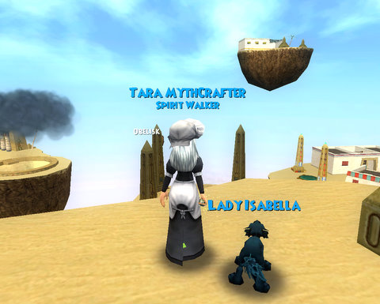

Back to: [West Karana](/posts/westkarana.md) > [2008](/posts/2008/westkarana.md) > [November](./westkarana.md)
# Wizard 101: Looking back

*Posted by Tipa on 2008-11-18 10:00:32*

There's nothing as sad as seeing any empty quest journal. Er, assignment book. We are, after all, all wizards at Ravenwood, and in between saving all the worlds of the Spiral from the renegade Death professor, Malistaire, we're meant to be getting in our assignments on time and are graded on neatness!

I've done all the assignments, been to every alley of Wizard City, every monument in Krokotopia, every rooftop in Marleybone and every temple in Moo Shu.

Many times.

I think I would give up EQ2 and Spellborn together if I could log into Wizard 101 tomorrow and find Dragonspyre open for business.

I even spent the weekend farming Onis for gear I probably don't need. My alt went from level 9 to 21 pretty much on experience from instances.

So now that I've been everywhere and fought everything, what have I learned?

  
*A much-appreciated dryad brings me back from the brink of death in a fight with the Jade Oni.*

Every fight is different. Because of the card battle mechanic, no fight ever plays out the same way. Sometimes you win easily; sometimes the cards just aren't there, but they seem to be there for the other side. Sometimes your Sprite Guardian spends the whole fight healing herself as your life plummets downwards.

Just saying.

Deck construction becomes an art. The best decks are constructed for specific fights, and usually tend to be only about 20 cards or less, nearly guaranteeing the cards I needed and not expecting any surprises from the foes. Fights against unknown enemies or many different sorts at once meant a more expansive and general deck.

The schools of magic of the enemies always called for certain responses. Life beats Balance and Death. Fire beats Ice. Spirit and Elemental magic don't mix. You can't effectively ward against Balance. Go Ice if you don't like taking damage but can take it better than anyone else. Go Storm if you want things to die fast (and wear +Accuracy clothing and accessories at the expense of anything else). Go Myth and never fight alone.

The need to weigh all these factors means fights are never "hit autoattack and get some coffee". Nor are they especially fast. Sometimes you'd LIKE fights to be over in just a couple of seconds.

  
*A mystery in Krokotopia: What IS that island? It's not the Tomb of Storms, that's to the left and below. It's not the Krokosphinx -- no sphinx (and it's clearly visible, just not in the picture). It's not the secret island, because I'm standing on it. It's a mystery.*

Bad parts? The quests are almost always unimaginative kill fests -- kill ten cats :) kill these until you get five of this rare drop. Bring this to that person. The missions break the tedium of the kill quests; some of them are pretty imaginative, and they get better as you proceed through the worlds. If only a young wizard could level solely through missions -- which have the best loot, usually. To stop players from powerleveling by repeating easy, high level instances, though, KingsIsle added diminishing returns. You get to do any certain mission twice; after that, no experience.

That places an effective cap at leveling. After you have emptied your assignment book and done every mission twice, you're between 44 and 46, depending on how much additional killing you did. The level cap is 50, but only those who got there before the diminishing returns patch are there now.

  
*Tara and Allison speak with Wavebringer after defeating the Plague Oni in Shiritaki Temple*

This points out Wizard 101's greatest failing: You can run out of things to do. The diminishing returns patch removed any way to progress your character after a certain point. There's gear to get, but any specific gear takes so long to get that it takes a Herculean effort to run the same instance just one. More. Time. And then the next.

If gear were tradeable, it would encourage people to gather their friends and keep on fighting the bosses to get their loot. But to do Plague Oni four or five times now and see my class boots keep going to people who can do nothing with them but sell them to a merchant? That's painful. To run the Krokopatra instance (which is admittedly pretty fun) (you can't put lipstick on a lizard and you look silly if you try) and to have the rare robe drop for Tara twice but not for Allison who needed it after all the times we ran it (it's a pretty quick instance)? Disappointing. Crowns armor available for huge sums of gold from merchants, making it so that most people have that armor as a baseline (and a crutch)? Disappointing.

The almost total lack of a community in the game is absolutely distressing for an MMO of this quality. In the name of protecting children from imagined threats (games where kids and adults mix freely, such as World of Warcraft or any game on Xbox Live, show the hollowness of the threat), KingsIsle has made it nearly impossible to meet real life friends in the game without extensive out of game communication. The text filter makes it extremely difficult to discuss how to even play the game in any useful way, meaning to actually play the game well, friends need to use a third party program to talk with each other around the game.

Wizard 101 played with Ventrilo is a different game.

Wizard 101 played with Menu Chat, as you must do when kids join your group, is like trying to sing with your mouth taped shut.

Guilds and clans let people who play many games build a community and an identity through friendship. Guilds are a good way of making real the idea that if I like you and I like her, then maybe you will like her. And you and she like him, so maybe I'll like him. And maybe when I log on, I can say hi to everyone in my guild at once, and we can perhaps group up and do some instances you need, or decide to take on Kensington just for the fun of it.

Without any community tools, there can be no community, and so Wizard 101 feels emptier than it is.

W101 is a great game, it's a fun game, it's an innovative game, but it's a game that has bought into the hysteria that every adult is a real or potential child abuser, completely disregarding that children are in considerably more danger from people they know in real life than from anyone they might meet playing a video game. That attitude cripples an otherwise amazing game. Adults wonder why they are being suspected of being criminals. Kids wonder why a game company thinks they can't take care of themselves. Everyone just wants to have fun and play the game with friends.

## Comments!

**[Ysharros](http://stylishcorpse.wordpress.com/)** writes: Great stuff. I've only just made it to 20 with my (newish) Life-Storm lass -- and what a fun combo that is, by the way -- but I can already see most of what you mention as both good and bad.

I think if W101 were the only MMO I played, at my age, I would end up chewing my arms off. As a diversion, however, it's a lot of fun. Currently the compare/contrast of W101 and WAR makes their flaws bearable and their virtues shine; it's thanks to my break in W101 that I'm looking forward to going back to WAR, and I mean that in a good way.

---

**[mbp](http://mindbendingpuzzles.blogspot.com)** writes: From back when I tried the beta myself I always felt that the developers of W101 completely goofed in positioning their game. It looks like a kids game but it isn't. The depth and complexity of the game play is way beyond what most kids are prepared to put up with.

---

**[Hudson](http://hudshideout.com/blog/)** writes: Well said about the content censoring. People love to call it a "kids game" but honestly it COULD have mass market appeal. Look, even reading Darren's blog today we can see that more people "get injured" playing World of Warcraft or games like Lineage II. You have young people playing that as well banked by a parents credit card. Could it be the free to play aspect?

They really need to open up the chat and let people COMMUNICATE. The chat now is about as empty as WAR Tier 1-3.

---

**[crookshankz](http://thegaminggoob.wordpress.com)** writes: You've got great points on here Tipa. I really wish all these would get addressed by KI. Even if they just put those options in their parental controls, it would add so much to the game. Give us the ability to communicate properly, a guild for a home and a shared bank and it would add so much to the game.

---

**[Mordiceius](http://www.mordiceius.com)** writes: So I only played Wizard 101 for a couple days pre-Wrath of the Lich King and only got to about level 8 before I quit and I absolutely LOVE the gameplay. My problem is that I mainly play MMOs for the community. I can handle sub par gameplay in a game if I have friends I'm playing with. I would love to be able to have a guild and friends in a game that has GREAT gameplay like Wizard 101.

I think one of the times that most upset me was I randomly ran into this instance where you have to kill a level 4 elite pumpkin headed guy. I'm a life wizard so I don't do much damage but a fire wizard went in with me. We fought well. I kept healing and they kept pumping out the damage. Just before we killed the boss though, I died. I couldn't add them to my friend list because we were in combat and as soon as combat was over, I got ported back to the central area. I will never be able to communicate with them again although they would have made a great adventuring friend.

It's too bad there aren't "kids servers" and "adult servers." If there were adult servers with unrestricted chat and ability to create guilds. I think this game would hook me even more.

---

**fuzzygoblin** writes: Nice assessment. My sons like the game, but I am not sure about the long term possibilities. The lack of grouping/party support, communications weakness, and gear flexibility is tiring. A game night does not pass that does not include my 6 year old saying "come see this item, I wish I could give it to you" The low population makes doing things as a group much easier, if there were more people we would be doing many battles without the entire family in the battle due to random adds.

Since we only play one night a week we have lots of content left so we will get our moneys worth on the first year, but unless there are some mechanics changes I suspect we will be moving on. Shame.

---

**Ripper McGee** writes: 
> 

> > 

The game has been out a while, is stable and the revenue model has likely been finalized. This is a great time for KingsIsle to consider updating the game to not only attract and retain older, more experienced gamers (especially with FreeRealms looming on the horizon). I think they could do this with a few changes:

**Chat** - Older gamers can become frustrated with the enfornced constraints of the kid-friendly chat system. As of now, gamers under 13 and free gamers are limited to emote-based chat. Only paid players over 13 can use the "free text" chat (or paid players under 13 whose parents expclitly enable free text chat), although this still limits the chat based on an approved dictionary. Players limited to emote-based chat, either due to age or subscription status, cannot even see free text chat by those who are allowed to use it. All they see are ellipses (...). Why not add in a third layer of chat for paid subscribers >= 18 years of age? This third layer could be truly free, non-dictionary based (except for obvious words that should be censored, just like they are in adult MMOs). The mechanics of the chat system would still be the same in that <13 and non-paid subscribers would still see ellipses instead of the chat, thereby mitigating the possibility of children seeing chat that may not be appropriate. Paid subscribers between 13 and 17 would only see the text they're allowed to see, based on their level of chat, unless the most open level of chat is explicitly enabled by their parental unit. This approach still keeps kids safe, but will reduce frustrations more mature gamers have with the existing chat system.

**Trade** - at this time, players can only trade treasure cards, not items. Introduce item trading for paid players >= 18 years old (unless explicitly allowed by an adult, in which case it'd be 13+ - NEVER under 13, UNLESS IN THE SAME FAMILY ACCOUNT). This introduces a famiilar MMO mechanic, but still keeps kids safe from being scammed, bamboozled, tricked, etc....

**Groups** - the concept of groups don't really exist within Wizard101. Grouping is really done on an encounter-by-encounter basis. Any player can simply join a battle already in progress (except for a few specific challenge battles) by entering the battle circle (either by teleporting to a friend in an instance or just running up on a public street). This is a great approach to both solo and casual play, but it has limitations. When I want to play with my son and daughters, we basically all have to follow each other around and jump in on each other's battles. Additionally, since there aren't any real groups, there isn't an explicit group chat channel. I'd love to see groups and group chat implemented. Group creation could be limited to those paid players >= 18 (unless explicitly allowed by an adult, in which case it'd be 13+ - NEVER under 13, UNLESS IN THE SAME FAMILY ACCOUNT)

**Guilds** - there aren't any guilds at this time. As a parent, I'd absolutely be leery of letting my 9 year old son join a guild in a MMO, even in a kids game. That being said, I think it's a critical component for more mature gamers. As such, why not add in guilds for paid players >= 18 (unless explicitly allowed by an adult, in which case it'd be 13+ - NEVER under 13, UNLESS IN THE SAME FAMILY ACCOUNT).
All of the above features would help to attract and retain an older, more MMO-experienced audience and could be implemented in a manner that would still keep the younger players safe. Other than those, some more granular controls could be implemented, like the abilty to "lock down" your encounters. It can be very frustating, especially for younger players, to be in a stressful fight (because you're low on hp/mana, running out of cards, just trying to finish a quest or whatever....) when somebody jumps in and brings another monster with them (and everybody who jumps in brings a monster with them, so 3 players jumping in can turn your encounter from a 1-on-1 to a 4-on-4). An option to lock down your battles would be great!

~Ripper
> 
> 

---

**Chickenwings** writes: lol i love wizard 101 but most of you guys have a point. Wizards is a fun game but has its exceptions like the fact that you cant trade items but getting scammed from treasure cards ( I never use them so i just sell them to the Bazaar) isnt important then. It should have some content only 13+ should be able to use like guilds, trades, etc. It is fun but well it can get borring after a while when they hardly ever add new content.

---

**[akizaiah](http://wizard101.com)** writes: you guys are right its just that i am 10 and i know what you mean.i have the same way with wizard101.i wish it was like dark age of camelot.where they are mostly adults and no kids in their.and trade items.

---

**frog master** writes: You know that wizard 101 has that valor sword for Veterans day,well I entered the information and I still haven't recieved the code for it.If anyone knows the code please tell me or tell me when it is supposed to be sent to my e-mail address. Thanks!

---

**Michael** writes: I, for one, prefer the restricted chat. We all know that there is an overwhelming amount of immature individuals who attempt to ruin the game by mouthing off their senseless profanity. Even adults will find ways around free chat to curse off little kids who act smug in PvP. 

Ripper McGee wrote: "This approach still keeps kids safe, but will reduce frustrations more mature gamers have with the existing chat system." What frustration? What more can you say in a MMO game? Do you need to talk about sex? Something political? Or how about the consequences of global warming? The main prerogative of Wizard 101 is to keep everyone in character, and not to deter those who simply want to play the game. In addition, who wants to argue amongst imbeciles with unresolved insecurity issues? Perhaps YOU wouldn't engage in such topics, but more than enough people would. 

As for the trading discrepancy, it's fine the way it is. We are fortunate that the creators of Wizard 101 moderate all item prices and gold currency. Wizard 101 is regulates prices within the margins of a steady constant. If Wizard 101 turns into anything like Maple Story, we'll find the rich becoming even richer and various equipment becoming substantially more expensive. You may provide the counterargument that crown items are unfair, but even crown items are distributed on relatively equal playing ground. Those who are able to make it up into the higher worlds will also have the opportunity to make these purchase. So, in a sense, it is not unfair at all. Keep in mind that there are items in the game that supersede crown items. Red McGee also makes another pointless suggestion: Segregate the younger and older players through a revised trading system. That simply complicates the entire process, and you'll find the older players owning an advantage over the younger players. The reason for implementing our current system is because it prevents inflation and rampant competition. At the moment, this is the main prerogative of Wizard 101: To ensure stability and equal opportunity to all of its players. 

The implementation of parties and group chat should be equal because then it would seem that the creators are out to seek a profit rather than provide a "free gaming service," like they advertise. Not very good PR. 

Overall, this whole idea of giving more to the "older and more mature" audience is laughable. You're simply disenfranchising the youth. Simply put, it is best if everyone is on the same playing ground. Once you start making people feel alienated from the game, you will begin to lose both free players and paid customers. There is a critical balance that must be maintained in order to keep the majority satisfied. 

MPB wrote: "From back when I tried the beta myself I always felt that the developers of W101 completely goofed in positioning their game. It looks like a kids game but it isn’t. The depth and complexity of the game play is way beyond what most kids are prepared to put up with."

No, you are wrong my friend. Kids nowadays are heavily exposed to the harshness of the adult world. They obtain these notions through more than online MMOs and standard video games. It isn't surprising that as time goes by, games offered to players younger than thirteen years old will be significantly more intricate and complex. The growing trends of technology suggest the viability of widespread distribution and availability among children under thirteen years old. 

However, the lack of a structured community is unappealing. Wizard 101 should resolve this issue.

---

**[Tipa](https://chasingdings.com)** writes: Since I wrote this, KingsIsle has implemented a totally free chat where anything can be said. I do find it helpful, but it can be a bother talking to someone with the dictionary chat -- they get sudden '...' in what they see. But you have a little visual cue when you're about to use a restricted word -- it's yellow -- letting you know.

Kids already easily bypass the chat restrictions.

We still do need guilds.

---

**Paul** writes: I agree about restricted chat.
But like in my grandkids case, I pay for their acct and I am the one who restricts them.

And as it is, they have currently, no restrictions of any sort. Though they are under 12, they play the game properly.

All 3 of us (and im 50+) rarely if ever play with anybody who is restricted.
And I intentionally ignore 'such requests' to 'friend' with them.

I wont be restricted and neigther will those I pay for in a game. 
If we were to be restricted, I would cancel the acccts I pay for and I pay for a total of 12 kids who play regularly.
(Subscription)..

As it is, the game works and i rarely have issues with it. thoguh Im now finding it boring.

---

**Paul** writes: i disagree about it being a bit much for kids.. my grandkids find it nice to have a game thats more involved and more fun than toontown, which both found to be a big and badly done, bore.

---

