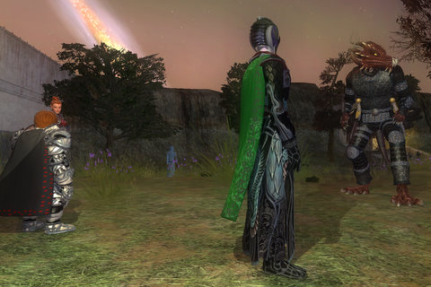

Back to: [West Karana](/posts/westkarana.md) > [2008](/posts/2008/westkarana.md) > [November](./westkarana.md)
# EQ2: Welcome to The Shadow Odyssey!

*Posted by Tipa on 2008-11-18 14:00:55*

If SOE sticks to the schedule, then The Shadow Odyssey should be live about now.

Amazon tells me my box was shipped today and should be here in time for Thanksgiving. I didn't remember to also buy a digital download for my main account, so guess what I'll be doing when I get home...

Tonight and for the rest of this week, it's going to be all about The Shadow Odyssey. I want to go on a crafting mission, first thing. My tailoring is at 60, which should be good enough -- and I have an 80 jeweler if needed. In fact, I can two box them.

As for the real meat of the expansion, the dungeon crawls. I have to admit that I haven't fallen in love with the latest dungeons, Runnyeye: the Gathering and Veksar. No group I've been in has even finished Veksar. Though I was in the EQ2 beta, I ran out of disk space to keep both the live game and the beta one patched and ready to play, so after looking around just a very little, went back to the live game. So it's all still new to me.

The parts that I have seen, though, look absolutely fantastic, and I am very much looking forward to seeing these places. The best part about EQ's LDoNs (and later, DoNs) were that they were good xp and other rewards, and they didn't require you to sign up for four hours in order to get anything done. Group up, get in, spend half an hour to an hour in the dungeon, and then you're done and can do another or go your own way.

SOE has a pretty good track record of doing just this for instances past Desert of Flames (Poet's Palace in DoF was just never going to be quick), so I am looking forward to bite-sized chunks of adventure goodness and hopefully some serious Nostalgia for places last seen hundreds of years ago, in EverQuest.

See you in Norrath!

## Comments!

**[Saylah](http://notadiary.typepad.com/mysticworlds)** writes: I'm sure you'll get to it and your time is short like everyone's but I'm REALLY interested in reading about the crafting dungeons. Crafting and player house are what I love about EQ2. Do you get XP for the crafting dungeons - for leveling and crafting? Can you point me to something substantial to read about them? I'm not playing EQ2 at the moment but my account has remained active. I did move out of my expensive rooms though to cut down on the housing costs while not actively playing.

---

**[Tipa](https://chasingdings.com)** writes: You get tradeskill experience and tradeskill-specific (or crafter-specific) items from the dungeons.

As soon as I get on, I hope to grab some Nostalgians and head into one and find out, first-hand, what they're all about. Hmm. I sure hope everyone doesn't get locked out before I get home!

---

**[Pete S](http://dragonchasers.com)** writes: Amazon was telling us the 20th for our expansions, then suddenly switched it to today and we got excited (Seagoat more than I, to be honest) but now Tracking the package, it looks like they didn't make it out on the delivery truck, though the box is at the local depot, so we may have to wait until tomorrow. 

I have a Berserker that I started at launch and he's up to an astounding level 38 now. LOL. Slowly but surely I pick away at the levels...

---

**[Lars](http://mmomentofzen.blogspot.com/)** writes: Its been live for like four hours already. Ran around the Moors for a little bit earlier and got a pet monkey. But unfortunately now I have to work. But I'll be on tonight! Woo hoo!

---

**[p@tsh@t](http://potshot.wordpress.com)** writes: I wants mah bear. Lunch! Time to go to Fry's

---

**[Tipa](https://chasingdings.com)** writes: I want a Fry's in New England. I would seriously move and/or change jobs to be as close to a Fry's as I was when I lived in San Marcos. Had one right down the road. I felt blessed.

---

