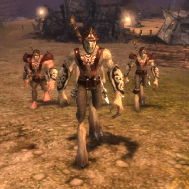

Back to: [West Karana](/posts/westkarana.md) > [2008](/posts/2008/westkarana.md) > [November](./westkarana.md)
# Chronicles of Spellborn pushed back to January

*Posted by Tipa on 2008-11-19 09:56:12*

I don't think that anyone is really surprised by this, but [Massively](http://www.massively.com/) reports that the launch of Chronicles of Spellborn in North America, UK, Oz, NZ and South Africa has been [pushed back to January](http://www.massively.com/2008/11/19/spellborn-american-launch-date-pushed-back-closed-beta-starts-t/).

However, the closed beta will now start on the 27th of this month.

Europe (aside from the UK) will still see the full, live game on the 27th.

So, if the game is LIVE, WTF do we need a CLOSED BETA for? The game will be LIVE. We can just head over to any of the Euro sites covering the game and read all about it. How you can have a closed beta for a live game that will ALREADY have an English version (along with their German and French versions).

It just staggers the imagination. "Open beta" I could understand, to keep people in the game as they bring up their servers and what-not. But the point of a closed beta? I dunno.

Still hoping to get in -- to the closed beta, I guess -- and it's nice to hear anything at all about the game's North American release, but such a big deal was made about delaying the game's worldwide release so that Acclaim could roll out the NA release same day. And now they aren't going to even be able to do that.

So what was the delay for, in the end?

[Full details of the NA release](http://tcos.com/en/news,id91,new_north_american_release_date_spellborn.html) are copied below:

---

Los Angeles, CA (November 18, 2008) – Acclaim Games officially updates the release schedule for The Chronicles of Spellborn MMORPG (Massively Multiplayer Online Role Playing Game). With additional testing and ongoing game improvements, Acclaim’s release schedule has been updated with Closed Beta testing to begin on November 27 and a new release date scheduled for January 2009. Acclaim’s licensed territories for Spellborn will include North America, United Kingdom, Australia, New Zealand, and South America.

When the European countries go live on November 27, Acclaim will simultaneously start Close Beta testing in its territories and then go live in January 2009. Both launches will have the exact same product versions featuring identical Freemium models but with a different release date to accommodate additional testing for a smooth official release. Extensive testing of the game will ensure players receive the highest quality gaming experience at launch.

With players around the world eagerly anticipating the launch of Spellborn, the game has undergone some key upgrades to allow more players to participate and enjoy the various features of the online game. In all regions, Spellborn will be a “Freemium” game, with a Free to Play zone and a required premium subscription service in order to access the full game past the Free to Play zone.

The Spellborn game client will be completely free to download and install, and will feature the special Free to Play zone with no time restrictions (only level limit). Key features of this Free to Play zone include the following:

• Free players are limited to the starting zones Hawksmouth and Aldenvault.

• A gameplay limit occurs at Fame level 7, when free players have progressed approximately 90% towards Fame level 8.

• Upon reaching this limit, all character progression is blocked and the player will receive a pop-up informing them of this block and what is obtainable beyond this with a premium subscription.

The following elements will be explicitly blocked:

• Players will be unable to gain Fame in any way or form, frozen at a fixed amount.

• The player will be able to accept quests, but not able to complete any objectives/quests.

• Able to kill mobs, but the player will receive no kill credit. This means, no fame reward, no pep reward and no item reward.

• Unable to travel beyond the zones Hakwsmouth (*sic*) and Aldenvault.

Players who want the full game experience and wish to go past the zone restrictions must purchase a premium subscription option priced at $15 per month to open all game content. This Freemium model will allow many more players to experience the gameplay before choosing the premium subscription to access the full array of game features and content.

Initial feedback from the MMORPG player community has been excellent, and the development team is taking this feedback to make various improvements to the game.

## Comments!

**[Ysharros](http://stylishcorpse.wordpress.com/)** writes: Well phooey!

---

**[Openedge1](http://simple-n-complex.blogspot.com)** writes: OMG...I knew something was amiss when I read that community managers post.

Acclaim is to blame for this, and we can only assume the reason the Euro version is a go is the developer said "Screw you and your ineptitude..."

Ah well, guess I may have a longer wait for an MMO. Either that or a change of plans...

DRATS!

---

**[JoBildo](http://bildos.blogspot.com)** writes: The game's been in closed beta EU with many US residents in it for over a year (not that I'd know or anything)... 

It also had an EU publisher for months before Acclaim stepped up to the plate. I still think that SOE should have opted on it, they'd have done it better.

Bah well, the EvE model or no price for the client, pay only for the subscription is a good thing. Really drops the barrier of entry for such an Indie type game.

---

**[tenfoldhate](http://tenfoldhate.com)** writes: "Freemium."

Marketing jargon makes me LOL. And puke in my mouth a little bit.

---

**[Tipa](https://chasingdings.com)** writes: I think this would have been a FANTASTIC property for SOE or NCSoft. Even Aeria Games would have been a good choice (and was my guess for the actual publisher before Acclaim was announced).

@Bildo: Your beta-fu is more powerful than mine :) But with the Euro launch looming, surely you can answer whether the game was fun?

---

**[JoBildo](http://bildos.blogspot.com)** writes: Hrm... I won't shed details but sure. Yes it's fun, and very unique in those areas where it strives to be. :D

Not sure if it's a "must play" for me, but considering it's free to own, and free to play to an extent it'll have a spot on my HDD.

---

**[Toldain](http://toldaintalks.blogspot.com)** writes: I can think of one reason for a closed US beta, with variations. There's stuff involved with either the localization from British English to American English that's potentially embarrassing, or the hosting solution is ragged, and also potentially embarrassing and they don't want horror stories leaking out. Hard to say whether it's a good reason unless you get in the closed beta.

I wouldn't call that a good sign, but there it is. Then there's the people-are-stupid reason. Americans and American media, as a rule, don't pay much attention to what's going on in Europe.

---

**[Tipa](https://chasingdings.com)** writes: I guess it depends what websites you follow. Sarkozy always seems to be in the news for some reason. 

The reason Spellborn doesn't need a closed beta is because we were told the game was delayed six months PRECISELY to take care of the issues surrounding the North American launch -- translation issues, renting server farms and so on.

Unless it turns out that during this six month delay, Acclaim didn't do ANYTHING and is now having to play catch up at the very end, well. That's it, though, isn't it? They signed a letter of intent back last spring, and then forgot entirely about it until maybe September, when some marketing exec got a reminder on his BlackBerry to "step up Spellborn promotion" and had to ask around until someone remembered what Spellborn WAS.

---

**[Openedge1](http://simple-n-complex.blogspot.com)** writes: *"some marketing exec got a reminder on his BlackBerry to “step up Spellborn promotion” and had to ask around until someone remembered what Spellborn WAS"*

OMG...you are probably right too.

"Hey, is that an Asian game? Oh...no Cash shop?...Oh...(note to self...I will get to this when I can...)"

Stupid Acclaim!

My favorite was the 2 Moons / Dekaron debacle. It seems that David Perry said they only bought the "engine", and would be making the game more for Western Audiences.

I played the Japanese version of Dekaron, and when I tried 2 Moons and found the EXACT SAME game, it was pitiful.

Still, 2 Moons is an acceptable grinding Diablo clone for those who want to try it...just ignore the really bad dialog with swear words for no reason.

As to Spellborn...I will mourn your loss...

---

**[Tipa](https://chasingdings.com)** writes: @Toldain also note, re: embarrassing American English/British English goofs that the Acclaim version is for both NA, UK, and most other English-speaking countries. (I imagine the other English-speaking countries in Africa will piggyback off South Africa, and Singapore will be included with the other Asian countries).

@Edge we'll see the game sometime!

---

**[JoBildo](http://bildos.blogspot.com)** writes: The NDA is down today apparently... I'll have to think hard about whether to just write up what I liked and didn't like. Due to many reasons I wasn't able to spend much time in beta until recently, and since I've been able to... I've had AoC, WAR, work, school, TTH work, and other things going on.

So yeah... I'm not the best judge of how good the game is past the first few levels. Maybe I'll do a "new players experience" type thing.

---

**[Tipa](https://chasingdings.com)** writes: @Bildo -- hearing the reactions of someone I trust and has seen the game recently would be amazing :)

---

**[Sente](http://adingworld.wordpress.com)** writes: Acclaim will probably have a closed beta because they had that written in the original plans and perhaps in the agreement with Spellborn NV and they will follow that to the letter. 

"Oh my we screwed up with the preparations for the release date. But we will promise them that we will do everything else that we agreed upon!"

And the Acclaim release is set to "January 2009" - not any specific date and that is 1-2 months away. If they cannot set anything more specific than a month I cannot say that I am not that confident in their ability to be ready and handle the game.

---

**[Tipa](https://chasingdings.com)** writes: @Sente -- I am definitely sharing that lack of confidence. I have this horrid feeling that we in the English speaking part of the world will have a great game robbed from us by an indifferent publisher.

Isn't this about the time SOE steps in and saves the day?

---

**David** writes: Having been in the closed eta and now playing the open beta I must say this game rocks. Although if you are purely a statbased mmo'er keep in mind playerskills (dodging for example) are dependent on you not your level.

I hope they get this game grounded with a nice playerbase, I absolutely believe it deserves a chance as a breath of fresh air through the stat driven mmo genre.

As a not so stat loving (nor hating) mmo'er this will be my next mmo.

---

**David** writes: Forgot, and keeping in mind this is the company's first, it's a hell of an achievement.

-Currently addicted to beta so I have to get back to it now :)

---

