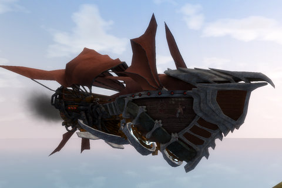
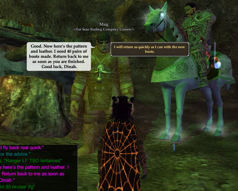
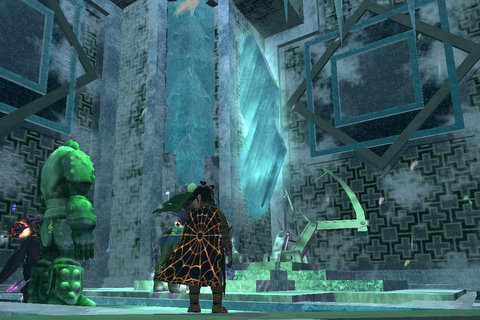
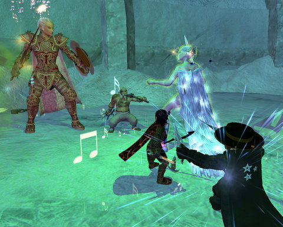

Back to: [West Karana](/posts/westkarana.md) > [2008](/posts/2008/westkarana.md) > [November](./westkarana.md)
# EQ2: The Shadow Odyssey? It's like a really big book...

*Posted by Tipa on 2008-11-20 09:50:14*

The Shadow Odyssey is like a really big book... but you only have summaries for each chapter, and you'll be having a test on it the next morning. At 7AM.

At least, that's how it feels to me. Way, way too much to digest at once. New dungeons all over the place, or re-imagined old ones. The whole plot that runs through the Moors of Ykesha. All new crafting! All new AAs! 

One thing you have to give Rise of Kunark; the expansion masterfully gave you a few levels to get used to things before dumping the expansion on you. You get all of The Shadow Odyssey from the moment you step off the Ethernaut airship.

EverQuest did that once, with the Scars of Velious, its second expansion. A group of gnome explorers broke through the ice surrounding the lost continent of Velious with their magical ship and opened up new lands to the rest of the world. After that, the gnomes were more or less forgotten for the rest of the expansion, aside from some adventures with a lost ship of the little ones in the Western Wastes... similar to the lost Ethernaut ship of gnomes crashed somewhere in the Moors of Ykesha. Rise of Kunark was EQ2's Ruins of Kunark -- obviously. The Shadow Odyssey is EQ2's Scars of Velious.

The expansion's heavy emphasis on crafting set it apart from other expansions since the Fallen Dynasty adventure pack. Crafters are taken aside soon after landing in Ykesha, and told how they can help the explorers learn the hidden lore and alliances of the vast swamp by gearing them up with special recipes for which they will supply most of the ingredients. For those crafters still too low level to go traipsing about the zone on their own, a secondary quest leads them through the balloon rides which take players safely through the zone.

I haven't done much of the quest yet, so I don't know the eventual rewards; I imagine they lead into the various crafting missions.

Though some of us (ahem) may have jumped right into TSO, the expansion actually begins with a quest from the monarchs of Freeport and Qeynos. We now know why they were both so eager to get the guild halls constructed a couple of game updates ago; it was so they could move into them!

Overlord Lucan D'Lere's lair is an elaborately decorated edifice to himself, complete with all the comforts and amenities you'd want if you were an immortal, self-important, ruthless dictator. I especially liked the cool aquariums. I think they've been peaking at Stargrace's apartment :)

Lucan ordered me to investigate the new lands, which leads right to some easy quests in TSO, great for AAs. And you want AA experience. All you can get. Because some of the new AAs are very sweet. I couldn't spend my way down to the super fast run speed, but I got 5% more run speed and a decent chance to double harvest, which will be nice for when I do the epic harvesting quest.

I was invited into a group to do my first TSO dungeon, Miragul's Phylactery, which appears to be a greatly expanded version of the older dungeon, Miragul's Menagerie. I have to admit that I was totally confused by the whole thing. Apparently there are like ten quests for the dungeon of which I had... um... one. About midway through, everyone shared their quests and that brought a little more sense to the mad dashing about. 

Just seemed so... disconnected. That's not a criticism of the zone. It was just so fast paced, and that's likely a good thing. Half the people had done the dungeon before and were more or less dragging the rest of us from place to place. Suddenly something surprising would happen. Then we'd race around trying to make something else happen. Suddenly something else would happen.

I can't make it any clearer than that. We'd fight for awhile, run around, something would happen, we'd fight again.

LOTS of cloaks dropped. I have the bard cloak from RE2, so I wasn't that interested in any of them, until the very last, which had decent enough resists that I had to vote NEED on it. I remembered how my poor resists hurt me in Thuga and the Shard of Hate. Boosting my resists is a necessary step toward returning to raiding.

Fighting some Valkyrie. I don't know what they were for. They are fairly common in Everfrost, and even have their own mini-instance, but I don't know if their presence here means they were for Miragul or trying to kill him. They were good-aligned creatures previously. Anyway, we're killing them here.

Here we are killing some animated hands, like the ones in EverQuest's Lower Guk and Karnor's Castle. Similar to the Valkyrie, I have no idea why they are here. They appear, we kill them. I do like how they clatter about, John Carpenter's "The Thing"-like, on little insect legs.

Don't take my confusion over what was happening in this one dungeon as an indictment against TSO. All new things are confusing, and the dungeon did have a nice mix of killing and puzzle solving. There's definitely a plot that runs through the place that was kinda hard to follow since so many quests asked you to do so many things in there. While I was looking at my quest list trying to see the things I should be looking for, everyone else was racing about trying to do the same. And then ice spikes would impale you from the ceiling.

Best way to approach The Shadow Odyssey? I'd definitely say the thing to do is to focus on just one thing at a time. Do the crafting lines, or the exploration quests, or all the different instances of a single dungeon and all those quests. Because TSO is not the kind of expansion you can get the sense of by trying to do everything at once.

While my experiences in Miragul's Phylactery were kinda fun and I did get a nice cloak from it, I think I would be happier, right now, doing the crafting quests and exploring the place slowly as the quest brought me through it -- and THEN taking on the dungeons.

I'm looking forward to transferring my cleric over from Befallen once my second copy of the expansion makes it to my apartment and doing some of the kill quests that lead you through the swamp in a different path.

Maybe after I've done both of THOSE things, will I be able to tell if this is better or worse than the previous expansion, Rise of Kunark. Way too early to tell. But by this point, I'd already had enough bad experiences with RoK to sour me on the whole deal -- repetitive quest grinding and very, very little experience for just killing stuff, especially given the difficulty of the very first dungeon, Karnor's Castle -- so in that respect, TSO is already a win.

## Comments!

**[Cow Nose the 50 Pound Cat](http://cownosethe50poundcat.blogspot.com)** writes: EPIC post Tipa!! Wonderfull read, awesome screens.

---

**[Toldain](http://toldaintalks.blogspot.com)** writes: I attempted Miragul's Phylactery last night, but we didn't get far with an inexperienced tank and only a fury healing. To add to my frustration, due to some UI glitch that I don't understand I wasn't able to type into any chat channel, even though my keyboard was otherwise working. Not everyone in the group was on voice chat, so that made things more painful.

---

**[Tipa](https://chasingdings.com)** writes: @Toldain -- go to each chat window, right click on it, choose Window Settings, and for Frame & Title, choose "None". That'll solve your chatting problem. I had the same thing happen to me.

We did wipe a couple of times, but it was all good and nobody minded. Wiping shouldn't ever be a downer, just a lesson to not DO that next time!

---

**[Jason](http://www.channelmassive.com)** writes: Sigh...dagummit Tipa.

All of these EQ2 posts of yours are making me think about actually subscribing again. If I could just keep my Gigglegibber gambling addiction in check...

Jason (resident drunken idiot of Channel Massive)

---

**[Loredena](http://gnomedepot.net)** writes: Sounds like you're having fun with the adventure missions! We have been doing the crafting quest-lines, and other than the cannon we somehow have never found any of the adventurer quests. Everyone keeps talking about this quest from Antonia, but we haven't found it!

---

**SnapJaw** writes: Where did you find Lucan and Bayle? I went to the Castle in NQ and I couldn't enter. Have no idea where Lucan is in Freeport.

---

**[Tipa](https://chasingdings.com)** writes: I got the quest to see Lucan from the East Freeport docks; after that, I could enter the citadel in West Freeport, a door I could never enter before -- and once I left, couldn't enter again.

I imagine the NPC that gives you the quest in Qeynos will be on the docks in Qeynos Harbor, but I haven't checked it out.

---

