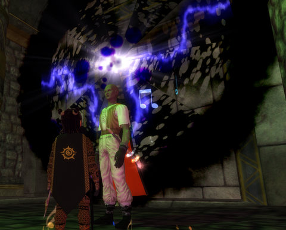
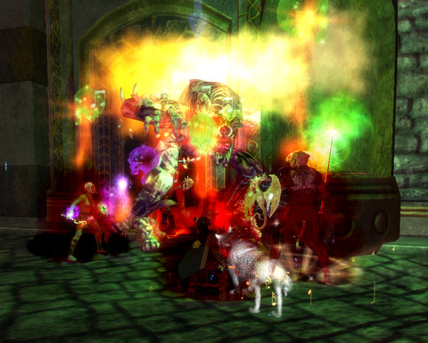
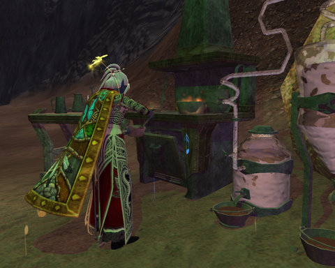
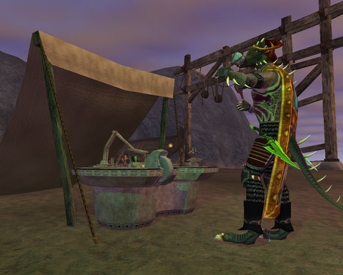
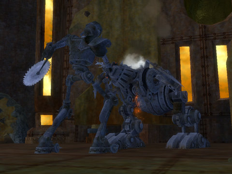

Back to: [West Karana](/posts/westkarana.md) > [2008](/posts/2008/westkarana.md) > [November](./westkarana.md)
# EQ2: Weekend Gaming

*Posted by Tipa on 2008-11-24 09:40:15*

Not surprisingly, the weekend continued the EQ2 fun from the week. The Shadow Odyssey is the most "different" EQ2 expansion yet, but I can't yet say HOW. But it is. Different. If y ou play in the TSO places, you are playing in a very different kind of game than if you play elsewhere.

So kinda working backward here.

Last night, after goofing around for awhile, I went LFG and got a group for the Evernight Abbey in Loping Plains. Never been here! And it seemed, neither had anyone else in the group, so we got to be the first. Most everyone was receiving lots of advice from their guildies on how it's done...

So what we basically figured out for the last guy, which was really the only unusual encounter in the place, was this.

The boss is surrounded by several lesser nameds. Each must be pulled to one of the rooms surrounding the central room and killed there. Their blood flows through channels in the floor, and buffs up various powers that can be claimed by the group. Each power weakens the boss in some way, so each person has to claim a power and then cast it at the right time.

The boss can cast Sun Sphere, which is a few seconds of the full power of the sun. My AE blocker could stop one of those. Then there is Holy Rain, which will instantly kill the group if not stopped using one of the powers. There is another power that removes all his buffs; one speeds up the group; the last one has something to do with pets.

After several tries, we couldn't manage to make everything work, so we left the dungeon empty except for him. Finished three quests and we did open the void shard chest, and now I have six void shards. Out of the hundreds needed for a full set of the best armor. Something to work toward, though, right?

Earlier, we did the Shipwreck Cove crafting mission. It starts in the Commonlands, but is a copy of the Cove of Decay in Thundering Steppes. Unlike the Klak'Anon crafting mission, where you build a meaner clockwork to take out a merely mean clockwork, this one is far more sedate. Now that we know how the crafting missions work, we split up the work along general lines -- me, as tailor, taking the Outfitter tasks; Kasul, as jeweler, taking the Scholar tasks; and Stargrace, as carpenter, taking on the Craftsmen tasks. Above, Stargrace wrestles with the stove as she mixes up a batch of grease.

Yum.

Kasul is making some fittings at the workbench. Kasul and Stargrace were making their two non-subclass items and finishing up with the one in their specialty. I'm not sure why, but decided to follow their lead and -- still not sure why. Maybe because it's a relief after two difficult jobs to have the third one be super easy.

And there's Stargrace and me, waving to the boat we just built as it sails away, without the crew, who is yelling at the boat from shore, but mostly yelling at US for not making some rope to tie it to the pier.

Oops.

So we have to go back and make ANOTHER one now.

Stargrace and Kasul have both blogged about our trip into the Clockwork Menace crafting mission, so I won't talk about it much here. It was fun :) We had NO idea what to do, but by the end, we were experts, and we had a good time watching OUR champion completely destroy that horrible, clanky, poorly constructed gnome one.

I helped!

And then our own champion killed me!

How ungrateful :(

## Comments!

**[Pete S](http://dragonchasers.com)** writes: Where do Stargrace and Kasul blog? I'd love to read more about the crafting missions!

---

**[Tipa](https://chasingdings.com)** writes: My bad! They are both on my blogroll.

Stargrace --> http://mmoquests.com
Kasul --> http://shatteredblog.wordpress.com

---

**[Pete S](http://dragonchasers.com)** writes: Thanks! I figured they were on your blogroll, just wasn't sure which ones they were. Adding 'em both to RSS now.

---

**Jexi** writes: I am having a hard time with the new carpentry recipes in TSO as a low level master carpenter. Unlike ROK they decided to not use crafting writs to gain factions needed to buy them. I have my daily quests figured to about 6 months to get my recipes. I have been told my other option would be to group with a high level and let them kill mobs. That would be about 1900 mobs. I like the idea of the crafting missions and all, but I am level 48 and can't do most of that. 8) Have you encountered this problem with crafting factions in TSO?

---

