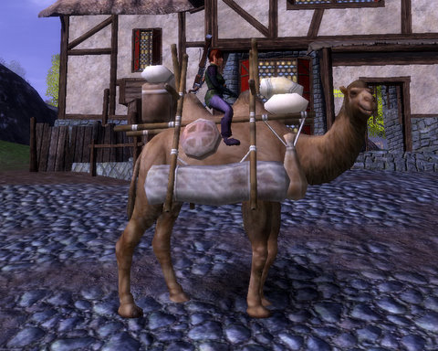
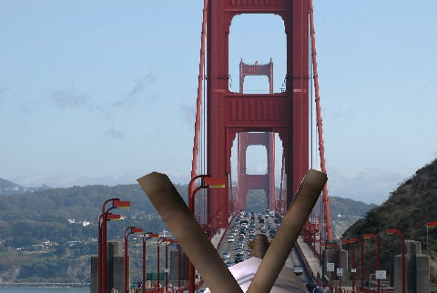

Back to: [West Karana](/posts/westkarana.md) > [2008](/posts/2008/westkarana.md) > [November](./westkarana.md)
# Vanguard: Telon on Camelback

*Posted by Tipa on 2008-11-25 09:12:18*

[Stargrace wrote](http://mmoquests.com/2008/11/25/meet-spit/) that everyone who plays Vanguard was given a camel. I've never had a camel before. They say about Vanguard, that you can just pick a direction and start walking, and nothing's going to stop you. Anyplace you see, you can walk to.

So I got some provisions from the kind merchants at the Village of Trush, packed up the bags, left a note for my family so they would know that I was okay, and I climbed up on the camel and looked all around.

Everything looks so small from on top of a camel's back. I can't believe I used to run everywhere. Now I ride my camel. She is so smart. Sometimes when we're riding, I fall asleep, and when I wake up, we are someplace else. And it's pretty funny, because sometimes they don't speak any language I know.

Sometimes they shoot at me. Camel bears me swiftly to safety.

Once when I woke up, we were surrounded by people trapped in metal boxes, and they were being made to cross this bridge to some hellish continent on the other side. They did not seem happy, but they did seem resigned to their fate. I turned camel away, and went in the other direction, away from that forbidding wasteland of noise and fumes.

I never know where I'll be when I wake up, but I trust Camel to keep me safe.

## Comments!

**[JoBildo](http://bildos.blogspot.com)** writes: You're nuts, Tipa. I like it!

---

**[almagill](http://almagill.livejournal.com)** writes: Are you sure your camel didn't come with anything herbal and relaxing? ;)

I'd totally forgotten I have a camel in Vanguard! Must og back and visit sometime "soon"

But 'bears me swiftly away' is a wee bit of an exageration, surely?

---

**[almagill](http://almagill.livejournal.com)** writes: go, not og. Eesh.

---

**[Stargrace](http://www.mmoquests.com)** writes: You must have gotten the collectors edition.

---

**[Tipa](https://chasingdings.com)** writes: You'd be surprised how fast Camel moves when people begin shooting at her.

---

**[Ogrebears](http://www.ogrebear.com)** writes: The image of the bridge is a lie.... The chances of seeing it with out fog is close to 0

---

**[Ogrebears](http://www.ogrebear.com)** writes: The bridge is related to the cake.....

---

**Egat** writes: If you had popped into WoW on the 23rd you'd have received a cute, fuzzywuzzy, white baby bear companion as an anniversary gift.

It was cute... until I started running across all the hunters /sleeping on the ground with the bear sitting on their faces. Leave it to the hunters to ruin a cute mechanic such as the bear sitting down when you stop moving for long.

Sorry for mentioning WoW, I know I just called the scrapers.

---

**[Tipa](https://chasingdings.com)** writes: Well, that's what you expect in WoW. The phrase "one bad apple spoils the barrel" was coined for WoW. As long as I don't mention WoW in the article, btw, the scrapers pass me by, so no worries :)

---

**[Hudson](http://hudshideout.blogspot.com)** writes: You're such a power gamer Tipa. Already on the Moon? Give me a break! ;)

---

**[Anjin](http://bulletpointsblog.blogspot.com)** writes: Even with my black, cynical heart, I couldn't help but laugh at this post. Stop it!

---

**[Jalent](http://www.downloadonlygamer.com)** writes: ...I don't even know what just happened. Haha!

---

