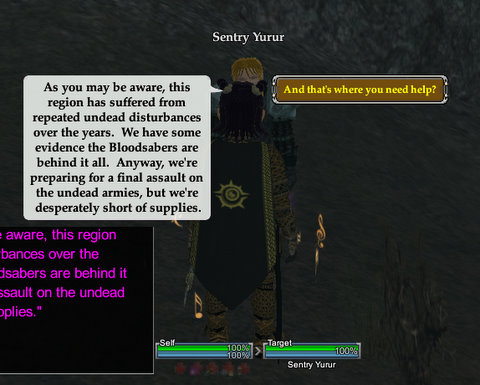
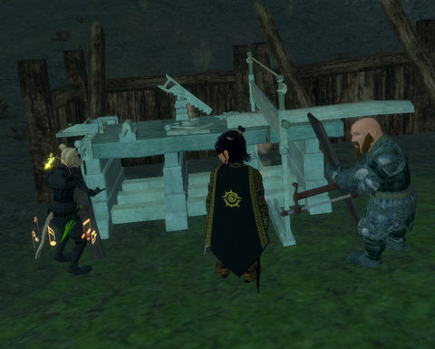

Back to: [West Karana](/posts/westkarana.md) > [2008](/posts/2008/westkarana.md) > [November](./westkarana.md)
# EQ2: The Firemyst Village crafting mission

*Posted by Tipa on 2008-11-26 09:15:49*

While I love MMOs, the idea of playing a game where wanton killing is the only path of advancement just seems morally wrong. If anyone acted like that in the real world, they'd be shut away. Yet in MMOs, it's meant to be heroic to kill as much as you can, until killing itself becomes so humdrum and ordinary that nobody ever talks about it. Even killing a god is just a means to an end. At least EverQuest had the decency to be shocked when players finished killing the pantheon of Norrathian gods, when Druzzil Ro reset time itself so that it never happened. The gods remembered, though, and left Norrath rather than serve as the Raid Target of the Day for a new generation of adventurers.

  
*The dwarfs went through all this trouble of building crafting workstations and laying in supplies before they remembered they didn't know how to craft.*

In my perfect MMO, every kill mission or raid would have a peaceful way to finish it, through cleverness, or trickery, or puzzle solving, or maybe even just by crafting. In fact, kill missions would be so unusual (in my perfect MMO) that when you got one, it would be appropriately serious. Even though The Shadow Odyssey's three crafting missions just have you craft twelve each of nine different things, one for each craft, it's a start.

I was kind of hoping for something a little more dynamic from the crafting missions. Like, you have half an hour to equip a village to fend off a dragon attack. Will you focus on armor, weapons, or resist gear? Or will you make some special spells or abilities? Or a combination? The things you made would determine how the encounter went, and you could definitely lose if you made the wrong things or not enough of the RIGHT things.

  
*I turn my back for ONE SECOND and Goudia swoops RIGHT IN and steals my crafting station!*

There's no urgency in current crafting missions. You can solo them. It will take you about three hours to do so, but that's okay, no rush. Take all day!

Not to say that running the missions isn't worthwhile -- you can get crafting books as rewards that let you make and upgrade TSO gear for FAR fewer void shards than would normally be required. Plus the special crafter gear sold in the Village of Shin requires the tokens earned from running crafter missions. New, five-use recipes are sold there as well. I'm not entirely sure how recipes with uses work -- I guess that means I can make five things from those recipes before I have to buy them again. It'll be awhile before I reach level 79 so I can scribe them, though.

  
*Too bad the dwarfs didn't ask us to make them some decent looking armor. What are these, the Terracotta Dwarfs of Firemyst Valley, or something?*

The night before last, we were all still locked out of all crafting missions, even though we'd cleared our lockout timers. That was a little disappointing. Last night, Kasul was STILL locked out. Why? Makes no sense, but there it is. Stargrace and I decided to try duoing one. She logged in her dirge alchemist for the run, because doing a crafting mission when you're already at max level is just wasting good experience. I've leveled from 63 to 67 tailor purely through TSO crafting quests and missions. For most of that, I didn't have to harvest anything or buy any fuel, because the crafting missions supply everything you will need, for free.

With me doing the outfitter items and Stargrace taking on the scholar items that Kasul would normally craft, there was a big giant gaping hole of the craftsman items in which neither of us had any but the minimal artisan skill. It must have taken me a good five minutes to make one item that just didn't want to be made, but I eventually muddled through, and if the Heavy Shields I made weren't quite dwarven quality (the foreman took a LONG TIME to approve my craftsmanship), they served to fend off the undead hordes that were attacking the encampment.

  
*Don't look at my feet. Oh no, you looked ><*

Afterward, I had the faction and the tokens required to GO SHOPPING! The crafting faction merchant in the Village of Shin had these sleek armors of a kinda unique design that also boosted crafting skills, if you wore a full set. I bought the vest and pants of the Midnight set, getting server discoveries on them both. Guess they aren't that popular.

I noticed that the new shoulder armor for the Tier 1 Sackcloth and Tranquil Sackcloth sets looked really fantastic, so I chose that for its looks. I'd love to have bare feet, but I'm not sure if you can buy the appearance-free armor from the Void Invasion merchants any more. I'll have to check up on that. I still have three banners to spend, and I'm pretty sure the "bare feet" shoes cost only one or two.

|  |  |
| --- | --- |
|
 *Sackcloth Armor* |
 *Tranquil Sackcloth Armor* |

While it's not exactly gi-like, the Tier 1 armor sets do have a fairly unique appearance that a young monk or bruiser might really enjoy.

Crafting missions? I've done all three of them now. They aren't terribly exciting, but it's very nice to do missions with decent rewards that don't require killing. I'm hoping for a lot more of this type of content in the future.

## Comments!

**[tenfoldhate](http://tenfoldhate.com)** writes: I too would love to see games with progression that can be achieved by averting violence or avoiding violent resolutions to conflict. It could be done--and done pretty easily. When I think of some of my favorite single-player PC games of the nineties, I immediately think of Myst and the 7th Guest. The thing is, after seeing what happened to Myst Online (which I never had the chance to play) I think there does need to be a balance between action-based progression and alternatives to killing. Even if you think of the old text based games like Zork, there was killing, but it wasn't the primary type of advancement. I think Vanguard touched on this with diplomacy, but their execution was just all wrong and got really dull really quickly. Don't get me wrong, I love the old hack-and-slash, but it does seem silly that the only formula to gain wealth, renown, and experience in today's MMO worlds is to bludgeon forest creatures to death and decapitate goblins.

---

**[Stargrace](http://www.mmoquests.com)** writes: I love having alternative means to gaining things in game. These tradeskill instances have been fun - and I hope to see more then the three we currently have. I've already written about how underestimated the popularity is in these types of progression forms (the crafting community in VG is huge and very passionate for example) and moving a game along that caters to different methods of advancements is fantastic instead of just the hack and slash portions.

---

**[Saylah](http://notadiary.typepad.com/)** writes: While I have to admit to having not problem whacking things in MMOs, I do have two best friends who simply refuse to do it. I want so badly to have a game we can all play together but I can't do the pure social MMOs like Habba and SL. I keep peaking at SL because they dabble in there but after going Wow over the cool structures designed by players, I'm done.

---

**Milia** writes: I really like the ability to progress with something that doesn't require killing or raiding 6 nights a week to progress. I hope they develop the crafting missions along the lines you outlined above - put some challenge back in crafting. More strategy, more puzzle solving. Isn't that what makes a dungeon fun in the first place? Finding out how to progress rather than just a simple tank and spank. We tried to help our Champion kill the out of control clockwork and several of us ended up getting killed after it turned out we had attacked our own Champion. Let the crafters in on the fight - or have to sail the boat to some sort of fabled loot - and make it hard enough you can't get it easily on your first try.

So far I am enjoying the crafting missions. I like that crafting is hard again and you do have to really work, almost use strategy, to get a combine - or so it seemed to me originally. So far I have done one mission solo and 4 duo and one with a full group. I'm doing them on two toons, a jeweler and a provisioner. I would SWEAR to you that between Thursday and Sunday the combines on the missions became MUCH easier. And this isn't because I am getting more experienced or better - the rolls seem to be consistently better and I haven't upgraded my gear yet (that happens tonight!). Originally, I had found you couldn't spam the arts not in your direct line because failing to counter or mis-countering an event caused such a hit to progress and durability. No so my last three dungeons. I was dissappointed and embarassed when, after I had been telling them how much harder it was, I got my guildies in and *poof* mission complete without one combine lost! 

In addition, the first mission I did, I got 3 or 4 Far Seas Innovations - one of which rewarded a coin and another a silicate. Another person in my guild was regularly getting 3 - 5 FSI per solo mission. The last 2 missions we haven't had ONE FSI. Another duo in our guild did one last night with nary a rare counter. That is very disappointing. 

I also liked the weekly mission. It could have been made more puzzle-like by having to kill in a certain order or having the statues placed in such a way that you had to get in a certain place before you could neutralize a mob. Maybe have the last warrior on the dragon's nose or have to run down one of the dragon's whiskers to get in the right place. They could incorporate the doors there as well. They can be used but I think they are a challenge to get closed.

Over all, a nice addition.

---

