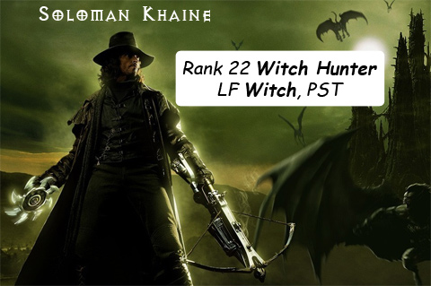

Back to: [West Karana](/posts/westkarana.md) > [2008](/posts/2008/westkarana.md) > [October](./westkarana.md)
# Straight Talk Warhammer: The Witch Hunter

*Posted by Tipa on 2008-10-01 08:05:23*

Was your life as devastated as ours when one, two, and then three days went by without a Straight Talk Warhammer? Did you feel feverish, slipping in and out of consciousness, and have long and repetitive arguments with yourself about whether or not Sokka from *The Last Airbender* was inspired by Xander Harris from *Buffy the Vampire Slayer*?

Friends, we know exactly how you feel. But from those pits of despair and dreams we have wrangled news of one of the most excitingly original careers ever conceived of by a game which has already proven time and time again that a war between orcs and humans was too good an idea not to copy, the Witch Hunter.

  
*Simulated Warhammer screenshot.*

The problem with being a Witch Hunter is, not enough Witches to go around. Like, you come to a village, and you see normal people going about their normal jobs. How can you tell which are witches?

Luckily, there's an easy test. Have your minions line up the villagers and send them into Witch Hunter Central one at a time, and see if they match any of these tell-tale witch signs in our handy "Description-Prescription" table.

| Description | Prescription |

| Taller than you? *Only witches dare stand taller than a witch hunter.* | Burn them. |

| Red-headed? *Red hair is the sign of the devil.* | Burn them. |

| Walks with a limp? *Physical imperfection is a sign of corruption.* | Burn them. |

| Claims not to be a witch? *Witches will always deny their true nature.* | Burn them. |

| A child? *Children are willing vessels of evil.* | Burn them. |

| Your mother? *Just the kind of trick a servant of destruction would likely pull.* | Hug, then burn them. |

Simple truth is, a good witch hunter can't be really effective against the minions of darkness if there's any sign of taint in their so-called allies. I mean, how sure can you be that you yourself are not a witch?

Witch hunters always place themselves behind the allied lines, so they can keep a sharp eye both on their friends AND their enemies. Because witch hunters have no friends. They can't afford them. They have seen too many friends willingly and with great intensity shrug off the illusion of Order to reveal the demon hiding beneath after it was shown to them that their homes, wives, children and fields were unholy.

It doesn't matter who you are, really. The Witch Hunter has looked into your soul with his steely, unforgiving eyes, and what he sees disgusts him. Prepare to burn.

---

*There's only one blog that will wade through the scourges of fire and fever to bring the Straight Talk about Warhammer Online: Age of Reckoning, and that's this one. You won't find this on any Tome of Knowledge... is not given as a reward in a Public Quest... but dammit, it should be. Tune in tomorrow for another exciting edition of Straight Talk Warhammer, where we discuss that bane of pressed clothing, the Ironbreaker.
*
## Comments!

**[Hudson](http://hudshideout.blogspot.com/)** writes: I have to say this 

Taller than you? Only witches dare stand taller than a witch hunter. Burn them. 
Red-headed? Red hair is the sign of the devil. Burn them. 
Walks with a limp? Physical imperfection is a sign of corruption. Burn them. 
Claims not to be a witch? Witches will always deny their true nature. Burn them. 
A child? Children are willing vessels of evil. Burn them. 
Your mother? Just the kind of trick a servant of destruction would likely pull. Hug, then burn them. 

IS CLASSIC

---

**[Openedge1](http://simple-n-complex.blogspot.com)** writes: *Witch hunters always place themselves behind the allied lines, so they can keep a sharp eye both on their friends AND their enemies. Because witch hunters have no friends.*

Ahhh...and I thought it was because the ugly woman Witch Hunter I made was ...well.....so ugly, no one wanted to be her friend.
Seems the ugly WAS just the visual quality of the game, and the reason I REALLY had no friends is...WITCH HUNTERS HAVE NO FRIENDS...

(Glad to see you back on track@@)

---

**[almagill](http://almagill.livejournal.com)** writes: Witch hunting is SO easy.

You just head to Altdorf, buy up the entire stock of Jimmy Choo shoes (not real ones of course, the rip offs that the dwarves make), then announce a Cheese Wine and Shoe Party in one of the local hotels.

Pretty soon the place is full of cackling witches of all shapes and sizes. Bar the door, make a few sarcastic Vincent Price comments and torch the place. If you had the sense to charge an entry fee you also come away from the venture significantly richer.

Of course, Altdorf being full of wooden buildings you can only do this once because, like, they take your travelling priveldges off you and you're left walking round the Troll Lands trying to hitch a ride anywhere where there's more witches.

---

**[Sean](http://dadsbattleground.blogspot.com)** writes: I made a witch hunter that looks like your daughter. 

Coincidence?

---

**[Tipa](https://chasingdings.com)** writes: ... or creepy ...

---

**yunk** writes: You know, to be serious for a second, it's an interesting idea to give the witchhunter some sort of debuff that affects allies, in return for buffing himself. This would kinda match the pieces of crap witchhunters are supposed to be.

"I'm debuffing you with -10% to heals? So? I need that power to fight evil! Or do you not want me to fight evil? Only a secret servant of Chaos would not want me to fight evil! You aren't a servant of Chaos are you?"

---

