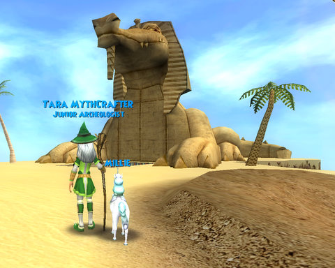

Back to: [West Karana](/posts/westkarana.md) > [2008](/posts/2008/westkarana.md) > [October](./westkarana.md)
# W101: Krokosphinx and October 1 patch notes

*Posted by Tipa on 2008-10-01 12:00:35*

After being a one-wizard elimination team on the Niriki royalty, it turned out it was all for nothing. Professor Winthrop told me with an astonished tone that the missing Order of the Fang was on an *entirely different island*. Not in the Pyramid of the Sun *at all*, it turns out.

So, I had just gone through and spread terror throughout the Pyramid *for nothing*?

Just so.

All those hours, all those endless card battles, all of that -- and I was on the wrong island the entire time?

Sadly, that is the case. And now, would you hurry along to the Krokosphinx and get on with the killing?

How do I know that the real evil won't actually be on that mysterious looking Temple of Storm island nobody is talking about yet? Why can't I just skip right there? HUH?

At least I got to see the cool Map Room, which certainly has nothing to do with the Map Room Indiana Jones discovers in *Raiders of the Lost Ark*. Bah, who am I kidding? Krokotopia has such a love affair going with *Raiders* that it almost hurts. From the music, to the quests, it's all there. Just give me a whip and a fedora, please.

Thankfully, the Krokosphinx is the home of creatures that use Ice. My secondary school, Fire, was mostly useless in the heat of the Pyramid of the Sun. But nearly every critter in the Krokosphinx will be baking in the cleansing fire of my Sunbird. Especially if I can get to level 22, my next spell level, before I get too deep. I think this level is the meteor storm, that does fire damage to every enemy.

The Pyramid of the Sun quests left me off partway through Level 21, so I'm just about there.

Last night I had to "de-friend" my first "friend". I normally approve all friend requests -- and why not? But when one of these random friends kept teleporting to me in the middle of a boss fight, I had to let him go. It didn't matter so much in these instanced fights if people join the fight and immediately leave, because the fight won't get any harder. But if that had been an open fight, a fight tuned for just one wizard could quickly turn impossible with the adds an extra wizard would bring, but who wouldn't stay to fight them.

Some people say this is a cheesy way to PK someone, where people will intentionally try to make fights so hard that you're forced to flee or die, but I don't think it's that malicious. These were likely just kids -- it's nearly always children -- who were hoping I would be heading to Marleybone or Moo Shu and they could hitch a ride with me to those higher level zones. When this kid saw I was just fighting the final bosses of the Pyramid of the Sun, he lost interest.

But I just couldn't have him, in the future, pulling this stuff in Marleybone or Moo Shu where that kind of behavior would get me killed, so I de-friended him. Today's patch, that limits the size of the friends list, will likely have me de-friending a lot of the people I don't know.

[
Wizard 101 released a huge patch this morning](https://www.wizard101.com/site/posts/list/2142.ftl), but it doesn't seem to have fixed that many things. The notes, such as they are, are below:

---

Big News!
1. All new pets dropped by bosses will no longer only be named Baby Abbey, they will now have a randomly generated name.

*All boss-dropped pets were named "Baby Abbey", the default name for everything. I wonder if Baby Abbey pets will become rare, now? I still haven't found a dropped pet...
*

2. The floating book pedestal in Crimson Fields appears to have been fixed.

*This has long been an issue with people trying to complete a certain Moo Shu quest. It's been said to have been fixed in each of the last couple patches. So we'll see if it finally is :)
*

3. Choose your friends wisely. The size of the Friends List is no longer unlimited. Each character can have a maximum of 100 friends, if you have 100 or more friends now, you cannot add new friends until you remove enough people from your list to bring the total under 100.

*So much for indiscriminately adding friends :P*

Spells
1. Steal spells now describe the "steal" action.
2. Accuracy for the Stun and Freeze spells has been increased to 70%
3. Quench spell Rank has been reduced to 2
4. Melt spell Rank has been reduced to 2
5. Dissipate spell Rank has been reduced to 2
6. Rebirth's spell accuracy has been reduced

Krokotopia
1. Djeserit Dwellers will turn to dust when they are defeated in a duel.
*This is a really cool effect -- like when vampires get dusted in Buffy.*
2. Oka looks much more like his portrait.
3. Players can no longer interact with the Frozen Forge multiple times.
4. Zan'ne may ask you to do the Tome of the Fang quest again.
5. Desert Golems give credit for both Elemental and Golem badges.
6. Completing the quest "A Fang in Hand" is no longer be required for "Master of the Oasis" Badge.
7. Shackled Slaves will no longer have the word 'Shackled Slave' over them.

Moo Shu
1. The Myth Wand available in Moo Shu is now available for all schools of Wizards to use.
2. Players can no longer use "Teleport To Friend" when another player is inside Fushiko's dojo in Village of Sorrow, since it is now a single-player instance zone. You are meant to complete this on your own as a test of your ability.
3. The floating book pedestal in Crimson Fields appears to have been fixed.

Misc
1. Cyrus has been busy with his red corrective pen again, this time he's been correcting grammar and spelling.
2. Many treasure cards have new cinematics when they are cast.
*Oh, cool :) Treasure cards are always so much fun to use.*
3. At the Wizard Creation screen, buttons have been added to rotate your character during character creation. You can still use the mouse to do this as well.
4. The names of all the mini games can now be said in Text Chat. 

