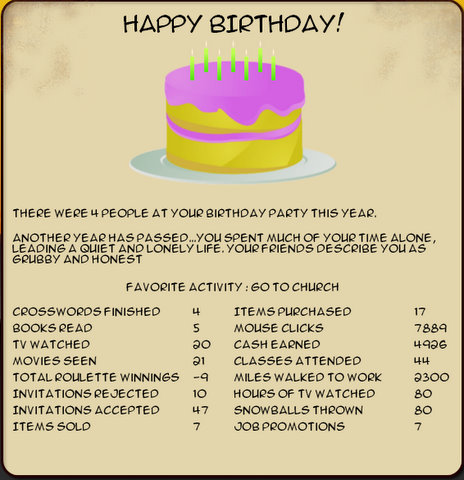

Back to: [West Karana](/posts/westkarana.md) > [2008](/posts/2008/westkarana.md) > [October](./westkarana.md)
# Kudos 2 review

*Posted by Tipa on 2008-10-03 07:47:56*

If you could relive your life, would you do it all over again the same way? What if you could live your life in a better, or at least different, way? [Positech's Kudos 2](http://www.positech.co.uk/kudos2/) lets you chart ten years in the life of someone just starting out in the world, working at some menial job that just barely pays the bills.

I started out life as a waitress, making a pittance, going out with my friends every so often. I suppose I could have spent the next ten years doing the exact same thing, and that's a way you can play it.

Once each weeknight, and twice on weekends, you get a chance to change your life. Friends will lift up your spirits or depress you, make you overspend on bad food or simply ignore you. Or you can study for classes, look for another job, watch TV, go shopping, take a bath, go for a walk in the park, read a book... make a choice to read up on current events to qualify for a news job, and your friends may resent you not going out with them. Go to the theater with friends when you're in a bad mood, and they may wish you'd been more excited about being with them.

  
*The graphs that rule my life.*

I decided I didn't want to be a waitress all my life, so I took classes, studied, learned what kinds of things made me relaxed and happy so I would do well in interviews, and found a job writing filler for a local newspaper, and later a better job for a paper that was a little too far away to walk. That meant taking the bus, and the bus fares were outrageous, taking nearly all my money. Since I couldn't afford to see my friends very often, they abandoned me.

I joined a bowling league and would go out with the few friends I had when I could afford to, and after awhile, found a much better paying job as a reporter for a local radio station. I was making good money, it was a lot closer, I was learning how to drive, I had subcriptions to all the local papers to stay informed, and I could afford to go to the ballet and theater and stuff, but my friends were too lowbrow to keep up, and so they in turn eventually drifted away as I turned my attention to a local cable TV station that needed a new presenter.

  
*Boring, grubby churchgoer with a radio show but few friends? I sound like a Stephen King villain.*

Kudos 2 is one of those "just one more turn" games that have you playing far longer than you expected. Trying to reach a certain goal while dealing with life's roadblocks is a definite challenge. I would never have expected that my humble reporter would also turn out to be a league bowling champion or have a dog to whom she is 100% devoted, a border collie named Lord Shep, or to be able to order food in French restaurants, in French.

I really didn't appreciate being robbed and assaulted so frequently. The game has remedies -- Lord Shep attacks robbers, and I could learn martial arts to help while walking to and from the bus station (or just learn to drive and buy a car), but I think after the first attack, I'd probably want to move to a different city...

The constant struggle to keep friends happy is the one true challenge of the game. While necessary to keep you happy and excited about life, many of them tend to be dull and pessimistic, dragging you down, or interested in things you don't find interesting, like constantly eating out (thanks for the calories, so-called friends) or drinking beer. And not sufficiently interested in, say, bowling. 

The game did crash to desktop on me once (the author has a patch for that issue already). It had autosaved recently, but when I returned to the game, I had no friends. This was oddly freeing in a way, because it allowed me to focus on studying and boosting my IQ and cultural knowledge for a better, closer job without worrying about partying with friends that I could not afford.

Buy or no buy? It's a casual game you might play once a month. It's fun the first couple of times, but even though you can choose different career paths, it's still going to be the same game every time you play. At $20, it's just slightly out of the price range of a casual game -- XBox Live, Wii Store and PSN have set the price point of the truly exceptional casual games at $15.

On the other hand, Kudos 2 is by an independent developer, and if that's important to you, then it might be worth a little more to support indie development. While I enjoy the game, I would have rather have seen it on a console, or to have ran on my Ubuntu-running Asus Eee either natively or via WINE. This might well be a perfect game for a netbook running Windows, actually. Its large, uncluttered interface is uniquely suited for the netbook's smaller screen.

Kudos 2 has [a full demo](http://www.positech.co.uk/kudos2/demo.html) that lets you play out a sample year for free, and is fully moddable via simple text files. If you want to add new jobs or don't like being robbed so much, help is just an edit away.

