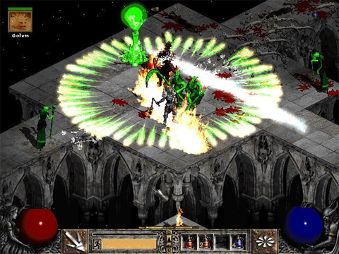

Back to: [West Karana](/posts/westkarana.md) > [2008](/posts/2008/westkarana.md) > [October](./westkarana.md)
# Straight Talk Warhammer: The Archmage

*Posted by Tipa on 2008-10-03 08:43:43*

I admit it, life before Warhammer Online: Age of Reckoning was fairly bland and meaningless. My life before I became consumed by WHOOOOAAAAA was just a shadow -- a shadow OF a shadow, really. Before Public Quests, how could I really do a quest? Before the Tome of Knowledge, how would I know what to do? Before Open Groups, how would I ever find a group? MMOs before WAR were mostly people just standing around, without direction, without anything to do.

WAR *changed* that, and changed it *forever*. Changed it to *death*. From now on, no other MMO developer will ever dare confuse players by not telling them exactly what to do and when. But really, when you already *have* WAR Everywhere, what do you even need other MMOs for?

It's time for all those other game companies to really examine their lives, to just sit back and wonder why they are even in this crazy business when the one game to rule them all has already been written? They should all roll up those masters of high elven magics, those twisted sisters of arcane allegiance, the Archmage, and go WAAAAAAAAA on someone.

  
*Simulated Warhammer screenshot.*

Your basic Archmage is always doing the wrong thing. When its just trash mobs everywhere, the Archmage is making them light up like fireworks at Christmas. When the boss is up and the Bright Wizards are all lighting up the bad guy, doing their part, the Archmage is looking for people to heal.

"We're BURNING here, Ossandra-the-Amazing!"

"Wait, Lego Lass has a nasty scratch, be right with you!"

*Crunch*Crunch* boss picks Lego Lass up in one meaty hand and bites off her head. Ossandra brightens up. "See?!"

The Bright Wizards laugh and nuke the boss dead while Ossandra gathers her magic for a huge blast -- finally. "Um, where'd he go?"

Archmages are famous for fighting the wrong mob at the wrong time. They bring dobermans to cat shows. They drive in the carpool lane without anyone else in the car. They show up to birthday parties a day early and send the present a month later.

Playing an Archmage? Here's a news flash. Nobody wants your cruddy heals. Just toss a few around to build up the power for the nukes you were hired for and try to ignore the Bright Wizards doubling over in laughter. Your guild leader has a clue in the guild bank just for wild cannons like yourself. Go get it.

Gandalf would have looked damned silly trying to get some quick heals off on Samwise so he could fight the Balrog.

Get over yourself. Archmage is the high elf word for 'hopelessly confused'.

---

*Wow, has this really been three weeks of Straight Talk Warhammer? Very nearly! Three weeks since all our lives were changed forever. This is also the last Straight Talk Warhammer -- for now, anyway. I've enjoyed doing them very much, and they've made me want to pick up the game and give it a try. But there are other games out there that need a pin in their balloons, and satirizing every class in Warhammer just to do it is definitely taking a good joke past the point where it's amusing. Starting next week, Stout Henry will be back with his twisted take on MMO combat with 'Stout Henry Goes to War".

For those few of you who stuck with STW this long, thanks :) Your laughter and comments made this worthwhile!
*
## Comments!

**[Stargrace](http://www.mmoquests.com)** writes: It's like you took a page of my Archmage Diary and just posted it for all the world to see.

---

**[Sean](http://dadsbattleground.blogspot.com)** writes: Last time I saw an arch mage he was taking a dirt nap while I (a true healbot, a Rune Priest) was healing the team.

You see Arch Mages have this funny way of thinking. "I'm going to nuke that guy, but I'm going to make a very huge arrow point to me while I do it so the other team can destroy me." 

Yep, want to nuke that Shaman git? Go right ahead, it will be a green rainbow arrow explosion.

I think I had a point to this comment... wait no I didn't.

---

