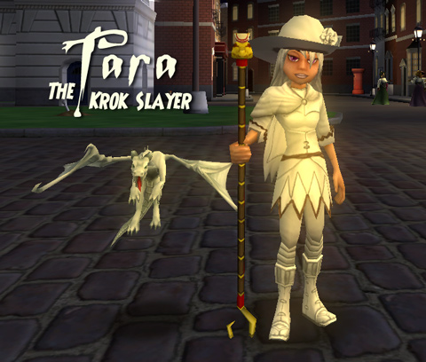
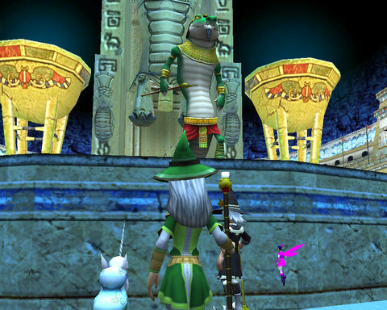
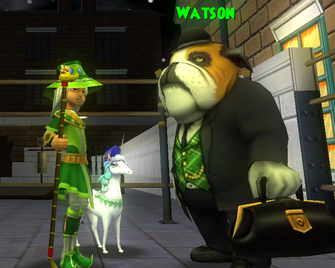

Back to: [West Karana](/posts/westkarana.md) > [2008](/posts/2008/westkarana.md) > [October](./westkarana.md)
# W101: Leaving Krokotopia

*Posted by Tipa on 2008-10-06 08:00:20*

  
*And I have the title to prove it.*

I didn't reroll as an Ice wizard :) I was just spending my mornings as I often do, killing Bastilla in Firecat Alley to try and get one of her rare pet drops -- it KILLS me that I haven't gotten a rare pet yet -- and she dropped, along with a rare staff, some rare robes, Chillcloak. For all that it looks like Luke Skywalker's second best clothes, it's a pretty unique look. Half cape slung casually over one shoulder. Matching hat and shoes to complete the outfit.

If you look behind Tara, you won't see the crowds of Wizard City or the blinding glare of Krokotopia. Tara is standing in the central square of Marleybone, its eternal night lit dimly by the glow of shop windows and the flickering magics of the minigame portals. She finished Krokotopia. Well, that's not *exactly* true. But she did earn the right to go to Marleybone; she didn't get there by tagging along on someone else's ticket.

  
*The Arena Master.*

I started off Saturday night, after getting back from helping my son move to college, having just barely achieved access to the Krokosphinx, the second quest hub in Krokotopia. The main storyline for that section is the rebuilding of the Order of the Fang, an ancient society that once protected the Krokonomicon from misuse by those undeserving of power. That vile tome was stolen and the Order killed or scattered. Those wizards who venture into the Krokosphinx are there to gather them together once more, both the living and the spirits of the dead. And if the situation of the servile Mander people may be improved, so much the better.

I met up with someone who was just a quest or two ahead of me. He helped me catch up, and we worked together through the Grand Arena and the Vault of Ice.

In the Grand Arena, the Arena Master sets you ever greater challenges to prove your worth to (if I remember right) earn one of the three badges that identifies the bearer as a member of the Order of the Fang. That, and a trip through the Vault of Ice, earns you the right to defeat the minotaur champion at the front of the Sphinx. There's always people willing to help with that boss, who has 2000 points of health and three friends, because he has some interesting rare drops.

  
*The Order of the Fang sends their love.*

That fight ended the night. This morning, I soloed the Emperor's Retreat instance (which I did again later to help someone with the scarab collection quest), and that earned me my second badge and membership in the newly invigorated Order of the Fang. I left them to continue the good fight and headed into the Temple of Storms.

Somewhere along there I picked up a friend, Oran Ogrestrider (or something like that, call him Oran O.) He was level 10, and I'd probably met him while farming Bastilla at some point. There was definitely no reason for him to be in Krokotopia -- 15 is really the minimum level for the second world. But, what the heck.

Unlike most kids who zap in to high level zones, he would stay to fight. Even low level people can be somewhat effective, and while I wouldn't want level 10 people popping in in Marleybone or Moo Shu, Krokotopia is still easy enough that it doesn't matter so much. Farming boss mobs so much gives me fairly decent gear (though no rare pets...).

I'd been hanging out with ANOTHER Oran (call him Oran T.), helping him with some boss kills, and zapping over to Oran O. to help him with boss battles in the Krokosphinx, a place he couldn't even get to without help. I enlisted them both to help me in the final instance of the Temple of Storms. I could use the help, and the final ten bosses or so might drop good loot for folks.

There's plenty of other things to do in the Temple of Storms, but I was getting impatient to get to Marleybone, just the same way I'd been eager to leave its sands behind when I played in beta. The secret is, you only have to finish the storyline quests to move to the next world. There's a lot of quests left waiting for me in the Temple, but...

  
*I didn't get the kill shot. It sure wasn't my Guardian Sprite who, like usual, was making her own healing her number one priority. Oran T had some sort of lightning elemental pet, probably that got the kill shot. But -- DUST! The Buffy fan in me screams with glee.*

This is me and Oran T. dusting the ultimate boss of Krokotopia. Oran O. was helping, but left mysteriously during the Trial of Strength. Oran T. asked me why I kept Oran O. in my friends list when he was kinda annoying. That was a good question. I'd been thinking about removing him from my friends list so he couldn't tag along all day, but didn't.

I told Oran T., finally, that if we were playing a kid's game, we kinda had to expect kids were going to act like kids.

So I don't think I'll be removing him. But I do hope he learns to call first before porting.

Some Marleybone pics (you'll be seeing a lot more of these as my friends and I work through this alternate version of London):

  
*Marcel Meow... hey, I don't name 'em.*

  
*By Jove, Holmes, you can't be serious!*

## Comments!

**[The Friendly Necromancer](http://thefriendlynecromancer.blogspot.com)** writes: I love the white witch outfit, Ms. Tara. You could definitely blend into that scene in Starwars where Luke and Leia swing across the bridge.

---

**[Tipa](https://chasingdings.com)** writes: If Tatooine is on the Spiral, I am SO prepared :)

---

**[Jack](http://planetxy)** writes: cool, that white outfit totally suits you

---

