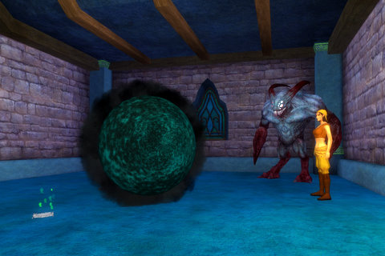
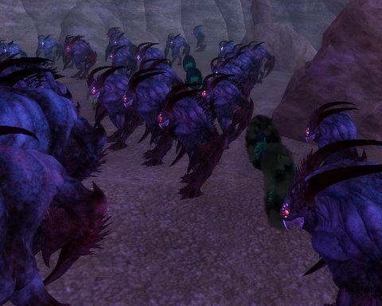
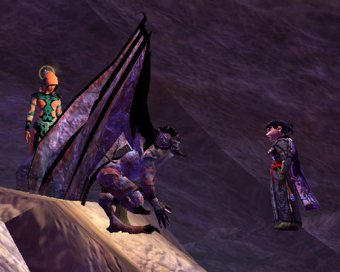
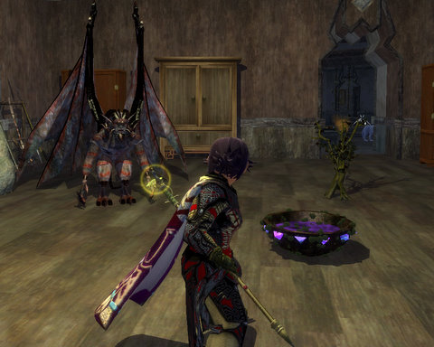

Back to: [West Karana](/posts/westkarana.md) > [2008](/posts/2008/westkarana.md) > [October](./westkarana.md)
# EQ2: The return of Anashti Sul?

*Posted by Tipa on 2008-10-07 08:40:20*

The EverQuest 2 GU48 world quest deals with, from the evil side, anyway, discovering who is responsible for the death of a Qeynosian Seeress who died mysteriously just before she was to make a pronouncement. All the signs point to work by Bertoxxulous's disciples, but the high priest of the god of disease swears that though they have no love for any follower of the Prime Healer, Rodcet Nife, it wasn't them. They were framed.

I put my necromancer, Adora, on the case. If this investigation was going to veer into life and death, who better than a necro to get to the (blackened, shrunken) heart of the matter?

Adora hunted for clues all over Norrath. Her investigations finally led her to a small apartment in Neriak, where she listened, hidden, as shadow creatures plotted with mortals about some foul deed. Then Adora was discovered.

While her pet went on a mad rampage and killed every living and unliving thing in the apartment, Adora picked up a curious amulet from the floor, and was immediately gripped in the power of a vision that seemed all too real.

Thousands -- millions of void beasts and shadowmen gathered in what can only be the Void, all looking at a mysterious figure addressing them from atop a tall stone...

Though robed and shrouded, the woman on the stone wielded incredible power, and she held Adora's soul in a grip so powerful she could not struggle nor scream... and then she was suddenly released.

Adora never suspected a necromancer could show fear. But there are some things in the universe more powerful, and more dread, than mere death. Adora realized that she had been left to live for one purpose only -- to give up the creed of Brell Serillis and to help reveal to the world the coming of the Queen of Unlife, Anashti Sul.

Adora got a replica of Anashti's staff as well as the amulet she found (now drained of its connection with The Void) and ... a treant pet? Not sure how that fits into the lore, but whatever. The bubbling bowl of poison on the floor was a gift from a grateful Evdonia for helping her clear the good name of the Disciples of Disease.

Today is possibly GU49 and the continuation of the story. One of the very nice things about EQ2 is how each expansion is set up with months of storyline and lore quests -- these have been going on since spring, and each one gets more elaborate.

## Comments!

**[Stargrace](http://www.mmoquests.com)** writes: Didn't the whole 'thousands and millions of void beasts' bit make you shiver! I know I did, it was *really* well done. The quest may have started out slow and put me to sleep (42 steps? No thanks!) but by the end I was really into it.

I'm hoping maybe these quests will still be around after the GU today. I didn't get a chance to do the evil one which looks like it differs by the goodie version quite a bit, including the poison bowl of goo.. I got a basket filled with berries.

---

**[Tipa](https://chasingdings.com)** writes: Yeah, it was REALLY creepy. I want to see a movie made of this whole plot :)

The plot point that the followers of Bert are being framed by an organization even MORE evil was a nice touch :) I love EQ2's handling of evil. They aren't that evil, just misunderstood mostly. And not very friendly.

---

**[Openedge1](http://simple-n-complex.blogspot.com)** writes: Looks cool. 
Still watching and waiting in the hopes that GU49 does a number on the performance issues. They said something about dual core fixes, and I am excited.
I have two months of AoC lined up, and I may rejoin EQ2 next month to keep me out of the cold weather coming..
I like creepy stuff in my games, and this should be the ticket.

---

**[Tipa](https://chasingdings.com)** writes: The multi-core fix is in Test right now, and it helps EQ2's performance for me, anyway, greatly. I'm really looking forward to the expansion :) I know all the cool bloggers are into Warhammer, but with Spellborn and Hello Kitty Online both coming up in the next month or so, along with the expansions to both EQ1 and EQ2, I just can't get excited about yesterday's news.

EQ2: TSO will rock, hopefully. More time with the beta this weekend will let me find out more.

---

**Isanox** writes: I'm stuck at work.
Is the next update live today?

---

**[Loredena](http://gnomedepot.net)** writes: I did the quest from both sides, and it was a lot of fun! The two sides do converge, since you're essentially solving the same puzzle from different angles, and it was tedious by the time I'd run a few alts through. But figuring it out the first time was great!

---

**[Tipa](https://chasingdings.com)** writes: I'm stuck at work, too, but Stargrace @ [MMO Quests](http://mmoquests.com) will have the patch notes up, I'm sure, really soon, and we'll know if it's GU49 or not.

Whether it is or not, I need to spend tonight on other games so even if it is, I don't know if I'll get much of a chance to check it out.

---

**[Stargrace](http://www.mmoquests.com)** writes: *Drags herself away from writ grinding* GU49.. whaa? 
Oh yeah. Posted the notes for it earlier today, and am frantically trying to get Nostalgia levels.. we're 29.. Almost.. 90 writs in two days later.... *groans and watches her fingers fall off*

---

**[Tipa](https://chasingdings.com)** writes: I'm having fun with the near randomness of comment times today. My host must be having a seizure.

---

