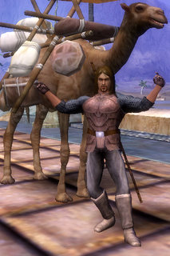

Back to: [West Karana](/posts/westkarana.md) > [2008](/posts/2008/westkarana.md) > [October](./westkarana.md)
# Stout Henry goes to war

*Posted by Tipa on 2008-10-08 08:37:45*

 Being a generally peaceful land, few people ever saw the inside of Cotsberry Prison, and those that did were often the sons of nobles who were left to sleep off their drunken carouses out of the sight of commoners. As such, the cells were clean and dry, the cot mattresses stuffed with soft feathers and the ticking, tick-free.

The cell's unusual comforts were lost on Stout Henry. Stout Henry was spending his time trying to force himself into the cell's corners and between the narrow-set bars on the tiny slit in the wall that let in air and light, hoping to pop through. It wasn't going well.

Duke Ferd chuckled when the jailor told him of Henry's antics. The odd man who'd stolen Ferd's horse, slaughtered a church full of peasants and then stripped the church of its meager riches and lastly skewered a farmer's prize hound, didn't have much of a future, but Henry was acting bizarre even for a condemned man. "We must see this for ourselves," said the Duke.

When Duke Ferd arrived at Henry's cell, Henry was sitting on his cot, motionless. "What's this?" demanded Ferd.

"I'm AFK," muttered Stout Henry, still sitting motionless.

"You said that when you were captured," said the Duke. "Instead of fighting."

"Look," said Stout Henry, still motionless, "you cheated. We were in battle, and then I went AFK, and then YOU'RE supposed to leave me alone and then go win or whatever it is you do, and then it would all be over and we'd both get honor and then I could leave. Instead, you drag me to THIS place, EVEN though I was clearly AFK, and toss me in here. You're just a lousy cheater and you don't know the rules and now you can let me out."

"Let you out? Rules?" said Ferd, getting a little angry. "The rules for stealing a Duke's horse are well known to all, save you. And for the slaughter of innocents, well..."

Stout Henry stared at Ferd. "So this is all about faction? I should have known Cotsberry was a faction grind. Look. Let me out and I'll kill enough Greenswold farmers until I'm not KOS. And then you'll love me and we can get ON with our lives."

Duke Ferd stared silently at Stout Henry for a long moment. "Your guilt is plain; I see no need for a trial," remarked Ferd. "Make peace with your maker, for at dawn, you will be hanged."

---

*Things look dire for our dear Stout Henry. Will he escape? Will he be hanged? What happens when you die? And where do babies come from? Find out the answers to at least some of these questions next week, in "The Death of Stout Henry".
*
## Comments!

**[Jim](http://tenfoldhate.com)** writes: Hehe. Just an aside Tipa--the pic you included with this chapter in the Stout Henry saga got me all nostalgic for Vanguard's camel mounts.

---

**[Tipa](https://chasingdings.com)** writes: Heh :) They are definitely really cool. I needed a horse, but couldn't find one. :P

---

