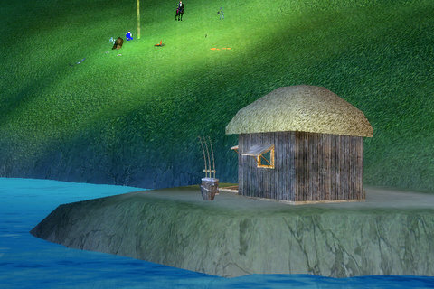
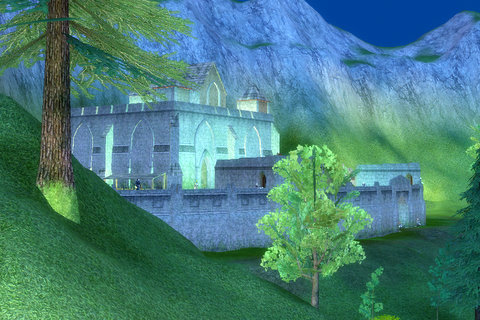
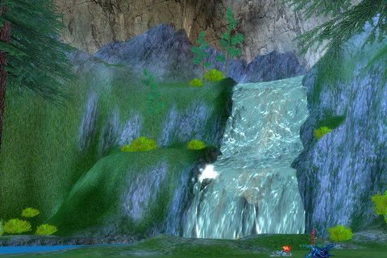
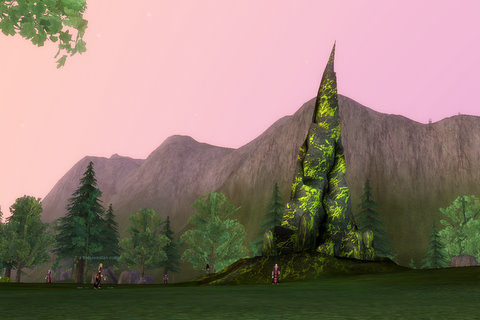
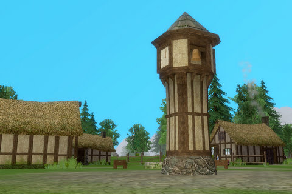

Back to: [West Karana](/posts/westkarana.md) > [2008](/posts/2008/westkarana.md) > [October](./westkarana.md)
# EQ: Oceangreen Hills and Oceangreen Village

*Posted by Tipa on 2008-10-08 10:00:21*

I'll say straight out that I can be slow sometimes. Even after all the clues from the last update, even after I knew that the Herald of Druzzil Ro would be sending me into Norrath's past, I didn't really connect the dots, right away. I landed in a place called Oceangreen Hills, and the area chat channel was called The Void, so I just assumed that I had landed in a particularly verdant part of the (incredibly inaccurately named) Void.

It wasn't until I stumbled upon this fishing cabin on a narrow lake, with a group camping it, that I realized the truth: This was Hadden's cabin, the guy who once dropped the Fishbone Earring -- he lived here. And Oceangreen Hills? They must be Qeynos Hills. In fact, every single place I had just visited seemed oddly familiar for a reason.

This fortress is approximately where Blackburrow will be dug, but it otherwise doesn't resemble the place.

I got here through a long, twisty tunnel. This can only be Surefall Glade, and I wouldn't be surprised to find a tunnel behind that waterfall. I was being chased by too many things by now to really stop and look things over, though.

A spire surrounded by the adherents of Bertoxxulous. This would be just outside of Qeynos in 'modern' times, but by the time Qeynos was founded, the followers of Bertoxxulous would have moved to the sewers.

A fortress or keep under construction. Gone by modern times.

Oceangreen Village, AKA Qeynos.

This? Why, the road to West Karana, of course :) WK hasn't been updated, unfortunately :/

The two zones were fairly busy with explorers and with groups. Really, actually, kinda looked like nice, but I didn't see anything that really struck me as amazing. But then, how much can you actually learn by just running at top speed around the zone?

I didn't find out how to get to any of the other new zones; I'd love to see Kaesora as it once was, though at 75 (was playing cleric), I am too low to get a group for any of the new zones. Which is EQ's continuing tragedy. Without having a good guild or lots of friends, there's not going to be many groups. Especially for clerics -- most people can 2box a cleric, and now that druids and shaman get rezzes, there will be even less call for them outside of raids. But I guess that's always the case for a support class.

I do hope the new expansion goes well; the zones I saw are as beautiful as anything else in EQ. But I can't think of anything, besides hirelings, perhaps, that it offers people who aren't max level and raiding.

## Comments!

**[Cow Nose the 50 Pound Cat](http://cownosethe50poundcat.blogspot.com)** writes: Wow, those are some really pretty pictures.

---

**Krijhok** writes: I wanted to say, the fortress is not where Blackburrow will be built, Blackburrow is where Blackburrow will be built. The fortress is the ruins where Pizjin spawns. :)

---

**[Tipa](https://chasingdings.com)** writes: Krij!!! Hi!!!

Okay, that makes more sense. I must have missed Blackburrow entirely, then.

---

**Egat** writes: I stood bravely at the fort while Krijhok roamed about and explored. I should petition to have my name changed to Sir Robin!

---

**[Tipa](https://chasingdings.com)** writes: Well, Krij can FD :) That gives him a little edge over a warrior when exploring :P

---

