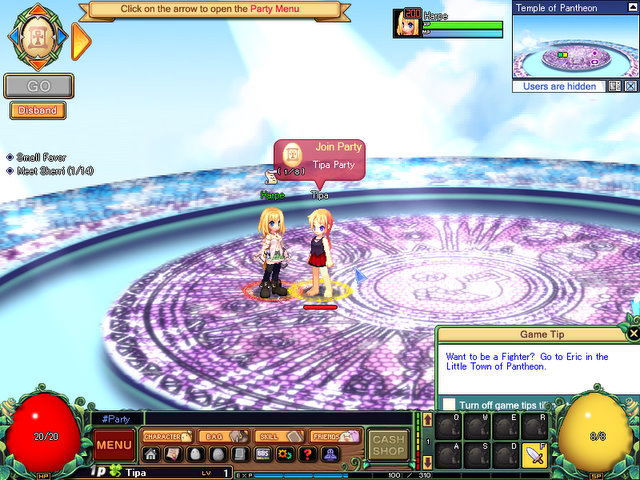

Back to: [West Karana](/posts/westkarana.md) > [2008](/posts/2008/westkarana.md) > [October](./westkarana.md)
# Pi Story, because everyone likes Pi(e)

*Posted by Tipa on 2008-10-10 08:16:49*

I've been wanting to get into Pi Story for months. Yeah, it's a 2D game in the vein of old Playstation action RPGs like 'Legend of Mana'. Yeah, it is entirely and unashamedly old school. Yeah, the game uses so little of your computer it could be run on a pocket calculator.

I'm not sure why any of those things would be a deal breaker. I, personally, had LOADS of fun with the old PlayStation and SNES RPGs.

Pi Story is a look back to the early days of Japanese-import RPGs. The graphics are colorful. The monsters, decidedly not scary. The music, bouncy.

But this being an MMO, you need never go on any adventure alone. With its innovative Open Group system, anyone can join your group at any time -- and surprisingly, a lot of people do. Once you have as many in your group as you think you'll need, your adventure is a click away. There is no traveling in Pi Story. There is only Pi.

Pi is that mysterious substance that allows travel between the broken shards of the world. Your job, and the job of all adventurers, is to defeat the evils of all the shards and allow them to, someday, be brought back together.

Along the way, you'll find new gear and outfits, get a room of your own that you can decorate however you wish, and in general, become a master adventurer who looks as awesome as they fight.

Like Kudos 2, this is a game very well suited to a Netbook, one of those ultra-tiny laptops, like the Asus Eee (and I love mine). An adventure only takes a few minutes, or you can just han around a quest hub and help someone out with theirs. It's only a click and then you're off.

I didn't get all that far into Pi Story in the closed beta; I hope to get a lot further in now.

Pi Story is free to play, but includes a cash shop. Typical for Asian MMOs, you will eventually want to use the cash shop for the cooler outfits or perhaps a little help in the leveling -- but it's never mandatory to pay anything to play.

## Comments!

**[Beau Turkey](http://www.voyagesofvanguard.com)** writes: Aww I love all these lil free games, I play them all. 

 Try Mabinogi! It's a skill based system and the combat is very actiony-turn based kind of like FFXII was. 

 Ima go check this one out. I am a 34 year old man and I love games. Even cute Asian ones. There, I said it.

 Beau

---

