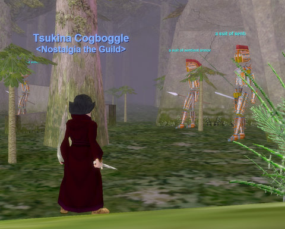
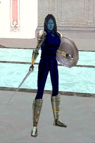

Back to: [West Karana](/posts/westkarana.md) > [2008](/posts/2008/westkarana.md) > [October](./westkarana.md)
# EQ: Asleep in the Wakening Lands

*Posted by Tipa on 2008-10-11 07:46:06*

We didn't have enough people show last night to continue on the Lavaspinner's Lair quests, but Nostalgia's newest member, Stolig, a 44 Magician, was there and eager to kill something. So I logged back in to my necro, Tsukina, who I haven't played since we were all hanging around Dulak, and we headed off to the level 40 hot zone, Wakening Lands, to do some armor bashing in the name of Nostalgia.

The good thing about hot zones is that they tell you where to go for your level. The bad thing about hot zones is that they tell you where to go for your level. I'd used the guild portal to Cobalt Scar to get close to Wakening Lands. The easily single-pullable and kiteable drakes were unmolested. There used to be a druid, wizard or other kiter in front of each one, back in the day. I used to quad kite them myself with my druid when I couldn't find a group (which was often).

But, nobody there. Headed into Skyshrine, nobody there. Into Wakening Lands and -- nobody there. Okay, that was strange. Hot zone empty?

Maybe because it's just an annoying place to hunt. Trees everywhere mean it's hard to see stuff coming for you. The flying mage monkeys are officially the most annoying mobs in the game. Invisible panthers sneak around. But there are PLENTY of good, save camps.

There's the giants just outside Kael, the geode caves, the raptor camp, and the sentient armors.

Way back in the day, I used to team up with a monk -- can't remember his name now. But we figured that on those days when neither could get a group, we could still duo. So we'd travel someplace fun, like Burning Woods or Skyfire, and I'd kite something while he attacked it. It worked really well. We spent a lot of time in Wakening Lands doing just that with these same sentient armors.

One side benefit of so much time spent kiting armors: Lots of crappy sentient armor for my shadow knight. Back before you could dye your armor, it looked really cool. Now, meh. We did get a sentient axe (way back when), which grants shadow knights the "Voice Graft" spell, which lets you talk through your pet. So from that moment on, Nashuya would hold long, weird conversations with her pet, who, according to her backstory, was made from the bones of her father, who was betrayed and killed while on a mission for Neriak.

Anyway. I'm not really sure why there weren't many other people there last night. When we were all in Dulak, there were bunches of people. Blightfire Moors, bunches of people. Wakening Lands -- not so much. 

Anyway, I didn't get a screenshot of Stolig because I was all worn out. I've been getting tired and going to bed early all this week and last night was no different; I was tucked in, cat purring softly by my pillow, by 10:30.

## Comments!

**[Maritzia](http://maritzia.consecrated-life.org)** writes: *sighs* I miss the EQ gnome models. I hate the gnomes in EQII and just won't have a gnome character there.

---

**Bhagpuss** writes: The problem with Hot Zones is that they only modify the xp relative to the ZEM of the zone in question. If you make a zone like Blightfire or Blackfeather Roost, which already gave noticeably better than average xp, into a Hot Zone then it becomes extremely attractive. Wakening lands, on the other hand, was always mediocre at best for xp and the Hot Zone bonus doesn't even raise the xp to a competetive level with many other non-Hot Zones of similar level. Add to that its relative inaccessability and it's not surprising its largely ignored.

---

**[JoBildo](http://ramblings.rebelutionstudios.com)** writes: It's amazing to me that EQ still looks "good" for a nearly 10 year old game. I wish the UO upgrade would have pulled it closer to the looks of EQ, or thereabouts.

---

