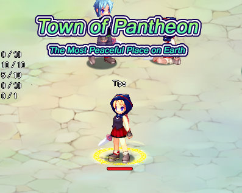
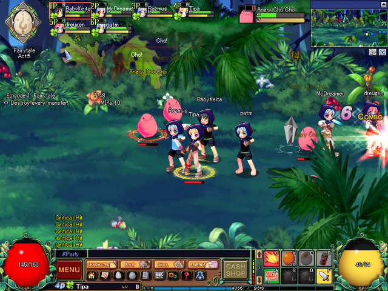

Back to: [West Karana](/posts/westkarana.md) > [2008](/posts/2008/westkarana.md) > [October](./westkarana.md)
# Pi Story: one in a thousand

*Posted by Tipa on 2008-10-12 12:55:15*

  
*The game is lying.*

So, a long time ago, I looked around at all these dozens, hundreds of minor MMOs, most free to play but some not, most imports from overseas but some not, and wondered just who is PLAYING all these games? For mass market MMOs, you had World of Warcraft; for mid budget MMOs, you had RuneScape; for low budget kid MMOs, you had Maple Story, and not really much reason to play anything else. Why would you deliberately pick anything but the BEST MMO, right? And if you accidentally found yourself playing something that wasn't the best -- that would be a mistake.

When you think about it like that, though, you have to wonder why people are so different. What are we doing with almost seven billion people that we couldn't do with, like, seven thousand? But every one of those seven billion people has someone that cares about them and thinks they're special. And every game developer thinks they are making a game just as special as a person.

  
*Grouping in Act 5, one of the many instances you have to repeat a dozen times for various reasons.*

So what if, instead of seeing Pi Story as just another Asian MMO -- one which looks like it could have been made a dozen years ago (the game only supports a 800x600 resolution, so maybe it WAS) -- someone got REALLY SERIOUS with it, decided this was to be their special game.

This, then, is why Pi Story is the most unique game in the world (as is every person, as is every game).

Pi Story is a game that will actually evolve as you play -- the base classes, Fighter, Cleric, Mage, Thief and Newbie -- are only the beginning, and will branch out into specialist classes as the game evolves. In that way, it's like A Tale in the Desert, which is guided by its players. So is Pi Story guided by ITS players.

Newbie? Yeah, Newbie is a class (that evolves into Adventurer). At level 10, Newbies, by virtue of their luckiness, can often find secret paths to the level boss or other loot-rich bits that more specialized adventurers cannot find. Newbies also craft faster than anyone else and make items nobody else can make. In fact, Newbie is the most hard-core class in the whole game. You don't have the fighting or spell skills of the specialized classes, but you have a mix. You have your luck going for you, and little else. But every group needs one.

At level 10, you can opt to choose another class by visiting a class trainer and doing a short quest. Once you've done that, you will never be a newbie again. You can switch to another class any time you like (and you retain the skills of your old classes, I believe). It's all based on putting points into a skill tree that branches depending on your class.

Fighters, though, everyone wants to be a fighter. Fighters can put all their skills on the hotbar, which means all you have to do is press a button, and the skill happens!

Why is that so earth-shattering? Because the clerics and magicians can't slot all their spells.

Their power depends on their -- typing speed. Isn't that unique? You won't see that anyplace else.

Even newbies get some magic words, so I have some experience with the Mavis Beacon approach to spell casting.

You hit your Magic Word key and then -- you stop, arms stretched out to grab power from the sky -- and you type "Milkyway". Really fast. Just because you stopped doesn't mean the monsters have. That sends a jet of power out that makes everything really, really mad at you. But you can deal with it.

You can pick the monsters up and toss them into other monsters, which makes them all go boom a little. So the MORE monsters you have, the more damage you're doing as you're flinging mobs around. This is really key to taking on the armies of monsters you'll be facing. You can also toss them up in the air and hit them as they're coming down -- or jump up in the air and really hurt them with a spike when you hit.

All these special moves take special power -- and this special power isn't refilled by resting or using potions, either. It's refilled only by landing attacks. So nobody just stays back and casts from afar; they have to build up their special powers by getting in the fray.

Adventures are obtained through bits of Pi, sometimes granted by quest givers, or sold by the merchant who pops up at the end of a successful adventure. You'll be buying a lot of Pi, because you'll be replaying these adventures a LOT. The Act 4 adventure is, I think, the first time you meet the Fuming Cho. He's fuming because he's mad (and also. hot). He's mad because he's a little pink bouncing ball of goo.

I think I have done that adventure a dozen times. Sometimes I try Act 5, either with a group or just farming the first two stages for quest items. Once I got an Act 7 group. It was pretty much a wipe. A fun one, though. People herding mobs into a clump in the center so that tossed mobs can land, grenade-like, where they'll do the most damage.

Since everyone has to do a LOT of adventures to level, finding a group is never a problem. People gather around the housing stone (which leads to the various housing districts) with their group open for anyone to just click in; when they have enough, the group leader clicks the GO button and it all begins.

The incredibly simple graphics mask a fairly deep and involved gameplay. Friday night, the high level people were strutting their stuff at the housing zone, and a GM was organizing a banshee doll hunt. You eventually do lose that newbie look, which you can hurry along by buying appearance clothing at the cash shop. I haven't been able to get an idea what, besides appearance clothing and items for your house, the cash shop has. Maybe that's all it has.

Pi Story knows its audience -- anime and manga obsessed teens from around the world (and unlike my own experiences with WoW and EQ2, where people from South America were extremely rare (though not entirely unheard of), Pi Story players are truly global). One shop is the Pi Story outlet for Shojo Beat, a manga collection for girls that sounds like the counterpart to Shonen Jump's collection of boy-oriented manga. Subscribe and get a code for a special hat. Is that enough to get people to subscribe? According to the forums, it is :)

Sure, it's an Asian import. And sure, the company hasn't been shoving millions of dollars into marketing and it hasn't been dribbling details out to websites in little bits (and now, Aeria Games has announced the LEFT portion of Pantheon Village! Tune in for our five day spectacular exclusive coverage of each NPC in the LEFT portion!). Nah. It's just a little Korean game done by folks who worked on Ragnarok Online and Lineage, published by some Western developers who want to make it something truly unique.

I've said before and will say again -- it's smaller games, like Pi Story, where the new ideas that will appear magically in Triple-A MMOs (and there be called 'innovative'), will first be found. An actual adventuring class called 'Newbie' with a real, well-defined role in a group? Brilliant!

## Comments!

**[Zelmor](http://zelmor.blogspot.com)** writes: First thought on the first screen shot was that you have a blood count twice as much as your urinal. Note the resource pool spheres.

---

**[Tipa](https://chasingdings.com)** writes: Yuck! :P

New MMO: Dialysis Online...!

Should be worth at least a minigame ...

---

**[West Karana » A first look at Dragonica Online](https://chasingdings.com/index.php/2009/08/25/a-first-look-at-dragonica-online/)** writes: [...] MMOs like Pi Story and LaTale and follow the lead of the genre leader, Maple Story — a side-scrolling world, [...]

---

