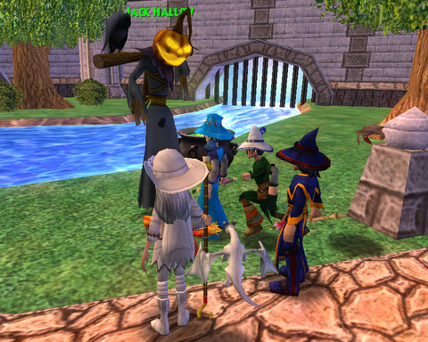
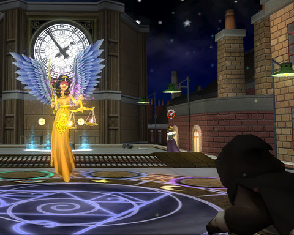
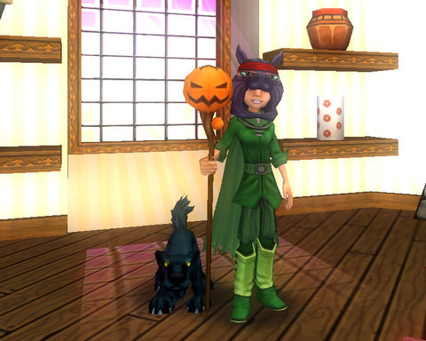
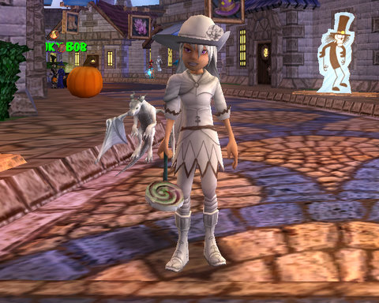

Back to: [West Karana](/posts/westkarana.md) > [2008](/posts/2008/westkarana.md) > [October](./westkarana.md)
# W101: Hallowe'en in Wizard City (and October patch notes)

*Posted by Tipa on 2008-10-13 08:42:59*

I didn't intend to spend all night playing Wizard 101, but after I finished the Hallowe'en quests and finished the Krokotopia quests I'd ignored to get to Marleybone, I met up with a couple of friends and we spent the night working on Hyde Park quests.

So this is going to be kind of a long post.

Wizard City was decorated in Hallowe'en colors. The staff had scary standees all over the place, but the staff was scarier. Jack Hallows was in the Commons, giving out quests; and Bob from Bob's Discount Crown Gear was in the Shopping District, selling RMT costumes, pets and staves. 

Jack gives out four quest lines. The first is to collect ghosts in various zones. The second, to collect pumpkins in various places. Third, to bob for apples in various places. Yes, it's a lot of running around, and these typically net only Black Cat treasure cards and sometimes a random piece of gear your level (he was giving me Marleybone gear, even though all quests take place within Wizard City).

The fourth quest line was the combat -- ie, the fun -- series. There was a three fight tower challenge going on in Ravenwood, given there by the Death graduate student. I went with two other people. The first fled during the first fight, the second fled during the second flight (which made me then re-do that fight), and so the third stage was me alone.

This, btw, is why I no longer accept friend invites from people with whom I have not grouped, any more. I only want to group with people who will stay through a fight.

The last fight in the series kinda surprised me -- a Rank 4 boss with a Rank *6* helper. This is way above anything in Wizard City or even Krokotopia. I have no idea if I just got a higher level version because I was level 27 or what. Someone followed me in (and stayed), so there was some welcome help.

See my cards in the screenshot above? First -- WRONG DECK. I forgot to switch out to my battle deck. Second, I'm facing high level Death mobs (note the skull next to their names). So I have to prepare myself for facing death magic. Also, these being high level, I have to bring out my Sprite Guardian as soon as I can. She requires four pips to play, BUT she can handle all the healing for a one or two person group, so I need to get her out just as soon as possible. I played the Myth/Death Shield card. This costs zero pips and absorbs 80% of the damage from one Myth attack and one Death attack. Playing buffs, debuffs, and wand attacks is required for bringing out higher ranked cards.

After I finished the fight and picked up my "final rewards" (which was a plain pumpkin mask. It looks like I have a pumpkin stuck on my head. No carvings or markings; just... a pumpkin). I headed off to Krok to calm things down between the dead Ahnic and Djesserit families, who are doomed to repeat the errors of life in death, throughout eternity. Now there's a cheery Hallowe'en thought for you.

And FINALLY -- starting the Marleybone quests! Which! Inevitably! Led me back to Krokotopia to help their people in the Pyramid of the Sun. Sigh.

Once I finally got to Hyde Park, Marleybone's first quest hub, I almost immediately met a couple of new friends with whom I did many of the storyline quests. For some reason, the Warehouse didn't activate for me; I'm thinking that because I skipped over some of the other quests, I missed a hidden pre-requisite. Or maybe it's because I'd helped a friend kill this same boss earlier in the night. Regardless, I went back to the beginning and started working on some of the boring fights (kill eight scurriers; kill six burglars, etc.) until it got late enough that I had to go.

I did get plenty of chances to bring out Judgment, summoned by my RMT hat, bought with crowns. She is more powerful the more pips you spend to summon her. At 125 damage per pip, she is slightly more powerful than my Life spells at the same cost, but since she is a Balance card, if I have my Life boost up (+40% to Life damage), it's more cost-effective to just play a Life card, like Seraph. Judgment is likely a poor choice for schools with more damaging spells.

RMT gear that boosts but does not overpower, is the best kind.

I ended the night by doing some of Marleybone's FedEx quests (one of which was delivering mail, a real Fed Ex quest...), and then ported to my dorm room. That's the new map option; instead of just being able to port to your current world's teleport point, you have the additional port to bring you to your dorm room in Ravenwood. This makes getting back to Wizard City when you need to go, easy-peasy.

Me in Marleybone clothes, along with a Ninja Pig mask (you can buy the whole costume), a pumpkin staff and a black cat, all bought with crowns from Bob's Discount Hallowe'en Supplies and Crown Store. Well, not the Marleybone clothes. The stats on those aren't good enough to wear so it's just for looks.

Wizard 101 needs appearance slots, a la EverQuest 2... Sure, it's cool to generally be able to tell someone's school by the color of their robes, but.. still... why sell appearance gear but not actually allow it to be worn while playing?

Trick or treating can be fun! The wand vendor in Wizard City's Shopping District sold me a white lollipop. I just had to switch over to my Tatooine Ice Wizard gear to eat it :)

[Full patch notes](https://www.wizard101.com/site/posts/list/2257.ftl) after the break.

You may have noticed you patched this morning! Surprise!
Welcome to our very first Hallowe'en celebration here at Ravenwood School of Magical Arts!

I'd like to introduce you to Jack Hallow. He is a newcomer to Wizard City, and he's just here for a few weeks so be sure to talk to him the next time you come to school. You can find him in the Ravenwood Commons.

He'll send you on many new adventures, throughout all the different areas of Wizard City. Free to Play players can participate in most of these new adventures, while subscribers can complete the entire story, if they prove their strength!

There are lots of Hallowe'en decorations, bubbling cauldrons, apple tubs, pumpkins and ghosts and surprises all over Wizard City. But beware, a new boss is waiting to test your skills!

Be sure to visit Sven Stonebreaker, the Wands Shopkeeper in Wizard City Shopping District for a special limited edition wand which you can purchase with gold. While you're in the Shopping District, visit the travelling salesghoul, Spooky Bob to see all his new Hallowe'en Crowns items.

Pet Renaming!
If you're not happy with your pet's name, you can now choose a new name by going to the Dye Shop. You will see a new icon there that will instruct you on how to rename your pet, for a small gold fee.

Return to Dorm
You'll find a new button on your map, that will take you to your Dorm room. Use this button whenever you find yourself in an area you do not know how to leave. This is also a quick way to drop items in your storage and get back to the dueling!

Dismiss Tooltip
When a ToolTip appears, if you do not want to read it, you can now Right Click the ToolTip to dismiss it. Beware though; your teachers may have something important to tell you!

Show Names on Mouseover
If you have your "Show Names" view set to "Non-Players" you can still move your cursor over someone to see their name appear above their head! If you have your "Show Names" view set to none, you can still move your cursor over other players, shopkeepers and residents, as well as creatures to see their name and title.

Auto Add New Spells
New spells you earn through training will be automatically added to your spellbook. New spells you receive through quests will still need to be added manually.

Available Treasure Cards
Treasure cards that are unavailable to purchase will have their icons grayed out. If you do not have enough gold to purchase a card, it will be the color grey in the library.

In other news:
-Treasure cards that are unavailable to purchase will have their icons grayed out. If you do not have enough gold to purchase a card, it will be the color grey in the library.
-Purchases made in game with Crowns, either at Zeke or Spooky Bob will now ask you to Confirm your purchase.
-Marleybone's Hat Shopkeeper is now named "Houghe Warner"
-There is no longer a level 30 restriction to get the quest "Welcome to Moo Shu?", but you still have to complete the quest named "Moo Shu" first!
-"Eyus, Conqueror" quest now offers the "Helm of Dependability" as a reward
-Ahnic Striders no longer use Natural Attacks that are stronger if they spend more pips on them.
-Forgotten Djeserit Souls now count for defeats during 'Restless Souls' quest. 
## Comments!

**[The Friendly Necromancer](http://thefriendlynecromancer.blogspot.com)** writes: haha! Awesome lollipop to match your gear, Tipa! Thanks for the update. One of these nights we'll have to figure out a meeting spot so I can add you to my friends list.

---

**[Tipa](https://chasingdings.com)** writes: That would be really cool. It is murder meeting someone in game, though.

---

**[The Friendly Necromancer](http://thefriendlynecromancer.blogspot.com)** writes: See, what ya gonna wanna do is go behind the tan van and look for a guy named Dan holding the golden an.

http://www.youtube.com/watch?v=1ZpjH1WcWOM

---

**[West Karana » Wizard 101: My greatest failure](https://chasingdings.com/index.php/2009/10/02/wizard-101-my-greatest-failure/)** writes: [...] It was all harmless fun last year… until I found out the Pumpkin Head would (rarely) drop the mechanical spider that otherwise is only found (also rarely) at the end of the most tedious, lengthiest instance in the entire game, Kensington Park. So, half an hour vs four hours, right? [...]

---

**[kane](http://web)** writes: i want a cool pet in this game but... its hard

---

**[kane stayrtall](http://web)** writes: i do not like the members no no! i do but why do we have to pay? ho amber is my friend in the game and in real life so its good i dont know why i am a lvl 10 but thats good but i know i know maby someday i maby become a member some day ho my friend ambers name is molly swifbrit ho and my bro;s name is josh\_noah starcaster bye

---

**[kane stayrtall](http://web)** writes: ha ha ha ha! no tits me agen oh hay hallowen is cool but i seen the crown shop and...its good ho by the way molly be a friend with her she but... dont remove and met you on youtube so see ya but i dont want to go but have to so bye

---

**[kane stayrtall](http://web)** writes: no no no no bl bl bl bl i am sad! not how do i do with a want?

---

**carson** writes: Well, the way you wrote it was hard to understand but I would suggest buying a gift card ($10 or $20) at gamestop or EB games. That is a good way to start. If you are looking for something cheaper, the $5 option give you 2500 crowns (they can be bought on the homepage). That is enough crowns to buy cyclops lane, firecat ally, and colossus blv. and still have some left over. I am a lvl 46 (still working (ugh) hard) and I live on those gift cards.

---

