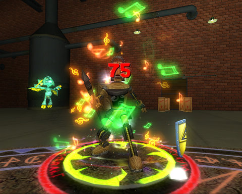

Back to: [West Karana](/posts/westkarana.md) > [2008](/posts/2008/westkarana.md) > [October](./westkarana.md)
# W101: On to Chelsea Court

*Posted by Tipa on 2008-10-14 08:38:20*

Kinda embarrassed to have fallen asleep while grouping with Kasul in Chardok last night. Sorry, Kasul :( It was weird, though. Wake up, at the keyboard, no idea how long you've been out... I just shut down the computer and went to bed.

Adora did hit 70 last night, though. This puts her in the right place to take advantage of the Shadow Odyssey's Moors of Ykesha solo zone, though. She has done barely any of the RoK quest grind, but I find that having done it twice, I can't bear the thought of doing it even once more. Maybe the Moors will help make the 70-80 run more exciting.

  
*Notes, notes, everywhere notes. I'm a bard at heart.*

This morning I ducked into Wizard 101 and finally managed to find Baxter. They SAY he's at the Warehouse, but the Warehouse instance didn't work for me. He's actually at the little map location that says "Baxter" on it, clear on the other side of the map.

Oops.

So I made short work of that and finished a couple of other minor quests on the way -- killed some scurriers, picked some flowers, ran back and forth in Regent's Square a couple of times. This led me to Chelsea Court, which means I can FINALLY finish my Life School quest. A friend who was sent to Chelsea Court for his Storm School quest says he, at least, had to enter a solo instance with a very high health boss and a friend.

I've just done exactly that with the Baxter fight, so I'm not worried. A Sprite Guardian lets me do damage without worrying about my own health. Actually, it wasn't a fight against Baxter. I was about to speak with him, when he was whisked away by clockworks. My job in Chelsea Court is to find these clockworks and rescue Baxter... so I can arrest him, I guess.

  
*A boosted Seraph delivers the coup de grace to the clockwork. I've chased these guys from EverQuest to EverQuest 2 to City of Heroes to World of Warcraft and now Wizard 101. They're as bad as Orcs. Worse. Bad as ELVES.*

Anyway, if I rush through these storyline quests, I should be in Moo Shu in a couple of days. But I won't, because Moo Shu is the end of the line, world-wise, so far. Who knows when Dragonspyre is coming out? I hope it's soon, but as it is, there's no need to hurry. After I finish my Life School quest in Chelsea Court, it's back to Hyde Park to finish off those quests.

I'm still incredibly bummed that I have not found any Marleybone clothes that are better than the ones I brought from Krokotopia. I'm SO DONE with that faux-Egyptian look.

Dinged 29 and expect to hit 30 before Hyde Park and Chelsea Court are done. I'd like to be 35 before Moo Shu, but I'm not sure there are quests enough in Marleybone to take me there. I know there are a lot of long instances left to finish in Marleybone, but killing alone is barely any XP at all. You advance, mostly, by completing quests.

