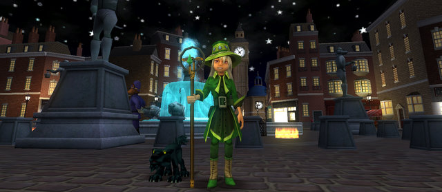
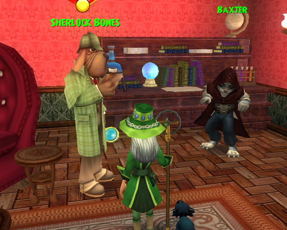
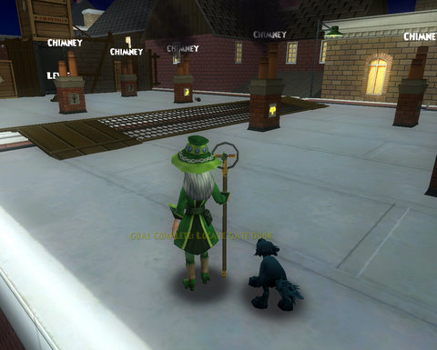

Back to: [West Karana](/posts/westkarana.md) > [2008](/posts/2008/westkarana.md) > [October](./westkarana.md)
# W101: The Ironworks

*Posted by Tipa on 2008-10-16 08:59:48*

Marleybone's Regent's Square at the end of last night's adventure. New staff, the Staff of Rejuvenation; my school, of course, which is kind of a bummer because using it triggers all my Life traps and blades, but with careful planning, it works. Its advantage over Britt's Flamelicked Staff? 75 Life damage vs 70 Fire damage means slightly more damage and somewhat more effective against Fire enemies. It also gives an extra pip at the beginning of every battle which means getting the good spells out becomes significantly faster. Since I begin most boss battles by trying to bring my four pip Sprite Guardian out to handle healing, being halfway there on the first round -- and with luck with power pips, 3/4 of the way there -- is extremely powerful.

|  |  |  |
| --- | --- | --- |
|
 *Freddy Nine Lives demanded I kill him nine times in a row to get my level 27 Life spell, a powerful heal over time.* |
 *Shakes O'Leary was one of the many mice I had to rough up in the Ironworks.* |
 *The clockwork boss of Chelsea Tower.* |

I started the night out by returning to Hyde Park and finishing up the various quests I had going there. They may be boring FedEx and kill quests, but quests are how you advance in Wizard 101, and I'm looking toward the future. I don't want to get in to Moo Shu and run out of stuff to do before I hit level 50.

In one Hyde Park fight, a wizard on my friend's list flickered into a fight, brought an add and fled, which earned her a removal from my friend's list. I had an angry kid on the W101 forums take me to task for not freely accepting random friend invites because I was tired of kids flickering in to my fights, bringing an add and fleeing, but... it happens, it happened last night.

A young fire wizard joined that same fight, he was maybe level 24 but had the title and pet from killing the Jade Oni, the final Moo Shu boss I believe, so I immediately pegged him as someone who randomly friended people and then ported to them, hoping to get lucky. The very first words out of his mouth were, "friends?" And at least he was fighting, which is all I ask of any W101 friend, so I said, "Sure!". And then he pleaded with me not to delete him. Not because he recognized me, but because, I guess, he's been removed from friends lists before.

Rest of my time in Hyde Park, he'd be flickering into my fights (but staying to help kill), bugging me to give him my Mutate cards (which I did, why not?), and so on.

  
*Newgate Prison, the next quest hub.*

On to Chelsea Court, a section of Marleybone centered around the massive Chelsea Tower. The whole place has been overrun with clockworks, and they have Baxter, the moll who has the goods on the infamous crime kingpin, Pops O'Leary, penned up in the tower. I joined with another Life wizard to take on some of the random trash clockworks, and we made short work of them. A couple of mini-boss fights later, I had access to Chelsea Tower, defeated the clockwork boss and rescued Baxter.

The whole zone was so short. I did ding level 30 during it, but I was kind of disappointed. I was hoping for more.

Sherlock Bones requested I meet him and Baxter at his home at 221B Barker Street and plan our next move against Pops.

Baxter revealed that Pops ran things from his factory, known locally as The Ironworks. A depressing place filled with the worst of the criminal element. The law would be no help, as all the bobbies were at tea, and the heroic detectives like Sherlock himself, would go but, alas, he had a masterclass scheduled with a violin maestro who was visiting Barkingham Palace and just couldn't tear himself away.

Not to anyone's surprise, least of all my own, I would once again be sent off to battle Marleybone's greatest criminals, entirely by myself.

  
*Whoa. City of Heroes flashback.*

The Ironworks is an instance, meaning I had to complete it in one sitting. Pops O'Leary was no dummy; I couldn't go two rooftops without being challenged with a code phrase, or a special knock, or a chimney puzzle to solve. But ya know, that might work for your every day household pet, but not with a wizard straight from Wizard City. Headmaster Ambrose don't graduate any stupid wizards.

I was apprehensive about doing the entire instance without seeking help, but I have my Sprite Guardian, and nothing much gets past her. Unless she herself gets hurt, then she forgets entirely about me.

Seriously, though, she's my absolute best companion in the game. I even have removed most of the heals from my deck because she does such a great job or keeping me healed. This comes back to bite me when I join a group and they expect me to heal and I've forgotten to add the heals back in. Oops.

Anyway, the Ironworks was no challenge, which was fine by me, as I was distracted watching the debates. Ironically, when I finished the Ironworks instance and returned to Regent's Square, there was a doggess right there with a quest for me to collect crates... in the Ironworks. So I suppose I'll be heading back.

Full experience the first trip, but only half experience the second trip, and none thereafter, so unless someone asks me for help in the Ironworks, this next trip will be my last.

  
*Chim Chimeree, Chim Chimeree, Chim chim, Cheroo...*

After the Ironworks, I was asked to drop everything and head to Kensington, Marleybone's answer to Wizard City's Sunken City. The W101 forums paint Kensington as a punishing, two to three hour instance with no rewards, so... I'll probably skip it unless I see other people about to do it.

Sherlock Bones sent me to talk to his compatriot, Dr. Watson, on the rooftop of Scotland Yard. Because, that's where meetings are normally held. Or something.

Anyway, Watson warned me that the situation had just become more dire. Professor Meowiarty was on the prowl, and certainly up to no good. I needed to head into Newgate Prison and confront him there.

Meowiarty is the final boss of Marleybone, so the game is afoot!

I better cool it with this game, or I'll be done far too quickly.

The game was challenging when I was a Myth/Fire wizard in beta. Once I earned the Sprite Guardian in the live game as a Life wizard, though, I no longer had to particularly worry about losing a fight (though I have had to pick up my own heals once or twice when it took too long to bring her out).

Her heals may not be up to the task later on, but I'll worry about that when it happens.

## Comments!

**[Hudson](http://hudshideout.blogspot.com/)** writes: Cool post. I like the graphics in that game

---

**[Toldain](http://toldaintalks.blogspot.com)** writes: Meowiarty? Oh that one hurts. Don't forget to bring your service revolver.

---

**[Tipa](https://chasingdings.com)** writes: Heh yeah, Marleybone is pretty much pun city. It's actually pretty funny, I really get into it :)

I hear that you finally chase Meowiarty to a huge confrontation in Big Ben. Totally looking forward to that.

---

**[The Friendly Necromancer](http://thefriendlynecromancer.blogspot.com)** writes: I use that staff a lot, Tipa. My seven year old is completely jealous because she's a life wizard. "You shouldn't be able to use that Dad. no fair." My favorite part of that staff is when it pumps out a pip with a power pip. SO NICE.

p.s. I skipped Kensington too. hehe.

---

**Hakker** writes: I need to know how to catch where meowiarty hideout is add me if ya want, i will usually be roaming around the streets as a lvl twenty nine storm named Austin Friend Usually in realm pixie, i will be in regents square looking for side quests

---

